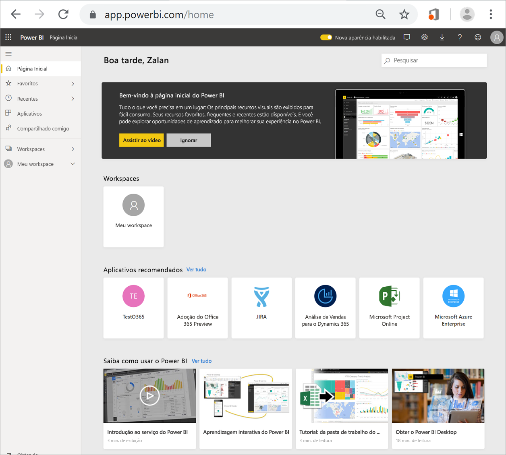
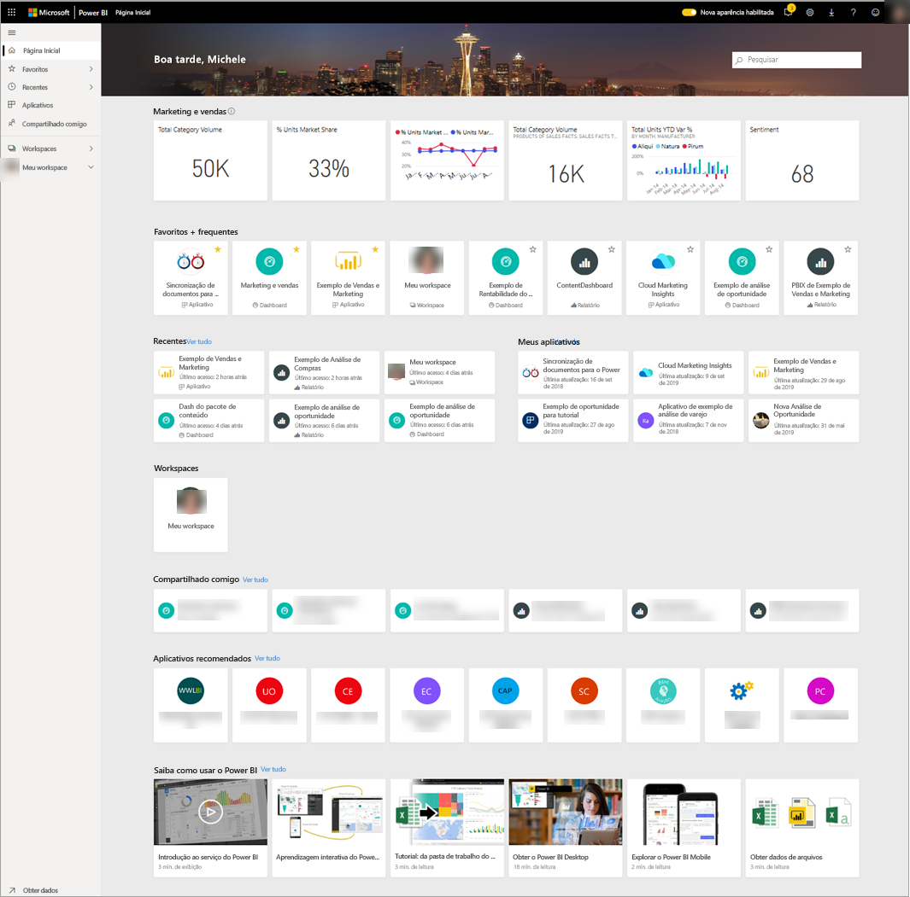
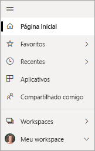
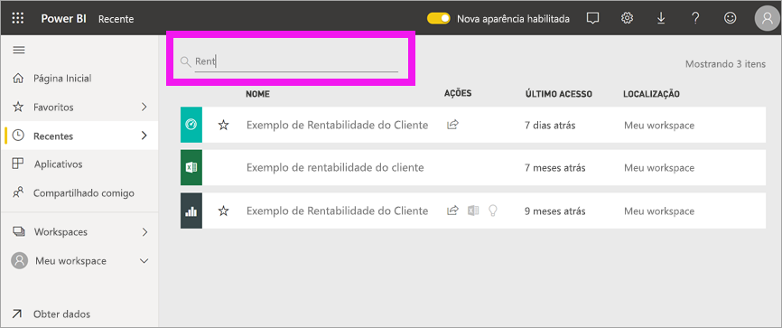

# Localizar dashboards, relatórios e aplicativos
No Power BI, o termo *conteúdo* refere-se a aplicativos, dashboards e relatórios. O conteúdo é criado por designers do *Power BI*, que o compartilham com os colegas como você. O conteúdo está acessível e visível no serviço do Power BI, e o melhor lugar para começar a trabalhar no Power BI é na página de aterrissagem inicial.

## Explorar a Página Inicial do Power BI
Quando você entra no serviço, o Power BI abre e exibe a tela Página Inicial, conforme mostrado na figura a seguir.
 

A Página Inicial do Power BI oferece três maneiras diferentes de localizar e exibir o conteúdo. Todas as três acessam o mesmo pool de conteúdo; são simplesmente maneiras diferentes de acessar esse conteúdo. Ocasionalmente, a pesquisa será a maneira mais fácil e rápida de localizar algo, enquanto outras vezes, a seleção de um *cartão* na tela Página Inicial será a melhor opção.

- A tela Página Inicial exibe e organiza seu conteúdo favorito e mais recente, juntamente com o conteúdo e recursos de aprendizado recomendados. Cada parte do conteúdo é exibida como um *cartão*, com um título e um ícone. A seleção de um cartão abre o respectivo conteúdo.
- No lado esquerdo, encontramos um painel de navegação, conhecido como barra de navegação. Nesse painel, o mesmo conteúdo é organizado de maneira um pouco diferente, por Favoritos, Recente, Aplicativos e Compartilhado comigo. Nele, você pode exibir listas de conteúdo e selecionar um para abri-lo.
- No canto superior direito, a caixa de pesquisa global permite pesquisar o conteúdo por título, nome ou palavra-chave.

Os tópicos a seguir examinam cada uma dessas opções para localizar e exibir o conteúdo.

## Tela Página Inicial
Na tela Página Inicial, exiba todo o conteúdo que você tem permissão para usar. A princípio, poderá não haver muito conteúdo na tela Página Inicial (confira a imagem acima), mas isso mudará à medida que você começar a usar o Power BI com seus colegas.

A tela Página Inicial também é atualizada com o conteúdo e recursos de aprendizado recomendados. 
 
Conforme você usar o serviço do Power BI, receberá dashboards, relatórios e aplicativos de colegas e, em seguida, a Página Inicial acabará sendo preenchida. Ao longo do tempo, ela poderá ficar parecida com a home page a seguir.

 
Os próximos tópicos examinam mais de perto essa home page, com todos os detalhes.

## O conteúdo mais importante ao seu alcance

### Favoritos e frequentes
A seção superior contém links para o conteúdo visitado com mais frequência ou marcado como [em destaque ou favorito](end-user-favorite.md). Observe que vários cartões têm estrelas amarelas; esses dois aplicativos e esse dashboard foram marcados como favoritos.
 
### Recente e Meus aplicativos
A próxima seção exibe o conteúdo visitado mais recentemente. Observe o carimbo de data/hora em cada cartão. A seção **Meus aplicativos** lista os aplicativos que foram compartilhados com você ou que você [baixou no AppSource](end-user-apps.md); os aplicativos mais recentes são listados aqui. Selecione **Ver todos** para exibir uma lista de todos os aplicativos compartilhados com você.

### Workspaces
Como *consumidor* do Power BI, normalmente, você tem apenas um workspace, **Meu workspace**. 

### Compartilhado comigo
Os colegas compartilham aplicativos com você, mas também podem compartilhar dashboards e relatórios individuais. Na seção **Compartilhado comigo**, observe que há três dashboards e três relatórios que os seus colegas compartilharam com você.

### Aplicativos recomendados
De acordo com as configurações de sua atividade e sua conta, o Power BI exibe um conjunto de aplicativos recomendados. A seleção de um cartão de aplicativo abre o aplicativo.
 
### Recursos de aprendizado
Na parte inferior da tela Página Inicial, há um conjunto de recursos de aprendizado. Os recursos exatos exibidos dependem da atividade e das configurações, bem como do Administrador do Power BI. 
 
## Explorar o painel de navegação (barra de navegação)

Use o painel de navegação à esquerda (barra de navegação) para localizar dashboards, relatórios e aplicativos e mover entre eles. Ocasionalmente, o uso da barra de navegação será a maneira mais rápida de acessar o conteúdo.
A barra de navegação fica visível quando você abre a Página de aterrissagem inicial e permanece estática quando você abre outras áreas do serviço do Power BI.
  
A barra de navegação organiza o conteúdo em contêineres semelhantes ao que você já viu na tela Página Inicial: Favoritos, Recente, Aplicativos e Compartilhado comigo. Usando os submenus, você pode exibir apenas o conteúdo mais recente em cada um desses contêineres ou navegar até listas de conteúdo para ver todo o conteúdo de cada categoria de contêiner.
 
- Para abrir uma dessas seções de conteúdo e exibir uma lista de todos os itens, selecione o título.
- Para ver o mais recente em cada contêiner, selecione o submenu ( **>** ).

    

 
A barra de navegação é outra maneira de localizar o conteúdo desejado rapidamente. O conteúdo é organizado de maneira semelhante à tela Página Inicial, mas é mostrado em listas, em vez de cartões. 

## Pesquisar todo o conteúdo
Às vezes, a maneira mais rápida de localizar o conteúdo é pesquisá-lo. Por exemplo, talvez você tenha descoberto que um dashboard que você não usou por algum tempo não está sendo mostrado na tela Página Inicial. Ou talvez você se lembre de que seu colega, Davi, o compartilhou com você, mas você não se lembra do nome dele ou de qual tipo de conteúdo ele compartilhou, seja um dashboard ou um relatório.
 
Você pode inserir o nome completo ou parcial do dashboard e pesquisá-lo. Além disso, você pode inserir o nome de seu colega e pesquisar o conteúdo que ele compartilhou com você. A pesquisa tem como escopo a busca de correspondências em todo o conteúdo do qual você seja o proprietário ou ao qual tenha acesso.

## Próximas etapas
Visão geral dos [conceitos básicos do Power BI](end-user-basic-concepts.md)
