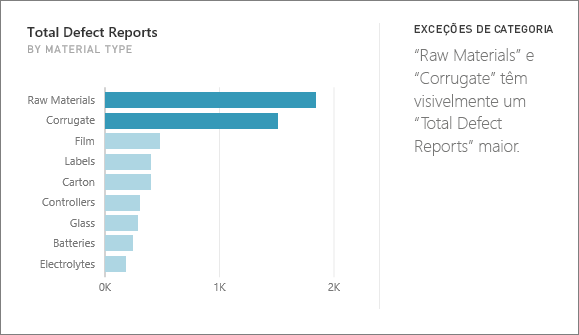
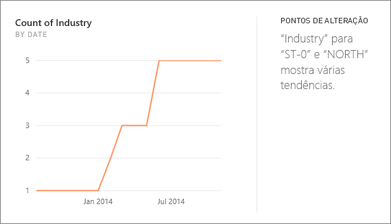
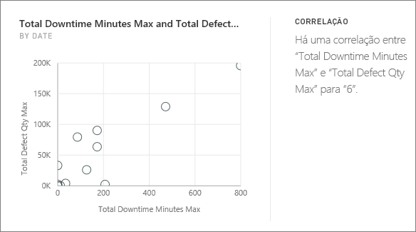
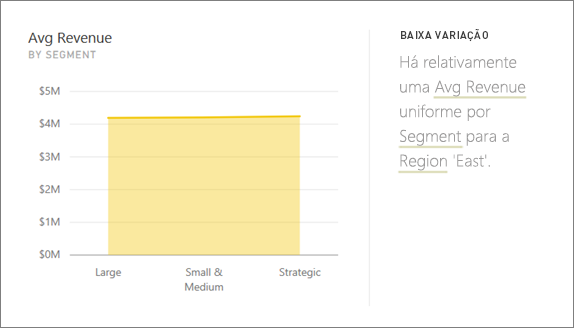
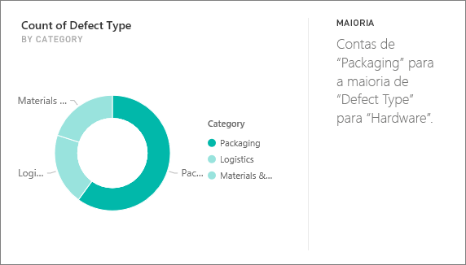
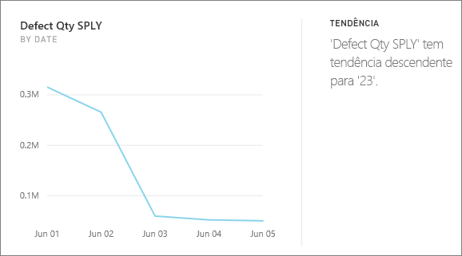
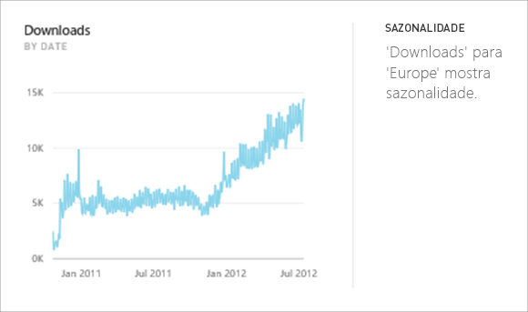
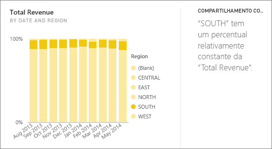
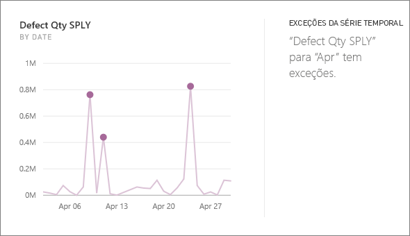

# Tipos de Insights com suporte para o Power BI

Você pode pedir ao Power BI que examine seus dados e encontre tendências e padrões interessantes. Essas tendências e esses padrões são apresentados na forma de visuais chamados *Insights*. 

Para saber como usar os Insights, confira [Insights do Power BI](end-user-insights.md)

## Como o Insights funciona?
O Power BI pesquisa rapidamente diferentes subconjuntos do conjunto de dados. À medida que ele pesquisa, o Power BI aplica um conjunto de algoritmos sofisticados para descobrir insights potencialmente interessantes. Os *consumidores* do Power BI podem executar os Insights em blocos de dashboard.

## Um pouco de terminologia
O Power BI usa algoritmos estatísticos para descobrir Insights. Os algoritmos são listados e descritos na próxima seção deste artigo. Antes de chegarmos aos algoritmos, vejamos as definições de alguns termos que talvez não sejam conhecidos. 

* **Medida**: uma medida é um campo quantitativo (numérico) que pode ser usado para fazer cálculos. Os cálculos comuns são soma, média e mínimo. Por exemplo, se nossa empresa fabrica e vende skates, nossas medidas podem ser o número de skates vendidos e o lucro médio por ano.  
* **Dimensão**: as dimensões são dados categóricos (texto). Uma dimensão descreve uma pessoa, um objeto, um item, produtos, um lugar e um período. Em um conjunto de dados, as dimensões são uma maneira de agrupar *medidas* em categorias úteis. Para nossa empresa de skates, algumas dimensões podem incluir a análise de vendas (uma medida) por modelo, cor, país ou campanha de marketing.   
* **Correlação**: uma correlação nos informa como o comportamento dos itens está relacionado.  Se os padrões de aumento e diminuição são semelhantes, eles estão correlacionados positivamente. E se os padrões são opostos, eles estão correlacionados negativamente. Por exemplo, se as vendas de nossos skates vermelhos aumentam toda vez que fazemos uma campanha de marketing na TV, as vendas dos skates vermelhos e a campanha de TV estão correlacionadas positivamente.
* **Série temporal**: uma série temporal é uma maneira de exibir o tempo como pontos de dados sucessivos. Esses pontos de dados podem ser incrementos, como segundos, horas, meses ou anos.  
* **Variável contínua**: uma variável contínua pode ser qualquer valor entre os limites mínimo e máximo; caso contrário, é uma variável discreta. Entre os exemplos estão temperatura, peso, idade e tempo. As variáveis contínuas podem incluir frações ou partes do valor. O número total de skates azuis vendidos é uma variável discreta, já que não podemos vender metade de um skate.  

## Quais tipos de insights é possível encontrar?
Esses são os algoritmos usados pelo Power BI. 

### Exceções de categoria (superior/inferior)
Realça os casos em que uma ou duas categorias têm valores muito maiores do que outras categorias.  

### Alterar os pontos em uma série temporal
Realça os casos em que há alterações significativas nas tendências em uma série temporal de dados.

### Correlação
Detecta casos em que várias medidas mostram um padrão ou uma tendência semelhante quando plotadas em uma categoria ou um valor no conjunto de dados.

### Baixa variância
Detecta os casos em que os pontos de dados não estão distantes da média.

### Maioria (Principais fatores)
Encontra casos em que a maioria de um valor total pode ser atribuída a um único fator quando dividida por outra dimensão.  

### Tendências gerais na série temporal
Detecta as tendências ascendentes ou descendentes em dados de série temporal.

### Periodicidade na série temporal
Encontra padrões periódicos nos dados de série temporal, como periodicidade semanal, mensal ou anual.

### Compartilhamento constante
Realça os casos em que há uma correlação de pai-filho entre o compartilhamento de um valor do filho em relação ao valor geral do pai em uma variável contínua.

### Exceções da série temporal
Para dados em uma série temporal, detecta quando há datas ou horas específicas com valores significativamente diferentes dos outros valores de data/hora.

## Próximas etapas
[Insights do Power BI](end-user-insights.md)

Mais perguntas? [Experimente a Comunidade do Power BI](https://community.powerbi.com/)

