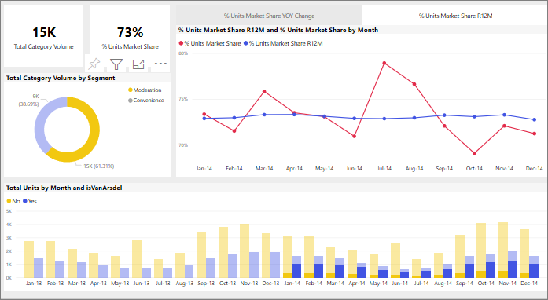

# Como os visuais realizam filtragem cruzada entre si em um relatório do Power BI
Um dos melhores recursos do Power BI é a maneira com que todos os elementos visuais na página de um relatório são interconectados. Se você selecionar um ponto de dados em um dos elementos visuais, todos os outros visuais na página que contêm esses dados serão alterados, com base nessa seleção. 

## Como os visuais interagem

Por padrão, a seleção de um ponto de dados em um visual em uma página de relatório fará filtro cruzado ou realce cruzado dos outros visuais na página. A interação exata dos visuais em uma página é definida pelo relatório *designer*. Os *designers* têm opções para ativar e desligar as interações visuais e alterar o comportamento padrão de filtragem cruzada, realce cruzado e [drilling](end-user-drill.md). 

Caso ainda não tenha encontrado as hierarquias nem o drilling, saiba tudo sobre eles lendo [Fazer drill down no Power BI](end-user-drill.md). 

A filtragem cruzada e o realce cruzado podem ser úteis para identificar como um valor nos dados contribui para outro. Por exemplo, a seleção do segmento Moderação no gráfico de rosca realça a contribuição desse segmento para cada coluna no gráfico "Total de unidades por Mês", além de filtrar o gráfico de linhas.

Veja [Sobre filtragem e realce](end-user-report-filter.md). 

  
> [!NOTE]
> Os termos *filtro cruzado* e *realce cruzado* são usados para distinguir o comportamento descrito aqui do que acontece quando você usa o painel **Filtros** para filtrar e realçar visuais.  

## Considerações e solução de problemas
- Se o relatório tiver um visual que dá suporte ao [drilling](end-user-drill.md), por padrão, o drilling de um visual não afetará os outros visuais na página de relatório.     
- Se você usar o visualA para interagir com o visualB, os filtros no nível do visual do visualA serão aplicados ao visualB.

## Próximas etapas
[Como usar filtros de relatório](../power-bi-how-to-report-filter.md)
