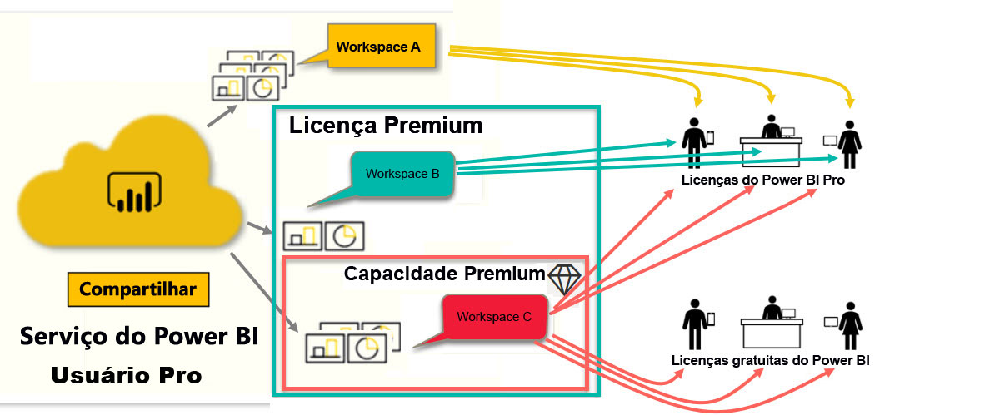

# Tipos de licenças do Power BI
Como *consumidor*, você usa o serviço do Power BI para explorar relatórios e dashboards a fim de tomar decisões de negócios. Se você usa o Power BI há algum tempo ou tem conversado com seus colegas *designers*, provavelmente descobriu que há alguns recursos que só funcionam se você tem um determinado tipo de licença. 

Este artigo explica as diferenças entre os tipos de licença e combinações: gratuito, Pro, Premium e capacidade Premium. Você também aprenderá a descobrir qual licença está usando.  

Começaremos examinando as duas categorias de licenças: licenças de usuário e licenças organizacionais. Nosso ponto de partida serão os recursos padrão disponíveis com as licenças. Depois, veremos como o administrador de Power BI e os proprietários de conteúdo podem usar funções e permissões para modificar os recursos de licença padrão. 

Por exemplo, mesmo que sua licença permita, o administrador pode limitar sua capacidade de executar ações, como exportar dados, usar consultas de linguagem natural de P e R ou publicar na Web. E quando um *designer* de relatório atribui conteúdo a um workspace, ele pode atribuir você a uma função de workspace. As funções determinam o que você pode e não pode fazer nesse workspace. O *designer* pode ajustar ainda mais os limites da sua licença usando as configurações de permissão. Em outras palavras... é complicado. Espero que este artigo explique um pouco, se não toda, a confusão.

## Licenças por usuário
O primeiro tipo de licença é uma licença **por usuário**. Cada usuário do serviço do Power BI tem uma licença gratuita ou uma licença Pro. Determinados recursos são reservados para usuários com licenças Pro.  

- **Uma licença do Power BI Pro** permite que um usuário colabore com outros usuários Pro criando e compartilhando conteúdo. Somente usuários com uma licença Pro podem publicar relatórios, assinar dashboards e relatórios e colaborar com colegas em workspaces. 

    

    O Power BI Pro é uma licença individual de usuário que permite que eles leiam e interajam com relatórios e painéis publicados por outras pessoas no serviço do Power BI. Os usuários com esse tipo de licença podem compartilhar conteúdo e colaborar com outros usuários do Power BI Pro. Somente os usuários do Power BI Pro podem publicar ou compartilhar conteúdo com outros usuários ou consumir conteúdo criado por outros usuários. A exceção a isso é o conteúdo hospedado na [capacidade do Power BI Premium](#understanding-premium-and-premium-capacity). Normalmente, as licenças Pro são usadas por *designers* de relatório e desenvolvedores. Para saber mais, confira [Capacidade do Power BI Premium](#understanding-premium-and-premium-capacity) abaixo.

- **Uma licença Power BI gratuita e autônoma**, embora avançada, é destinada a usuários que estão começando a usar o Power BI ou àqueles que criam conteúdo para si mesmos. [Inscreva-se no serviço do Power BI como indivíduo](../service-self-service-signup-for-power-bi.md). Uma licença autônoma gratuita não está associada a uma licença organizacional. 

    Uma licença de usuário autônoma gratuita é perfeita para alguém que usa exemplos da Microsoft para conhecer o Power BI. Usuários com licenças autônomas gratuitas não podem ver conteúdo compartilhado por outras pessoas nem compartilhar o próprio conteúdo com outros usuários do Power BI. 

    

Está claro até aqui?  OK. Vamos adicionar outra camada, a **capacidade Premium**.

## Como funciona o nível Premium e a capacidade Premium
Premium é uma licença **organizacional**. Pense nela como adicionar uma camada de recursos e funcionalidade a todas as licenças **por usuário** do Power BI em uma organização. 

Quando uma organização adquire uma licença Premium, o administrador normalmente atribui licenças Pro aos funcionários que criarão e compartilharão conteúdo. Além disso, o administrador atribui licenças gratuitas a todos que consumirão esse conteúdo. Os usuários Pro criam [workspaces](end-user-workspaces.md) e adicionam conteúdo (dashboards, relatórios, aplicativos) a esses workspaces. Para permitir que outras pessoas colaborem nesses workspaces, os usuários Pro usam uma combinação de *capacidade*, permissões e funções. 

Quando uma organização adquire uma licença Premium, ela recebe a capacidade no serviço do Power BI alocado exclusivamente a ela. Ela não é compartilhada. A capacidade tem suporte de hardware dedicado totalmente gerenciado pela Microsoft. As organizações podem optar por aplicar sua capacidade dedicada de forma ampla ou alocá-la para workspaces específicos. Um workspace em uma capacidade Premium é um espaço em que os usuários Pro podem compartilhar e colaborar com usuários do nível gratuito, sem exigir que esses usuários tenham contas Pro.  

Na capacidade Premium, as licenças Pro ainda são necessárias para os designers de conteúdo. Os designers conectam-se a fontes de dados, modelam dados e criam relatórios e dashboards empacotados como aplicativos de workspace. Os usuários que não têm uma licença Pro ainda podem acessar um workspace no Power BI Premium, desde que esse conteúdo esteja na *capacidade* Premium e desde que o proprietário do workspace forneça a permissão.

No diagrama abaixo, o lado esquerdo representa os usuários Pro que criam e compartilham conteúdo em workspaces.  
- **Workspace A** foi criado em uma organização que não tem o nível Premium. 

- **Workspace B** foi criado em uma organização que tem uma licença Premium, embora esse workspace específico não tenha sido salvo na capacidade Premium. O workspace não tem o ícone de losango.

- **Workspace C** foi criado em uma organização que tem uma licença Premium e foi salvo na capacidade Premium. Esse workspace tem um ícone de losango.  

O *designer* do Power BI Pro pode compartilhar e colaborar com outros usuários Pro usando qualquer um desses três workspaces. Desde que o designer compartilhe o workspace com toda a organização ou atribua funções de workspace aos usuários Pro. 

O *designer* do Power BI Pro só pode compartilhar e colaborar com usuários gratuitos usando o Workspace C. O workspace deve ser atribuído à capacidade Premium para que os usuários gratuitos possam acessá-lo. No workspace, o designer atribui funções a colaboradores: *Administrador*, *Membro*, *Colaborador* ou *Visualizador*. Sua função determina as ações que você pode executar no workspace. Os *consumidores* do Power BI costumam receber a função de *Visualizador*. Para saber mais, confira [Workspaces para consumidores do Power BI](end-user-workspaces.md).

## Descubra qual licença você tem
Há várias maneiras de pesquisar informações sobre sua licença do Power BI. 

Primeiro, determine qual licença de **usuário** você tem.

- Determinadas versões do Microsoft Office incluem uma licença Power BI Pro.  Para ver se sua versão do Office inclui o Power BI, acesse [o portal do Office](https://portal.office.com/account) e selecione **Assinaturas**.

    O primeiro usuário, Pradtanna, tem Office 365 E5, que inclui uma licença Power BI Pro.

    

    Esse segundo usuário, Zalan, tem uma licença gratuita do Power BI. 

    

Em seguida, verifique se a sua conta também tem uma licença Premium. Qualquer um dos usuários acima, Pro ou gratuito, pode pertencer a uma organização que tem uma licença Premium.  Vamos conferir nosso segundo usuário, Zalan.  

- No serviço do Power BI, selecione **Meu workspace** e selecione o ícone de engrenagem no canto superior direito. Escolha **Gerenciar armazenamento pessoal**.

    

    As licenças **por usuário**, Pro ou gratuita, fornecem 10 GB de armazenamento na nuvem que podem ser usados para hospedar relatórios do Power BI ou pastas de trabalho do Excel. Caso você veja mais de 10 GB, isso significa que você é membro de uma conta organizacional com uma licença Premium.

    

    Lembre-se de que, na página do portal do Office, a assinatura do usuário do Zalan era para o Power BI (Gratuito). Mas, como sua organização comprou uma licença Premium, no serviço do Power BI, Zalan não tem só 10 GB de armazenamento, ele tem 100 GB disponíveis. Como *consumidor* em uma organização com uma licença Premium, desde que o *designer* coloque o workspace na capacidade Premium, Zalan pode visualizar conteúdo compartilhado, colaborar com colegas, trabalhar com aplicativos e muito mais. O alcance das permissões dele é definido pelo administrador do Power BI e pelo designer de conteúdo. Observe que um usuário Pro já compartilhou um workspace com Zalan. O ícone de losango informa que esse workspace está armazenado na capacidade Premium. 

   
## Noções básicas sobre funções de workspace
Até agora, analisamos as licenças por usuário, as licenças Premium e a capacidade Premium. Agora, vamos dar uma olhada nas funções de *workspace*.

Como este é um artigo para *consumidores* do Power BI, temos o seguinte cenário:

-  Você é um usuário *gratuito* em uma organização que tem uma licença do Power BI Premium. 
- Um usuário do Power BI Pro criou uma coleção de dashboards e relatórios e publicou essa coleção como um *aplicativo* para toda a sua organização.  
- Os aplicativos existem nos *workspaces*, e o workspace está na capacidade Premium.    
- O workspace desse aplicativo tem um dashboard e dois relatórios.
- O usuário Pro nos atribuiu a função de **Visualizador**.

### A função de Visualizador
As funções permitem que os *designers* do Power BI gerenciem quem pode fazer o que em um workspace, para que as equipes possam colaborar. Uma dessas funções é a de **Visualizador**. 

Quando o workspace está em uma capacidade do Power BI Premium, os usuários com a função de visualizador podem acessar o workspace, mesmo se não tiverem uma licença do Power BI Pro. Porém, como a função de Visualizador não pode acessar ou exportar os dados subjacentes, é uma maneira segura de interagir com dashboards, relatórios e aplicativos.

> [!TIP]
> Para saber mais sobre as outras funções (Administrador, Membro e Colaborador), confira [Criar um novo workspace](../service-new-workspaces.md).

