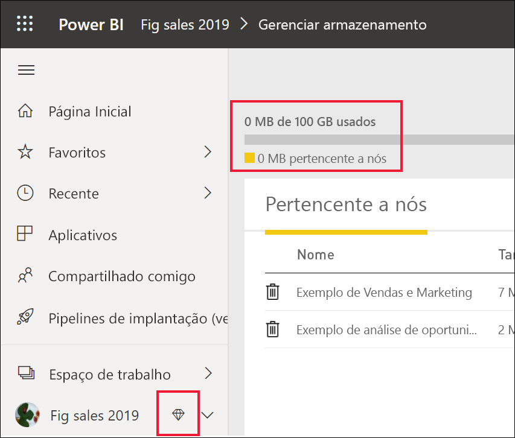
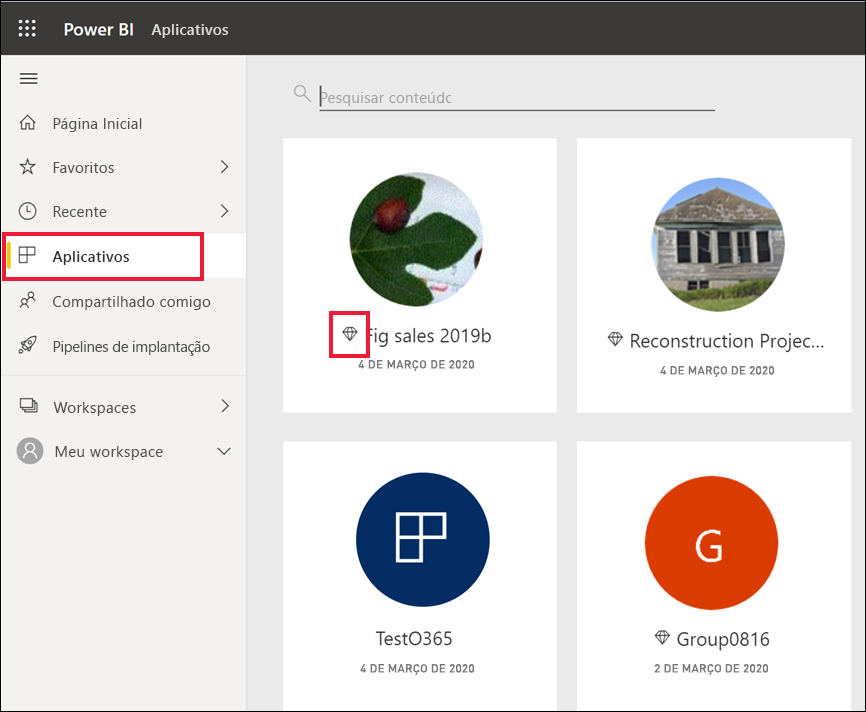
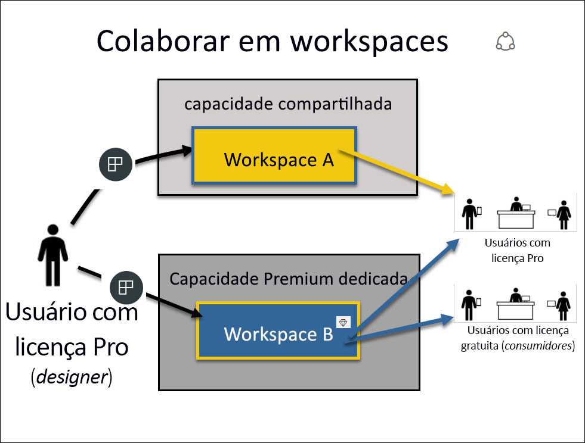
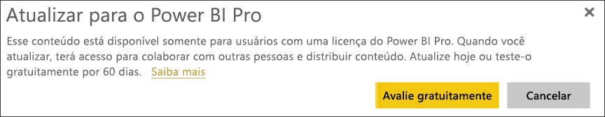

# Como usar o serviço do Power BI como *consumidor*

[!INCLUDE[consumer-appliesto-ynnn](../includes/consumer-appliesto-ynnn.md)]

Como [*consumidor*](end-user-consumer.md), você usa o serviço do Power BI para explorar relatórios e dashboards a fim de tomar decisões de negócios orientadas por dados. Se você usa o Power BI há algum tempo ou tem conversado com seus colegas *designers*, provavelmente já sabe que há alguns recursos que só funcionam se você tem um determinado tipo de licença, assinatura ou permissões. 

O que você pode fazer no serviço do Power BI depende de três coisas:
-    o tipo de assinatura que você está usando
-    o local em que o conteúdo está armazenado
-    as funções e permissões atribuídas a você

Neste artigo, descrevemos as funcionalidades de cada tipo de licença e como *o local em que o conteúdo está armazenado* pode afetar *o que você pode fazer com ele*. Você também aprenderá a examinar sua licença e assinatura e descobrir em que local o conteúdo está armazenado. Para obter mais informações sobre funções e permissões, confira [funções de workspace](end-user-workspaces.md).

## Licenças

Cada usuário do serviço do Power BI está usando uma licença *gratuita* ou uma licença *Pro*. Se você é um *consumidor* do Power BI, provavelmente está usando uma licença gratuita que é gerenciada pelo administrador. 

É possível ter mais de uma licença ao mesmo tempo.  O serviço sempre fornece uma experiência igual à melhor licença que você tem no momento. 

## Capacidade do Power BI Premium

O Premium é uma assinatura organizacional que fornece uma forma diferente de armazenar conteúdo: em capacidade dedicada. Com o Premium, qualquer pessoa, dentro ou fora da organização, pode exibir todo o conteúdo do Power BI, sem comprar licenças individuais do Power BI Pro. 

O Premium possibilita a distribuição difundida de conteúdo por usuários do Pro, sem precisar de licenças do Pro para os destinatários que veem o conteúdo. As licenças Pro são necessárias para criadores de conteúdo. Os designers conectam-se a fontes de dados, modelam dados e criam relatórios e dashboards empacotados como aplicativos de workspace. O usuário sem uma licença Pro ainda pode acessar um workspace em uma capacidade do Power BI Premium, desde que tenha uma função de Visualizador.

Dentro desses workspaces, os designers atribuem funções, como **Visualizador**, **Colaborador**, **Membro** e **Administrador**, que determinam a extensão até a qual os colegas podem interagir com o conteúdo. Para obter mais informações, confira [permissões e funções do workspace.](end-user-workspaces.md) 

Para obter mais informações sobre a capacidade Premium, confira [O que é o Microsoft Power BI Premium?](../service-premium-what-is.md).

## Descubra quais licenças você tem

Visite a [sua página **Minha conta** da Microsoft](https://portal.office.com/account) para ver quais licenças estão atribuídas a você.  Selecione a guia **Assinaturas**.

O primeiro usuário, Pradtanna, tem Office 365 E5, que inclui uma licença Power BI Pro.

Esse segundo usuário, Zalan, tem uma licença gratuita do Power BI. 

## Descubra se você tem acesso à capacidade Premium

Em seguida, verifique se você faz parte de uma organização que tem a capacidade Premium. Qualquer um dos usuários acima, Pro ou gratuito, pode pertencer a uma organização que tem uma capacidade Premium.  Vamos conferir nosso segundo usuário, Zalan.  

Podemos determinar se a organização de Zalan tem capacidade Premium pesquisando a quantidade de armazenamento disponível. 

- No serviço do Power BI, selecione **Meu workspace** e selecione o ícone de engrenagem no canto superior direito. Escolha **Gerenciar armazenamento pessoal**.

    

    Caso você veja mais de 10 GB, isso significa que você é membro de uma organização que tem uma assinatura Premium. A imagem abaixo mostra que a organização de Zalan tem até 100 GB de armazenamento.  

    

Observe que um usuário Pro já compartilhou um workspace com Zalan. O ícone de losango indica que esse workspace está armazenado na capacidade Premium. 

## Identificar o conteúdo hospedado na capacidade Premium

Outra maneira de descobrir se sua organização tem capacidade Premium é procurar aplicativos e workspaces de aplicativo com um ícone de losango. O losango indica que o conteúdo está armazenado na capacidade Premium. 

Na imagem abaixo, três dos aplicativos estão armazenados na capacidade Premium.

    
Como *consumidor*, desde que o *designer* coloque o workspace na capacidade Premium, você tem a capacidade, **dentro desse workspace**, de visualizar conteúdo compartilhado, colaborar com colegas, trabalhar os dashboards e relatórios de aplicativos e muito mais. O alcance das suas permissões é definido pelo administrador do Power BI e pelo designer de conteúdo. 

   

## Juntando as peças

Quando uma organização adquire uma assinatura Premium, o administrador normalmente atribui licenças Pro aos funcionários que trabalharão com a capacidade Premium criando e compartilhando conteúdo. Além disso, o administrador atribui licenças gratuitas a todos que consumirão esse conteúdo. Os usuários Pro criam [espaços de trabalho de aplicativo](end-user-workspaces.md) e adicionam conteúdo (painéis, relatórios, aplicativos) a esses espaços de trabalho. Para permitir que usuários gratuitos colaborem nesses workspaces, o administrador ou usuário Pro atribui os workspaces na *capacidade dedicada*.    
 

|Tipo de licença  |capacidade compartilhada  |capacidade dedicada  |
|---------|---------|---------|
|**Gratuito**     |  Para uso como uma área restrita pessoal, em que você cria conteúdo para si mesmo e interage com esse conteúdo. Essa é uma ótima maneira de experimentar o serviço do Power BI. Você não pode consumir conteúdo de outras pessoas nem compartilhar seu conteúdo com outros 1     |   Interaja com conteúdo atribuído à capacidade dedicada e compartilhado com você. Os usuários gratuitos e Pro podem colaborar sem o requisito de que os usuários gratuitos tenham contas Pro.      |
|**Pro**     |  Colabore com outros usuários Pro, criando e compartilhando conteúdo.        |  Colabore com usuários gratuitos e Pro, criando e compartilhando conteúdo.       |

1 Confira [Considerações e solução de problemas](#considerations-and-troubleshooting). 

No diagrama abaixo, o lado esquerdo representa os usuários Pro que criam e compartilham conteúdo em espaços de trabalho de aplicativo. 

- O **workspace A** foi criado em uma organização que não tem capacidade Premium. 

- O **workspace B** foi criado em uma organização que tem uma assinatura Premium e foi salvo na capacidade dedicada. Esse workspace tem um ícone de losango.  

    

O *designer* do Power BI Pro pode compartilhar e colaborar com outros usuários Pro em qualquer um dos três workspaces. No entanto, a única maneira em que o usuário Power BI Pro pode compartilhar e colaborar com usuários gratuitos é usando o workspace B, que está na capacidade Premium dedicada.  No workspace, o designer atribui funções a colaboradores. Sua função determina as ações que você pode executar no workspace. Os *consumidores* do Power BI costumam receber a função de *Visualizador*. Para saber mais sobre funções, confira [Workspaces para consumidores do Power BI](end-user-workspaces.md).

## Considerações e solução de problemas
- É possível ter mais de uma licença do Power BI. O serviço do Power BI sempre fornecerá a experiência igual à melhor licença que você tem atualmente. Por exemplo, se você tiver uma licença Pro e uma gratuita, o serviço do Power BI usará a licença Pro.

- Se você quiser compartilhar e criar conteúdo (dashboards, relatórios, aplicativos), talvez não seja um *consumidor* do Power BI, mas, em vez disso, um *designer*. Considere fazer a alteração para uma licença de usuário Pro. Você pode se inscrever em uma avaliação gratuita de 60 dias do Power BI Pro selecionando a caixa de diálogo de atualização que aparece no serviço do Power BI sempre que você tenta usar um recurso Pro.

    

  Quando a avaliação de 60 dias expirar, sua licença mudará de volta para uma licença gratuita do Power BI. Após isso acontecer, você não terá mais acesso aos recursos que exigem uma licença do Power BI Pro. Se você quiser continuar com uma licença Pro, entre em contato com seu administrador sobre como comprar uma licença do Power BI Pro. Se você não tiver um administrador, visite [a página de preços do Power BI](https://powerbi.microsoft.com/pricing/).     

- Se você se inscreveu para uma licença gratuita, ela nunca expira. Portanto, se você atualizar para uma avaliação do Pro ou a sua organização fornecer uma licença Pro e depois sua avaliação terminar ou sua organização remover sua licença Pro, você ainda terá a licença gratuita para fazer fallback, a menos que você ou um administrador cancele essa licença. 

- 1 Uma licença de usuário gratuita para o serviço do Power BI é perfeita para alguém explorando seus recursos ou usando-o para análise de dados pessoais e visualizações usando o **Meu workspace**. Um usuário gratuito não está usando o Power BI para colaborar com colegas. Usuários com licenças gratuitas não podem ver conteúdo compartilhado por outras pessoas nem compartilhar o próprio conteúdo com outros usuários do Power BI. 

    

## Próximas etapas
- [Sou um *consumidor* do Power BI?](end-user-consumer.md)    
- [Saiba mais sobre workspaces](end-user-workspaces.md)    
- [Exibir os recursos do serviço do Power BI por tipo de licença](end-user-features.md)
