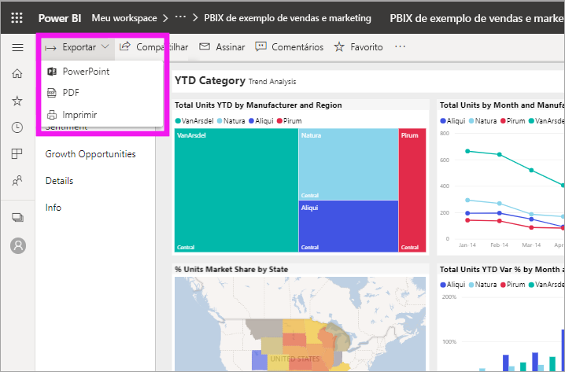
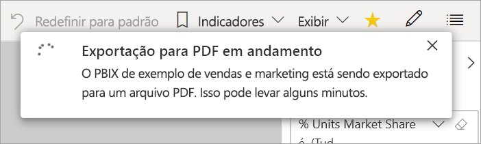
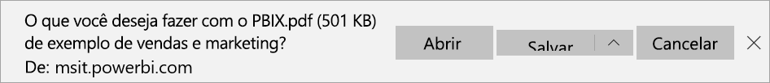

# Exportar relatórios do Power BI para PDF

[!INCLUDE [power-bi-service-new-look-include](../includes/power-bi-service-new-look-include.md)]

Com o Power BI, você pode publicar seu relatório em formato PDF e criar facilmente um documento baseado no relatório do Power BI. Quando você exporta para PDF, cada página no relatório do Power BI se torna uma página individual no seu documento PDF.

## Exportar um relatório do Power BI para o PDF
No serviço do Power BI, selecione um relatório para exibi-lo na tela. Você pode também selecionar um relatório na **Página Inicial**, em **Aplicativos** ou em qualquer outro contêiner, no painel de navegação.

1. Selecione **Exportar** > **PDF** na barra de menus.

    

    Na janela pop-up exibida, você tem a opção de selecionar **Valores Atuais** ou **Valores Padrão**. A opção **Valores Atuais** exporta o relatório no estado atual, que inclui as alterações ativas feitas nos valores de segmentação e de filtro. A maioria dos usuários seleciona essa opção. Como alternativa, selecionar **Valores padrão** exporta o relatório em seu estado original (como o *designer* o compartilhou) e não reflete as alterações feitas no estado original.
    
    Além disso, há uma caixa de seleção para marcar se você deseja ou não exportar as guias ocultas de um relatório. Marque essa caixa se quiser exportar somente as guias de relatório visíveis para você no navegador. Se preferir obter todas as guias ocultas como parte da exportação, deixe a caixa de seleção desmarcada. Se a caixa de seleção estiver esmaecida, não haverá guias ocultas no relatório. Depois de fazer as seleções, selecione **Exportar** para continuar.
    
    É exibida uma barra de progresso no canto superior direito. A exportação pode levar alguns minutos. Você pode continuar trabalhando no Power BI enquanto o relatório está sendo exportado.

    

    Quando o serviço do Power BI concluir o processo de exportação, o banner de notificação mudará para informá-lo.

2. O arquivo estará disponível quando o navegador exibir os arquivos baixados. Na imagem a seguir, ele é mostrado como uma faixa de download na parte inferior da janela do navegador.

    

E isso é tudo para ele. Você pode baixar o arquivo e abri-lo com qualquer visualizador de PDF, como o disponível no Microsoft Edge.

## Limitações e considerações
Há algumas considerações e limitações para ter em mente ao trabalhar com o recurso **Exportar para PDF**.

* No momento, não há suporte para visuais de R e Python. No PDF, esses elementos visuais ficam em branco e exibem uma mensagem de erro. 
* Há suporte para visuais personalizados que foram certificados. Para obter mais informações sobre visuais personalizados certificados, incluindo como obter um visual personalizado certificado, confira [Certificar um visual personalizado](../developer/power-bi-custom-visuals-certified.md). Não há suporte para visuais personalizados que não foram certificados. No PDF, eles são exibidos com uma mensagem de erro.
* O visual ESRI não é compatível
* No momento, não é possível exportar relatórios com mais de 30 páginas.
* O processo de exportar o relatório para PDF pode levar alguns minutos para ser concluído, seja paciente. Os fatores que podem afetar o tempo necessário incluem a estrutura do relatório e a carga atual no serviço do Power BI.
* Se o item de menu **Exportar para PDF** não estiver disponível no serviço do Power BI, provavelmente será porque seu administrador de locatários desabilitou o recurso. Entre em contato com seu administrador de locatários para obter detalhes.
* As imagens de segundo plano são cortadas com a área delimitadora do gráfico. Recomendamos que você remova as imagens de segundo plano antes de exportar para o PDF.
* Relatórios que são propriedade de um usuário fora de seu domínio de locatário do Power BI, como um relatório de alguém fora de sua organização e compartilhado com você, não podem ser publicados no PDF.
* Se você compartilhar um dashboard com alguém fora de sua organização, ou seja, um usuário que não está em seu locatário do Power BI, esse usuário não poderá exportar os relatórios associados ao dashboard compartilhado para o PDF. Por exemplo, se você for aaron@contoso.com, poderá compartilhar com cassie@cohowinery.com. No entanto, cassie@cohowinery.com não poderá exportar os relatórios associados para o PDF.
* Ao exportar para PDF com relatórios que contêm uma imagem de segundo plano, você poderá ver uma imagem distorcida na exportação se usar as opções **Normal** ou **Ajuste** para o **Segundo plano da página**. Para obter melhores resultados, use a opção **Ajuste** para evitar problemas no documento exportado.
* O serviço Power BI usa a configuração de idioma do Power BI como o idioma para a exportação do PDF. Para obter ou definir sua preferência de idioma, selecione o ícone de engrenagem  > **Configurações** > **Geral** > **Idioma**.
* No momento, os filtros de URL não são respeitados ao escolher **Valores atuais** para a exportação.
* Relatórios com tamanhos de página personalizados incomuns podem apresentar problemas em cenários de exportação. Para obter melhores resultados, considere alternar para um tamanho de página padrão para seu relatório.
* Ao exportar para PDF, relatórios que usam temas com fontes personalizadas terão a fonte personalizada substituída por uma padrão.
* Embora procuremos fornecer uma experiência consistente, não podemos garantir que o PDF exportado do serviço do Power BI sempre corresponderá ao PDF exportado de um arquivo local do Power BI Desktop.

## Próximas etapas
[Imprimir um relatório](end-user-print.md)
