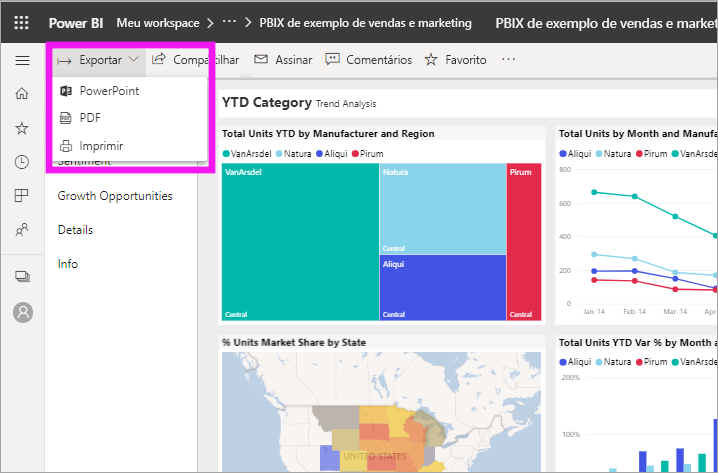
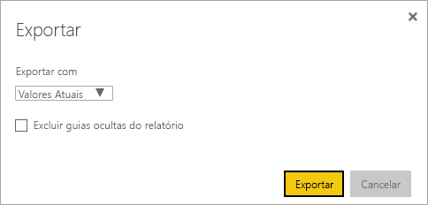
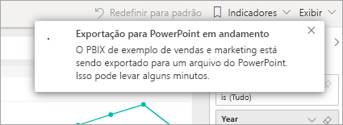

# Exportar relatórios do Power BI para o PowerPoint

[!INCLUDE [power-bi-service-new-look-include](../includes/power-bi-service-new-look-include.md)]

Com o Power BI, você pode publicar seu relatório no Microsoft PowerPoint e criar facilmente um conjunto de slides com base em seu relatório do Power BI. Quando você exporta para o PowerPoint, ocorre o seguinte:

* Cada página no relatório do Power BI se torna um slide individual no PowerPoint.
* Cada página no relatório do Power BI é exportada como uma única imagem de alta resolução no PowerPoint.
* As configurações de filtros e segmentações que você adicionou ao relatório são preservadas.
* É criado um link no PowerPoint que é vinculado ao relatório do Power BI.

Obter o **relatório do Power BI** exportado no **PowerPoint** é rápido. Siga as etapas descritas na próxima seção.

## Exportar um relatório do Power BI para o PowerPoint
No serviço do Power BI, selecione um relatório para exibi-lo na tela. Você pode também selecionar um relatório na **Página Inicial**, em **Aplicativos** ou em qualquer outro contêiner no painel de navegação esquerdo.

Quando o relatório que você deseja exportar para o PowerPoint for exibido na tela, selecione **Exportar** > **PowerPoint** na barra de menus.

Na janela pop-up exibida, você tem a opção de selecionar **Valores Atuais** ou **Valores Padrão**. A opção **Valores Atuais** exporta o relatório no estado atual, que inclui as alterações ativas feitas nos valores de segmentação e de filtro. A maioria dos usuários seleciona essa opção. Como alternativa, a seleção de **Valores Padrão** exporta o relatório no estado original, como o *autor* o compartilhou, e não reflete as alterações feitas no estado original.

 
Além disso, há uma caixa de seleção para marcar se você deseja ou não exportar as guias ocultas de um relatório. Marque essa caixa se quiser exportar somente as guias de relatório visíveis para você no navegador. Se preferir obter todas as guias ocultas como parte da exportação, deixe a caixa de seleção desmarcada. Se a caixa de seleção estiver esmaecida, não haverá guias ocultas no relatório. Depois de fazer as seleções, selecione **Exportar** para continuar.

Você verá uma faixa de notificação no canto superior direito da janela do navegador de serviço do Power BI de que o relatório está sendo exportado para o PowerPoint. A exportação pode levar alguns minutos. Você pode continuar trabalhando no Power BI enquanto o relatório está sendo exportado.

Após o serviço do Power BI concluir o processo de exportação, o banner de notificação mudará para informá-lo. O arquivo estará disponível quando o navegador exibir os arquivos baixados. Na imagem a seguir, ele é mostrado como uma faixa de download na parte inferior da janela do navegador.

E isso é tudo para ele. Você pode baixá-lo, abri-lo com o PowerPoint e, em seguida, modificá-lo ou aprimorá-lo, como faria com qualquer outro material do PowerPoint.

## Verifique o arquivo do PowerPoint exportado
Quando você abre o arquivo do PowerPoint que o Power BI exportou, encontra alguns elementos interessantes e úteis. Dê uma olhada na imagem a seguir e veja os elementos numerados que descrevem alguns desses recursos interessantes.

1. A primeira página do conjunto de slides inclui o nome do relatório e um link para que você possa **Exibir no Power BI** o relatório no qual o conjunto de slides se baseia.
2. Você também obtém algumas informações úteis sobre o relatório. **Última atualização de dados** mostra a data e a hora em que o relatório exportado se baseia. **Baixado em** mostra a data e a hora em que o relatório de Power BI foi exportado para um arquivo do PowerPoint.
3. Cada página do relatório é um slide separado, conforme mostrado no painel de navegação esquerdo. 
4. O relatório publicado é renderizado no idioma de acordo com as configurações do Power BI ou pela configuração de localidade do seu navegador. Para obter ou definir sua preferência de idioma, selecione o ícone de engrenagem  > **Configurações** > **Geral** > **Idioma**. Para obter informações sobre localidade, confira [Idiomas com suporte e países ou regiões do Power BI](../supported-languages-countries-regions.md).
5. A apresentação do PowerPoint inclui um slide de rosto com a hora de exportação no fuso horário correto.

Quando você entrar em um slide individual, verá que cada página de relatório é uma imagem independente.

>[!NOTE]
> Ter um visual para cada página do relatório é um novo comportamento. O comportamento anterior, que fornecia uma imagem independente para cada visual, não está mais implementado. 
 

O que fazer com seu material do PowerPoint daí em diante, ou com qualquer uma das imagens em alta resolução, cabe a você.

## Limitações
Há algumas considerações e limitações para ter em mente ao trabalhar com o recurso **Exportar para o PowerPoint**.

* No momento, não há suporte para visuais de R. Esses visuais são exportados como uma imagem em branco para o PowerPoint com uma mensagem de erro que afirma que não há suporte para o visual.
* Há suporte para visuais personalizados que foram certificados. Para obter mais informações sobre visuais personalizados certificados, incluindo como obter um visual personalizado certificado, confira [Certificar um visual personalizado](../power-bi-custom-visuals-certified.md). Não há suporte para visuais personalizados que não foram certificados. Eles são exportados como uma imagem em branco para o PowerPoint com uma mensagem de erro que afirma que não há suporte para o visual.
* No momento, não é possível exportar relatórios com mais de 30 páginas de relatório.
* O processo de exportar o relatório para o PowerPoint pode levar alguns minutos para ser concluído, seja paciente. Os fatores que podem afetar o tempo necessário incluem a estrutura do relatório e a carga atual no serviço do Power BI.
* Se o item de menu **Exportar para o PowerPoint** não estiver disponível no serviço do Power BI, provavelmente será porque seu administrador de locatários desabilitou o recurso. Entre em contato com seu administrador de locatários para obter detalhes.
* As imagens de segundo plano são cortadas com a área delimitadora do gráfico. Recomendamos que você remova as imagens de segundo plano antes de exportar para o PowerPoint.
* As páginas no PowerPoint sempre são criadas com o tamanho padrão 9:16, independentemente do tamanho ou das dimensões da página original no relatório do Power BI.
* Os relatórios que são propriedade de um usuário fora de seu domínio de locatário do Power BI, como um relatório de alguém fora de sua organização e compartilhado com você, não podem ser publicados no PowerPoint.
* Se você compartilhar um dashboard com alguém fora de sua organização, ou seja, um usuário que não está em seu locatário do Power BI, esse usuário não poderá exportar os relatórios associados ao dashboard compartilhado para o PowerPoint. Por exemplo, se você for aaron@contoso.com, poderá compartilhar com david@cohowinery.com. No entanto, david@cohowinery.com não poderá exportar os relatórios associados para o PowerPoint.
* A exportação poderá não funcionar com versões mais antigas do PowerPoint.
* Conforme mencionado anteriormente, cada página do relatório é exportada como uma única imagem no arquivo do PowerPoint.
* O serviço Power BI usa a configuração de idioma do Power BI como o idioma para a exportação do PowerPoint. Para obter ou definir sua preferência de idioma, selecione o ícone de engrenagem  > **Configurações** > **Geral** > **Idioma**.
* A informação de **Baixado em** (horário) no slide capa para o arquivo exportado do PowerPoint é definido de acordo com o fuso horário do computador no momento da exportação.
* No momento, os filtros de URL não são respeitados ao escolher **Valores atuais** para a exportação.

## Próximas etapas
[Imprimir um relatório](end-user-print.md)
