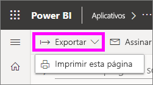
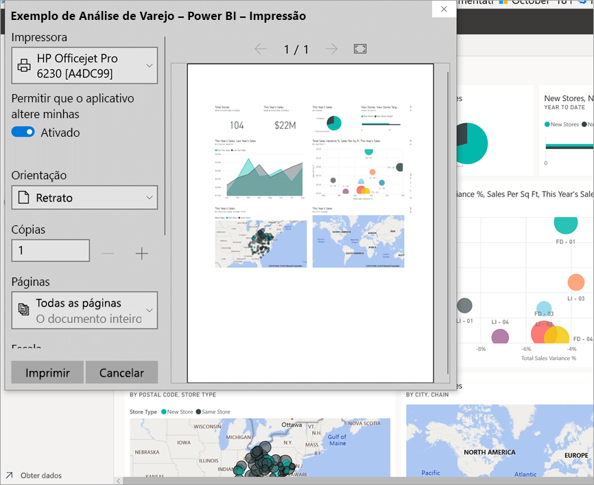
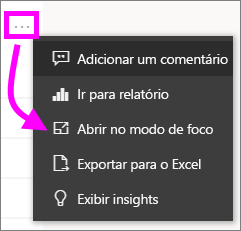
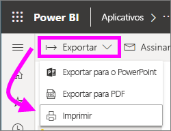

# Impressão no serviço do Power BI

[!INCLUDE[consumer-appliesto-yynn](../includes/consumer-appliesto-yynn.md)]
## O que pode ser impresso
[!INCLUDE [power-bi-service-new-look-include](../includes/power-bi-service-new-look-include.md)]

Imprima um dashboard inteiro, um bloco do dashboard, uma página de relatório ou um visual de relatório no serviço do Power BI. Se o relatório tiver mais de uma página, você precisará imprimir cada uma delas separadamente. 

## Considerações sobre a impressão

A maioria dos dashboards e relatórios do Power BI são criados por *designers* de relatórios para serem usados online e ficarem incríveis quando exibidos em diversos dispositivos. Quando você imprime um relatório, o modo como esse conteúdo é exibido no papel é controlado pelo navegador. 

Há configurações de navegador que você pode usar para ajustar a impressão, mas, ainda assim, você pode não ter o resultado desejado. Em vez disso, considere [exportar para PDF](end-user-pdf.md) primeiro e imprimir o PDF. 

## Ajustar as configurações de impressão do navegador
Quando você imprime do Power BI, o navegador abre uma janela de impressão. A janela de impressão de cada navegador é diferente. No entanto, você descobrirá que todas elas têm opções semelhantes disponíveis para controlar a aparência da impressão. 

Veja algumas dicas rápidas que você pode usar para formatar a cópia impressa.

   > 
1. Se o dashboard, relatório ou visual for mais largo do que alto, considere usar o layout de **paisagem**. 

   

2. Para ajustar mais à página impressa, ajuste coisas como as margens e a escala. 

    

Teste as configurações de seu navegador até chegar à aparência desejada. Alguns navegadores têm até opções para imprimir gráficos em segundo plano. 

## Imprimir um painel
1. Abra o dashboard que você deseja imprimir.
2. No canto superior esquerdo, selecione Exportar e escolha **Imprimir esta página**.
   
    

3. A janela Imprimir do navegador é aberta. Escolha as configurações. Por exemplo, se o dashboard for mais largo do que longo, talvez você queira alterar o layout para **Paisagem**. Selecione **Imprimir**.
   
    

## Imprimir um bloco do dashboard
1. Abra o dashboard no [modo de tela inteira](end-user-focus.md) selecionando o ícone de tela inteira  na barra de menus superior.

3. [Abra o bloco no modo de foco](end-user-focus.md) passando o mouse para revelar **Mais opções** (...) e escolhendo **Abrir no modo de foco** ou o .
   
    

4. Focalize o bloco para revelar o menu Opções.
   
    

4. Selecione o ícone de Impressão .     

5. A janela Imprimir do navegador é aberta. Escolha as configurações. Por exemplo, se o bloco não estiver se ajustando à página, talvez você queira alterar a escala para 75%. Selecione **Imprimir**.

     

> [!TIP]
> Se você seguiu todas as etapas e o bloco ainda não está sendo exibido da maneira desejada, tente o seguinte.
> 1. Abra a janela Imprimir e faça as alterações nas configurações de impressão que você acredita que resultarão na melhor impressão. Por exemplo, altere o layout, as margens e a escala. 
> 2. Mas, em vez de imprimir, selecione **Cancelar**. 
> 3. Siga as etapas 1 a 5 novamente. Seu bloco será ajustado às novas configurações da janela Imprimir e estará pronto para impressão.

## Imprima uma página de relatório
Somente uma página de relatório pode ser impressa por vez.

1. Abra o relatório e selecione **Exportar** > **Imprimir** para imprimir a página de relatório atual.
   
    
2. A janela Imprimir do navegador é aberta.

3. Siga as etapas de impressão em **Imprimir um dashboard** acima.
   

## Imprimir um visual de relatório
1. [Abra o visual no Modo de foco](end-user-focus.md) passando o mouse sobre o bloco e selecionando o ícone de Foco  no canto superior direito.

2. No canto superior esquerdo, selecione **Exportar** > **Imprimir** para imprimir o visual.

    

3. Siga as etapas de impressão em **Imprimir um dashboard** acima.

## Considerações e solução de problemas

* P: Não consigo imprimir todas as páginas do relatório de uma vez.    
* R: Isso está correto. As páginas do relatório só podem ser impressas uma página por vez.
* P: Não consigo imprimir em PDF.    
* R: Você só verá essa opção se já tiver configurado o driver de PDF em seu navegador.    
* P: O que vejo quando seleciono **Imprimir** não corresponde ao que é mostrado aqui.    
* R: As telas Imprimir variam de acordo com o navegador e a versão do software.
* P: Minha cópia impressa não está dimensionada corretamente.  Meu dashboard não se ajusta à página. Outras perguntas sobre escala e orientação.    
* R: Não podemos garantir que a cópia impressa seja exatamente a mesma que é exibida no serviço do Power BI. Itens como escala, margens, detalhes visuais, orientação e tamanho não são controlados pelo Power BI. Tente ajustar as configurações de impressão para seu navegador. Algumas das impressões que sugerimos acima são a orientação da página (retrato ou paisagem), o tamanho da margem e a escala. Se elas não ajudarem, consulte a documentação de seu navegador específico.      
* P: Quando estou imprimindo no modo de tela inteira, não vejo a opção de impressão ao passar o mouse sobre o visual.   
* R: Volte para o dashboard ou relatório na exibição padrão e abra o visual novamente no modo de foco e, em seguida, no modo de tela inteira. 

## Próximas etapas
[Compartilhar relatórios e dashboards com seus colegas e outras pessoas](../service-share-dashboards.md)

Mais perguntas? [Experimente a Comunidade do Power BI](https://community.powerbi.com/)

