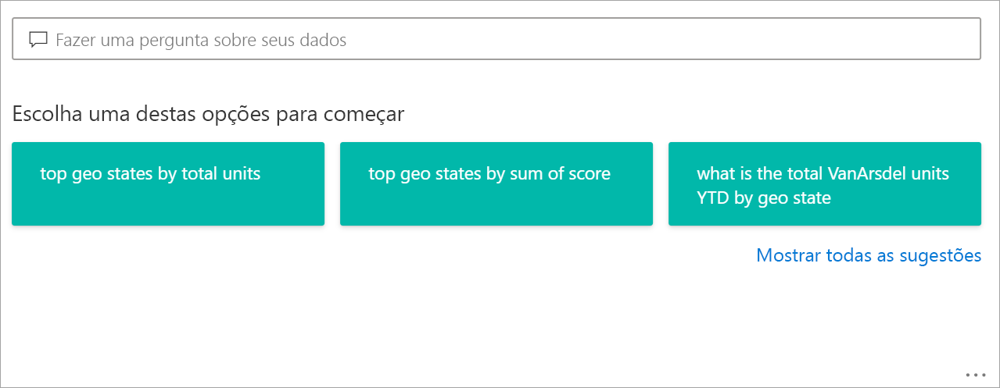
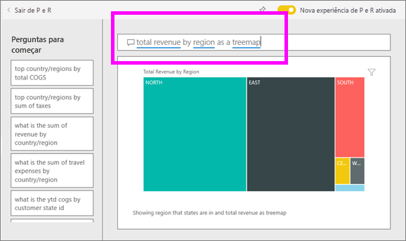
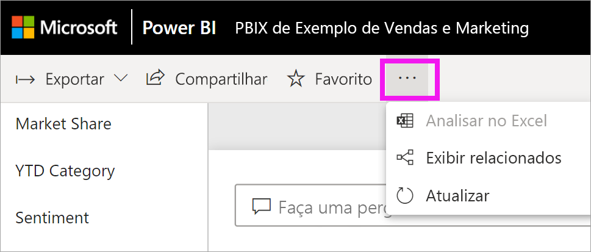
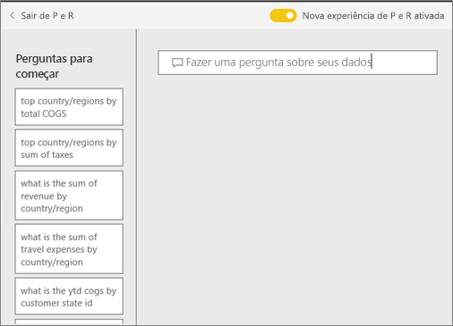
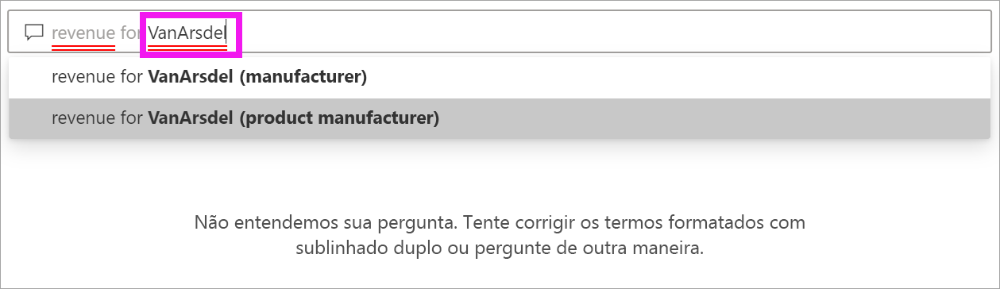
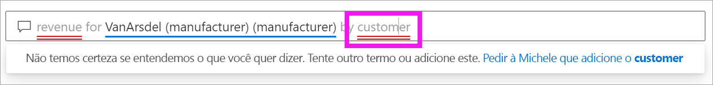
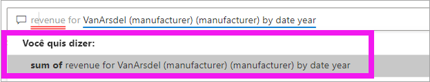
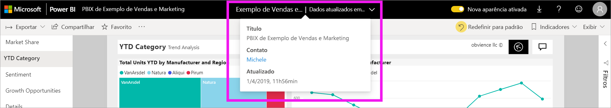

# P e R para **consumidores** do Power BI

[!INCLUDE [power-bi-service-new-look-include](../includes/power-bi-service-new-look-include.md)]

## O que é P e R?
Às vezes, a maneira mais rápida de obter uma resposta de seus dados é fazer uma pergunta usando o idioma natural. Por exemplo, "qual foi o total de vendas no ano passado".

Use P e R para explorar seus dados do Excel usando recursos intuitivos em idioma natural e receba as respostas na forma de quadros e gráficos. P e R é diferente de um mecanismo de pesquisa - P e R fornece apenas resultados sobre os dados no Power BI.

## Qual visualização que faz perguntas e um uso?
Perguntas e respostas escolhe a melhor visualização com base nos dados que estão sendo exibidos. Às vezes, os dados no conjunto de dados subjacente são definidos como um determinado tipo ou categoria, e isso ajuda o P e R saber como exibi-los. Por exemplo, se os dados são definidos como um tipo de data, é mais provável que sejam exibidos como um gráfico de linhas. Dados que são categorizados como uma cidade são mais prováveis de ser exibidos como um mapa.

Você também pode informar à P e R o visual que será usado, adicionando-o à sua pergunta. Mas tenha em mente que não será sempre possível exibir os dados no tipo de visual que você solicitou. A P e R mostrará a você uma lista de tipos de visual viáveis.

## Onde posso usar as P e R?
Você encontrará a P e R em painéis no serviço do Power BI, na parte inferior do painel no Power BI Mobile. A menos que o designer tenha lhe concedido permissões de edição, você poderá usar as P e R para explorar dados, mas não poderá salvar nenhuma visualização criada com as P e R.

Você também encontrará P e R em relatórios se o *designer* de relatório tiver adicionado um [visual de P e R](../visuals/power-bi-visualization-q-and-a.md).   

## P e R em dashboards

A **P e R do Power BI** está disponível com uma licença Pro ou Premium.  [P e R nos aplicativos móveis do Power BI](mobile/mobile-apps-ios-qna.md) e [P e R com o Power BI Embedded](../developer/qanda.md) são abordadas em artigos separados. No momento, a **P e R do Power B** só dá suporte a responder a consultas em linguagem natural frequentes em inglês, embora haja uma visualização disponível para espanhol que pode ser habilitada pelo administrador do Power BI.

A pergunta é apenas o começo.  Divirta-se viajando através de seus dados refinando ou expandindo sua pergunta, revelando informações novas de confiança, concentrando-se em detalhes e diminuindo o zoom para uma exibição mais ampla. Você vai se deliciar com as ideias e descobertas feitas.

A experiência é verdadeiramente interativa... e rápida! Equipada com um armazenamento na memória, a resposta é quase instantânea.

## Usar a P e R em um painel no serviço do Power BI
No serviço do Power BI (app.powerbi.com), um painel contém blocos fixados de um ou mais conjuntos de dados, portanto, você pode fazer perguntas sobre os dados contidos em qualquer um desses conjuntos de dados. Para ver quais relatórios e conjuntos de dados foram usados para criar o dashboard, selecione **Exibir relacionados** na lista suspensa **Mais ações**.

## Por onde começo?
Primeiro, familiarize-se com o conteúdo. Dê uma olhada nos visuais no painel e no relatório. Tenha uma ideia do tipo e do intervalo de dados que estão disponíveis para você. 

Por exemplo:

* Se os valores e os rótulos do eixo de um visual incluem "vendas", "conta", "mês" e "oportunidades", é possível fazer perguntas como: "qual *conta* tem a melhor *oportunidade*” ou “mostre as *vendas* por mês como um gráfico de barras".

* Se você tiver dados de desempenho do site do Google Analytics, poderá perguntar às P e R sobre o tempo gasto em uma página da Web, o número de visitas únicas à página e as taxas de participação do usuário. Ou, se você estiver consultando dados demográficos, você pode fazer perguntas sobre idade e renda doméstica por local.

Quando você estiver familiarizado com os dados, volte ao painel e coloque o cursor na caixa de perguntas. Isso abrirá a tela de P e R.

 

Mesmo antes de começar a digitar, a P e R exibe uma nova tela com sugestões para ajudá-lo a formar sua pergunta. Você vê frases e perguntas contendo nomes das tabelas nos conjuntos de dados subjacentes e poderá até mesmo ver perguntas *em destaque* criadas pelo proprietário do conjunto de dados.

Você pode selecionar qualquer uma para adicioná-la à caixa de pergunta e, depois, refiná-la para encontrar uma resposta específica. 

Outra maneira de o P e R ajudar você a fazer perguntas é com prompts, preenchimento automático e dicas visuais. 

<!--  -->

## O visual de P e R

O visual de P e R permite que você faça perguntas em linguagem natural e obtenha respostas na forma de um visual. O visual de P e R comporta-se como qualquer outro visual, pode ser com filtrado/realçado de modo cruzado e também dá suporte a marcadores e comentários. 

Você pode identificar um visual de P e R por sua caixa de pergunta na parte superior. É aqui que você vai inserir ou digitar perguntas usando idioma natural. O visual do P e R pode ser usado repetidamente para fazer perguntas sobre seus dados. Quando você sai do relatório, o visual do P e R é redefinido para seu padrão. 

## Usar o visual de P e R
Para usar o visual de P e R, selecione uma das perguntas sugeridas ou digite sua própria pergunta em idioma natural. 

### Criar um visual de P e R usando uma pergunta sugerida

Aqui, selecionamos **principais estados geográficos pelo total de unidades**. O Power BI faz o melhor para selecionar o tipo de visual a ser usado. Nesse caso, é um mapa.

Mas você pode informar o Power BI qual tipo de visual deve ser usado adicionando-o à sua consulta de linguagem natural. Saiba que nem todos os tipos de visuais funcionarão ou farão sentido com seus dados. Por exemplo, esses dados não produzirão um gráfico de dispersão útil. Porém, funciona como um mapa preenchido.

### Criar um visual de P e R digitando uma consulta em idioma natural

Se você não tiver certeza sobre o tipo de perguntas a fazer ou a terminologia a ser usada, expanda **Mostrar todas as sugestões** ou examine os outros visuais no relatório. Isso o ajudará a familiarizar-se com os termos e com o conteúdo do conjunto de dados.

1. Digite sua pergunta no campo de P e R usando idioma natural. Ao digitar sua pergunta, o Power BI ajuda você com preenchimento automático, sugestões e comentários.

    - Um sublinhado vermelho é usado para palavras que o Power BI não reconhece. Sempre que possível, o Power BI ajudará a definir essas palavras. Se você visualizar a definição correta, selecione-a na lista suspensa.  

        

    - Se nenhuma das definições estiver correta, tente outro termo ou selecione a palavra sublinhada em vermelho para solicitar que o proprietário do relatório adicione a palavra.

        

    - Conforme você digita mais partes da uma pergunta, o Power BI informa se ele não entende a pergunta e tenta ajudar. No exemplo a seguir, o Power BI pergunta "Você quis dizer..." e sugere uma maneira diferente de formular sua pergunta usando a terminologia de seu conjunto de seus. 

        

2. Depois de selecionar a correção do Power BI, os resultados são exibidos como um gráfico de linhas. 

    

3. Porém, você pode alterar o gráfico de linhas para outro tipo de visual.  

    

## Considerações e solução de problemas

**Pergunta**: Eu não vejo as P e R neste painel.    
**Resposta 1**: se você não vê uma caixa de pergunta, verifique primeiro suas configurações. Para fazer isso, selecione o ícone de engrenagem no canto superior direito da barra de ferramentas do Power BI.   

Em seguida, escolha **Configurações** > **Dashboards**. Verifique se há uma marca de seleção ao lado de **Mostrar a caixa de pesquisa de P e R neste dashboard**.    
  

**Resposta 2**: Às vezes você não terá acesso às configurações. Se o *designer* de dashboard ou o administrador tiver desativado P e R, verifique com eles se você pode reativá-lo sem problemas.   

**Pergunta**: Não estou obtendo os resultados que gostaria de ver ao digitar uma pergunta.    
**Resposta**: Selecione a opção para entrar em contato com o proprietário do relatório ou do dashboard. Você pode fazer isso diretamente em uma página de dashboard de P e R ou no visual de P e R. Outra opção é procurar o proprietário no cabeçalho do Power BI.  Há muitas coisas que o designer pode fazer para melhorar os resultados de P e R. Por exemplo, o designer pode renomear as colunas no conjunto de dados usando termos que são facilmente compreendidos (`CustomerFirstName` em vez de `CustFN`). Já que o designer conhece muito bem o conjunto de dados, ele também pode elaborar perguntas úteis e adicioná-los às perguntas sugeridas de P e R.

## Próximas etapas
Para saber como um visual de P e R é criado e gerenciado por um *designer* de relatório, confira [Tipo de visual de P e R](../visuals/power-bi-visualization-q-and-a.md).
