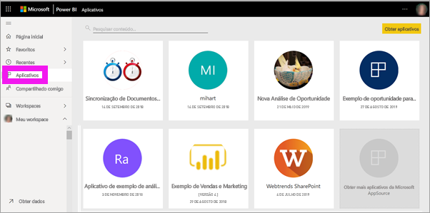
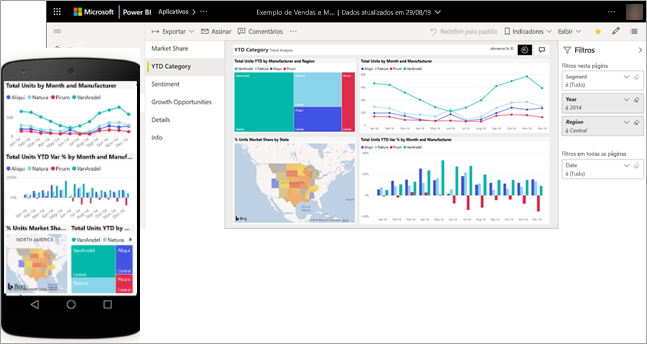
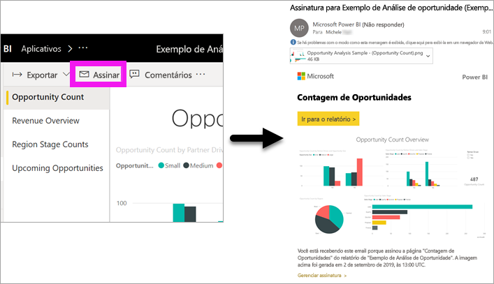
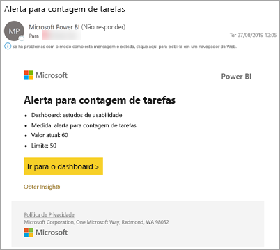
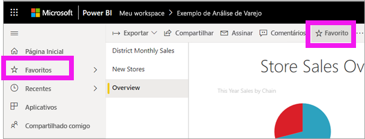
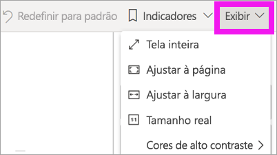
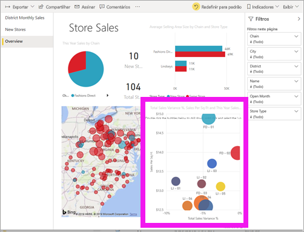
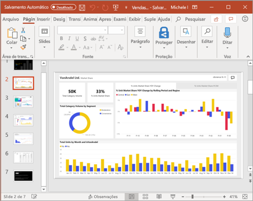

# Início Rápido: saiba mais sobre as funcionalidades do Power BI para *consumidores*
Neste início rápido, você aprenderá como interagir com o Power BI para descobrir informações de negócios controladas por dados. Este artigo não visa ser um aprofundamento do tema, mas sim uma passagem rápida por muitas das ações disponíveis para **consumidores** do Power BI.

Se você não estiver inscrito no Power BI, [inscreva-se para uma avaliação gratuita](https://app.powerbi.com/signupredirect?pbi_source=web) antes de começar.

## O que é Power BI? 
O Power BI é uma coleção de serviços de software, aplicativos e conectores que trabalham juntos para transformar suas fontes de dados não relacionadas em informações coerentes, visualmente envolventes e interativas. Quer seus dados sejam uma simples planilha do Excel ou uma coleção de dados de diferentes origens de dados, o Power BI permite que você se conecte facilmente às suas fontes de dados, visualize (ou descubra) o que é importante e compartilhe isso com qualquer pessoa ou com quem você quiser. 

## Exibição de leitura
O Modo de Exibição de Leitura está disponível no serviço do Power BI para *consumidores* de relatório. Quando um colega compartilhar um relatório, um dashboard ou um aplicativo com você, a exibição de Leitura será sua maneira de explorar e interagir com o relatório. 

Basta abrir o Serviço do Power BI em um navegador ou em um dispositivo móvel. Você e seus colegas trabalham sobre os mesmos aplicativos, dashboards e relatórios confiáveis, que são atualizados automaticamente para que todos trabalhem sempre com o conteúdo mais recente.   

Como o conteúdo não é estático, você pode se aprofundar buscando tendências, insights e outros aspectos de business intelligence. Explore cada parte do conteúdo e até mesmo faça perguntas usando suas próprias palavras. Ou apenas relaxe e deixe que seus dados descubram insights interessantes para você, emitam alertas quando os dados forem alterados e enviem relatórios por email com base em um agendamento prévio definido por você. Todos os seus dados, a qualquer momento, na nuvem ou localmente, por meio de qualquer dispositivo. 

Continue lendo para saber mais sobre essas e muitas outras.

## Conteúdo do Power BI
Quando usamos o termo "conteúdo" no Power BI, estamos nos referindo a relatórios, dashboards e aplicativos. Esses são os blocos de construção que você usará para explorar seus dados e tomar decisões empresariais. 

> [!NOTE]
> Dashboards, relatórios e aplicativos também podem ser exibidos e compartilhados em dispositivos móveis.

###  Aplicativos

Um *aplicativo* é um tipo de conteúdo do Power BI que combina dashboards e relatórios relacionados em um só lugar. Um aplicativo pode ter um ou mais dashboards e um ou mais relatórios, todos agrupados. Os aplicativos são criados por *designers* do Power BI que distribuem e compartilham os aplicativos com *consumidores* como você. 

Uma maneira de exibir seus aplicativos é selecionar **Aplicativos** no painel de navegação e escolher um aplicativo para abrir.

Para saber mais sobre como exibir aplicativos, confira [Aplicativos do Power BI](end-user-apps.md)

### Relatórios

Um relatório do Power BI é uma exibição de um conjunto de dados em várias perspectivas, com visuais que representam as diferentes descobertas e informações obtidas por meio desse conjunto de dados. Um relatório pode ter um único visual ou páginas repletas de visuais. Os relatórios são criados por *designers* do Power BI que distribuem e compartilham os relatórios com *consumidores* como você.

Para saber como exibir relatórios, confira [Relatórios do Power BI](end-user-reports.md)

### Dashboards

Um dashboard do Power BI é uma página única, geralmente chamada de tela, que usa as visualizações para contar uma história. Como ele é limitado a uma página, um dashboard bem projetado contém apenas os elementos mais importantes da história.

As visualizações exibidas no dashboard são chamadas de blocos e são fixadas ao dashboard por *designers* de relatórios. Na maioria dos casos, quando você seleciona um bloco, é levado para a página do relatório em que a visualização foi criada. 

Para saber como exibir dashboards, confira [Dashboards do Power BI](end-user-dashboards.md)
 
## Interagir no serviço do Power BI

### Colaborar com colegas
Ignore o email. Adicione um comentário pessoal ou inicie uma conversa com colegas sobre um dashboard, diretamente naquele dashboard. O recurso de comentário é apenas uma das maneiras de colaborar com outras pessoas. 

Saiba mais sobre [como comentar](end-user-comment.md)

### Relaxe e deixe Power BI trabalhar por você
Duas das maneiras de o serviço do Power BI trabalhar por você é com assinaturas e alertas. 

#### Assine um dashboard (ou relatório)
Não é necessário abrir o Power BI para monitorar um dashboard.  Você pode assiná-lo em vez disso, e o Power BI enviará um email com um instantâneo de dashboard conforme agendado por você. 

.

 Saiba mais sobre [assinaturas do Power BI](end-user-subscribe.md)

#### Receber alertas quando seus dados atingirem um limite
Seus dados estão ativos e seus visuais são atualizados automaticamente para refletir isso. Se você quiser ser notificado quando os dados forem alterados acima ou abaixo de um limite definido, use alertas de dados. Os alertas funcionam em medidores, KPIs e cartões.    

O Power BI envia um email quando o valor aumenta ou diminui após o limite definido.  

Saiba mais sobre [Alertas do Power BI](end-user-alerts.md)

### Usar P e R para fazer perguntas usando idioma natural
Às vezes, a maneira mais rápida de obter uma resposta de seus dados é fazer uma pergunta usando o idioma natural. A caixa de perguntas de P e R está disponível na parte superior do seu dashboard. Por exemplo, “mostre-me a contagem de grandes oportunidades por estágio de vendas como um funil”. 

Saiba mais sobre [P e R do Power BI](end-user-q-and-a.md)

### Exibir detalhes em uma visualização
Os visuais são compostos por pontos de dados e, ao focalizar um ponto de dados, é possível ver os detalhes.

### Adicionar um dashboard como favorito
Quando você adicionar um conteúdo aos *favoritos*, poderá acessá-lo do painel de navegação. O painel de navegação fica visível de praticamente qualquer área do Power BI. Os favoritos normalmente são os dashboards, páginas de relatório e aplicativos que você visita com mais frequência.

No canto superior direito do serviço do Power BI, selecione **Favorito** ou, se não estiver visível, selecione **Mais opções** (...) e **Favorito** na lista suspensa. 
   

Dê uma olhada nas outras ações disponíveis na lista suspensa.  Não abordamos todas elas neste artigo, mas as abordamos em outros artigos.  Saiba mais usando o sumário do Power BI ou o campo **Pesquisar**. 

Saiba mais sobre [favoritos e destaque](end-user-favorite.md)

### Ajustar as dimensões da exibição
Os relatórios são exibidos em vários dispositivos diferentes, com diferentes tamanhos de tela e taxas de proporção.  O processamento padrão pode não ser o que você deseja ver em seu dispositivo.  

Para ajustar, na barra de menus superior direita, selecione **Exibir** e escolha uma das opções de exibição. 

### Veja como os visuais em uma página são interconectados
Realçar e filtrar de maneira cruzada as visualizações relacionadas em uma página de relatório. As visualizações em uma página de relatório único são "conectadas" umas às outras.  Isso significa que, se você selecionar um ou mais valores em uma visualização, outras visualizações que usam o mesmo valor serão alteradas com base na sua seleção.

> 

Saiba mais sobre as [interações visuais](end-user-interactions.md)

<!-- ###  Open the **Selection** pane
Easily navigate between the visualizations on the report page. 

1. Select **View > Selection pane** to open the Selection pane. Toggle **Selection pane** to On.

    

2. The Selection pane opens on your report canvas. Select a visual from the list to make it active.

     -->

### Ampliar elementos visuais individuais
Focalize um visual e selecione o ícone do **modo Foco**. Quando você exibe uma visualização no modo de Foco, ela se expande para preencher toda a tela do relatório, conforme mostrado abaixo.

<!-- To display that same visualization without the distraction of menubars, filter pane, and other chrome -- select the **Full Screen** icon from the top menubar    .

 -->

Saiba mais sobre o [modo de foco e o modo de tela inteira](end-user-focus.md)

### Classificar uma visualização
Os visuais em uma página de relatório podem ser classificadas e salvas com as alterações aplicadas. 

Passe o mouse sobre um visual para ativá-lo e selecione **Mais opções** (...) para abrir as opções de classificação.

 

Saiba mais sobre [como classificar visuais](end-user-search-sort.md)

### Mostrar os dados usados para criar uma visualização
Uma visualização do Power BI é construída usando dados dos conjuntos de dados subjacentes. Se você estiver interessado em ver o que acontece nos bastidores, o Power BI permitirá *exibir* os dados usados para criar o visual. Ao selecionar **Mostrar Dados**, o Power BI exibirá os dados abaixo (ou ao lado) da visualização.

Com um visual ativo, selecione **Mais opções** (...) e **Mostrar dados**.
   
   

### Exportar dados para o Excel
Além de mostrar os dados usados para criar um visual, você também pode exportar esses dados e exibi-los no Microsoft Excel. Ao exportar para o Excel, você está criando um documento separado, uma planilha que não faz parte do Power BI. As alterações feitas no arquivo do Excel não afetarão os dados no Power BI. Se você quiser examinar mais atentamente os dados ou usar os dados em outro aplicativo ou para outra finalidade, o Power BI dá essa flexibilidade.

<!-- Exporting isn’t limited to individual visuals; you can export entire reports to PowerPoint or PDF to share with your colleagues.

 -->

Essa foi uma visão geral rápida de apenas algumas das coisas que os *consumidores* podem fazer com o serviço do Power BI.  

## Limpar recursos
- Se você se conectou a um aplicativo, no painel de navegação, selecione **Aplicativos** para abrir a lista de conteúdo de Aplicativos. Passe o mouse sobre o aplicativo a ser excluído e selecione o ícone de lixeira.

- Caso tenha importado ou se conectado a um relatório de exemplo do Power BI, no painel de navegação, abra **Meu workspace**. Usando as guias na parte superior, localize o dashboard, relatório e conjunto de dados e selecione o ícone de lixeira para cada um.

## Próximas etapas
[Power BI para consumidores](end-user-consumer.md)

