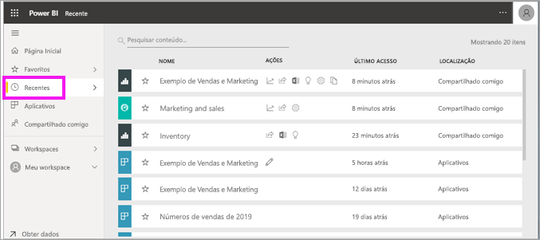
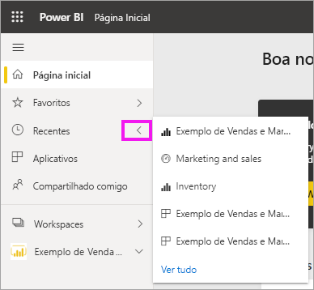
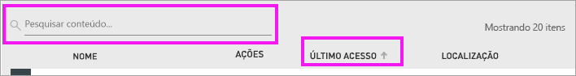

# Conteúdo **recente** no serviço do Power BI
Conteúdo recente são os últimos itens que você visitou no serviço do Power BI, até um máximo de 20 itens.  Isso inclui: dashboards, relatórios, aplicativos e pastas de trabalho.

Veja Amanda demonstrar como as listas de conteúdo **Recente** do serviço do Power BI são preenchidas e, em seguida, siga as instruções passo a passo abaixo do vídeo para testar por conta própria.

<iframe width="560" height="315" src="https://www.youtube.com/embed/G26dr2PsEpk" frameborder="0" allowfullscreen></iframe>

> [!NOTE]
> Este vídeo usa uma versão mais antiga do serviço do Power BI.

## Exibir conteúdo recente
Para ver seus cinco itens visitados mais recentemente, no painel de navegação, selecione a seta à direita de **Recente**.  Nesse local você pode selecionar o conteúdo recente para abri-lo. Apenas os cinco itens mais recentes são listados.

Se você tiver mais de cinco itens recentemente visitados, selecione **Ver todos** para abrir a tela Recente. Também é possível selecionar **Recente**, ou o , no menu de navegação esquerdo.

## Ações disponíveis na lista de conteúdo **Recente**
As ações disponíveis para você dependerão das configurações atribuídas pelo *designer* de conteúdo. Algumas de suas opções podem incluir:
* Selecionar o ícone de estrela para [adicionar um dashboard, relatório ou aplicativo aos favoritos](end-user-favorite.md) .
* Alguns dashboards e relatórios podem ser compartilhados novamente  .
* [Abrir o relatório no Excel](end-user-export.md)  
* [Exibir insights](end-user-insights.md) que o Power BI encontrar nos dados .
* Além disso, se suas listas se tornarem longas, [use o campo de pesquisa e a classificação para encontrar o que você precisa](end-user-search-sort.md). Para descobrir se uma coluna pode ser classificada, passe o cursor do mouse sobre ela para ver se uma seta é exibida. Neste exemplo, passar o mouse sobre **Último acesso** revela uma seta – o conteúdo recente pode ser classificado por data de acesso. 

    

## Próximas etapas
[Aplicativos do serviço do Power BI](end-user-apps.md)

Mais perguntas? [Experimente a Comunidade do Power BI](https://community.powerbi.com/)

