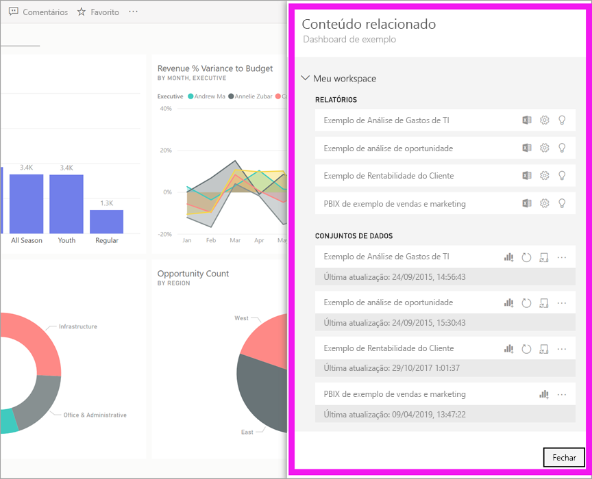
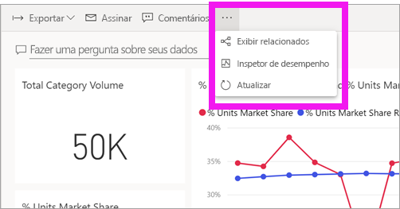
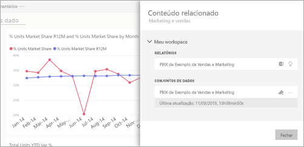
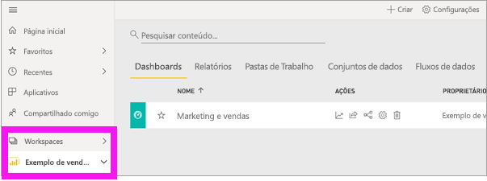
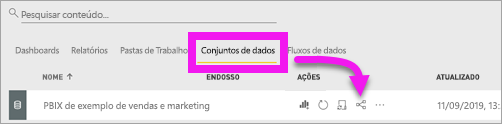
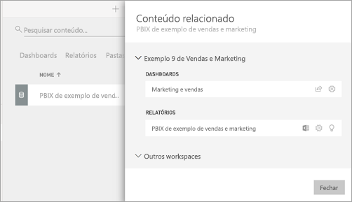

# Exibir conteúdo relacionado no serviço do Power BI
O painel **Conteúdo relacionado** mostra como o conteúdo do serviço do Power BI (dashboards, relatórios e conjuntos de dados) está interconectado. O painel **Conteúdo relacionado** também é uma plataforma de lançamento para executar ações. Aqui, é possível abrir um painel, abrir um relatório, gerar insights, analisar os dados no Excel e muito mais.  

No Power BI, os relatórios são gerados a partir de conjuntos de dados, visualizações de relatórios são fixadas em painéis e os elementos visuais dos painéis nos redirecionam aos relatórios. Mas como saber quais painéis hospedam elementos visuais do seu relatório de Marketing? E como localizar esses painéis? O seu painel Compras utiliza elementos visuais de mais de um conjunto de dados? Nesse caso, que nomes receberam e como é possível abri-los e editá-los? Seu conjunto de dados de RH está sendo usado em algum relatório ou painel? Ou, pode ser movido sem desfazer links? Perguntas como essas podem ser todas respondidas no painel **Conteúdo relacionado**.  O painel exibe o conteúdo relacionado, permite que você tenha controle sobre o conteúdo e navegue facilmente pelo conteúdo relacionado.

> [!NOTE]
> O recurso de conteúdo relacionado não funciona em conjuntos de dados de streaming.
> 
> 

## Exibir o conteúdo relacionado de um painel ou relatório
Assista Exibirá o conteúdo relacionado de um dashboard. Em seguida, siga as instruções passo a passo abaixo do vídeo para experimentar sozinho com o conjunto de dados exemplo de Análise de compras.

<iframe width="560" height="315" src="https://www.youtube.com/embed/B2vd4MQrz4M#t=3m05s" frameborder="0" allowfullscreen></iframe>

Com um painel ou relatório aberto, selecione as reticências (...) na barra de menus e escolha **Exibição relacionada** na lista suspensa.

O painel **Conteúdo relacionado** é aberto. Para um painel, ele mostra todos os relatórios com visualizações fixadas no painel e seus conjuntos de dados associados. Para esse painel, há visualizações fixadas de apenas um relatório, e esse relatório tem base em apenas um conjunto de dados. 

Neste ponto, você pode controlar diretamente o conteúdo relacionado.  Por exemplo, selecione um nome de relatório ou de painel para abri-lo.  Para um relatório listado, selecione um ícone para [analisar no Excel](../service-analyze-in-excel.md) ou [obter insights](end-user-insights.md). Para um conjunto de dados, você pode ver a data e hora da última atualização, [analisar no Excel](../service-analyze-in-excel.md) e [obter insights](end-user-insights.md).  

## Exibir o conteúdo relacionado de um conjunto de dados
É preciso ter no mínimo permissões de *exibição* em um conjunto de dados para abrir o painel **Conteúdo relacionado**. Neste exemplo, estamos usando o [Exemplo de Análise de Compras](../sample-procurement.md).

Na barra de navegação, localize o cabeçalho **Espaços de trabalho** e selecione um espaço de trabalho na lista. Se houver algum conteúdo em um espaço de trabalho, ele será exibido na tela à direita. 

Em um workspace, selecione a guia **Conjuntos de dados** e, em seguida, localize o ícone **Exibição relacionada**.

Selecione o ícone para abrir o painel **Conteúdo relacionado**.

Neste ponto, você pode controlar diretamente o conteúdo relacionado. Por exemplo, selecione um nome de dashboard ou de relatório para abri-lo.  Em qualquer painel da lista, selecione um ícone para [compartilhar o painel com outras pessoas](../service-share-dashboards.md) ou abrir a janela **Configurações** do painel. Para relatórios, selecione um ícone para [analisar no Excel](../service-analyze-in-excel.md), [renomear](../service-rename.md) ou [obter insights](end-user-insights.md).  

## Limitações e solução de problemas
* Se você não vir "Exibição relacionada", procure pelo ícone . Selecione o ícone para abrir o painel **Conteúdo relacionado**.
* Para abrir o Conteúdo relacionado de um relatório, é preciso estar na [exibição de Leitura](end-user-reading-view.md).
* O recurso Conteúdo relacionado não funciona em conjuntos de dados de streaming.

## Próximas etapas
* [Introdução ao serviço do Power BI](../service-get-started.md)
* Mais perguntas? [Experimente a Comunidade do Power BI](http://community.powerbi.com/)

