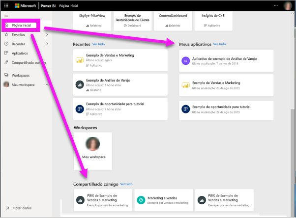
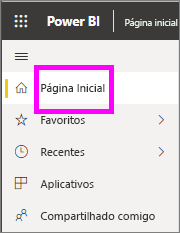
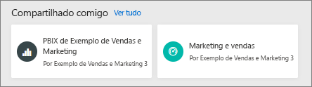
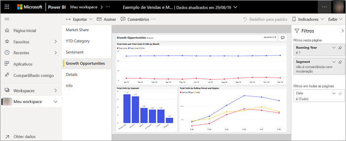
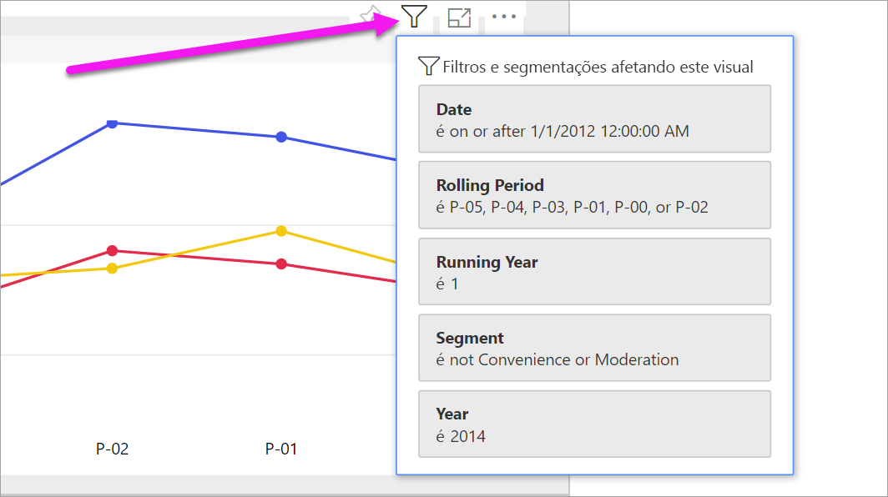
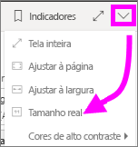
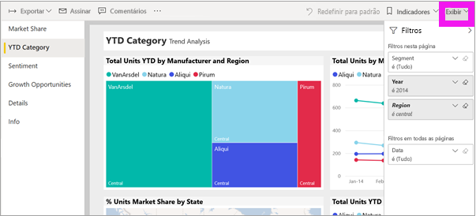
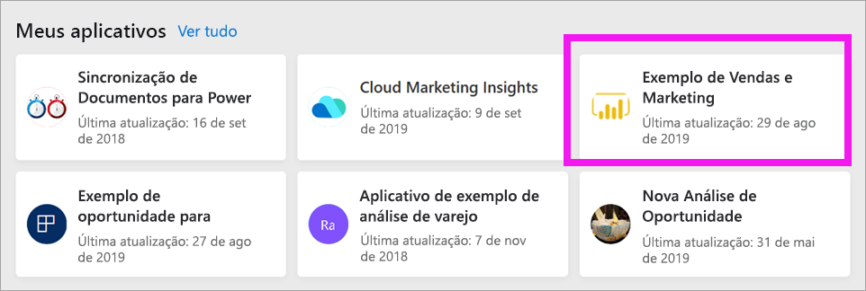
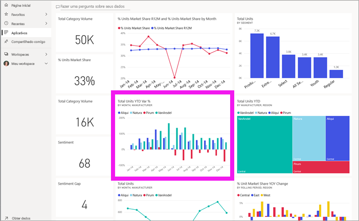
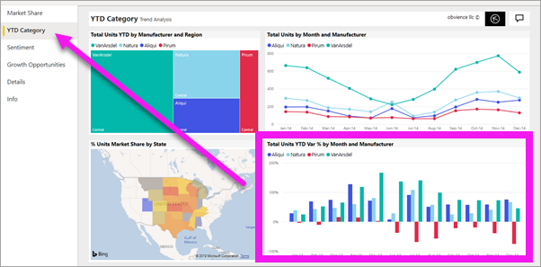

# Exiba um relatório no serviço do Power BI para *consumidores*
Um relatório é uma ou mais páginas de visuais. Os relatórios são criados por *designers* do Power BI e [compartilhados com *consumidores* diretamente](end-user-shared-with-me.md) ou como parte de um [aplicativo](end-user-apps.md). 

Há muitas maneiras diferentes de abrir um relatório e mostraremos duas delas: abrir na Página Inicial e em um dashboard. 

<!-- add art-->

## Abrir um relatório na Página Inicial do Power BI
Vamos abrir um relatório que foi compartilhado com você diretamente e, em seguida, abrir um que foi compartilhado como parte de um aplicativo.

   

### Abrir um relatório que foi compartilhado com você
Os *designers* do Power BI podem compartilhar um relatório individual diretamente com você por meio de um link no email ou adicionando-o automaticamente. O conteúdo compartilhado dessa forma aparece no contêiner **Compartilhado comigo** na barra de navegação esquerda e na seção **Compartilhado comigo** da tela Página Inicial.

1. Abra o serviço do Power BI (app.powerbi.com).

2. Na barra de navegação, selecione **Página Inicial** para exibir a tela Página Inicial.  

   
   
3. Role para baixo até ver **Compartilhado comigo**. Procure o ícone de relatório . Nesta captura de tela, há um dashboard e um relatório nomeado *Amostra de vendas e marketing*. 
   
   

4. Basta selecionar o *cartão* do relatório para abri-lo.

   

5. Observe as guias no lado esquerdo.  Cada guia representa uma *página* do relatório. No momento, a página *Oportunidades de Crescimento* está aberta. Selecione a guia *Categoria Acumulada* para abrir a página de relatório. 

   

6. Observe o painel **Filtros** à direita. Os filtros que foram aplicados a esta página de relatório, ou a todo o relatório, aparecem aqui.

7. Focalizar um visual de relatório revela vários ícones e reticências (...). Para ver os filtros aplicados a um visual específico, selecione o ícone de filtro. Aqui, selecionamos o ícone de filtro para o gráfico de linha *Total de unidades por período consecutivo e região*.

   

6. Agora, estamos vendo toda a página do relatório. Para alterar a exibição (aplicar zoom) da página, selecione a lista suspensa Exibição no canto superior direito e escolha **Tamanho real**.

   

   

### Abra um relatório que faz parte de um aplicativo
Se você já tiver recebido aplicativos de seus colegas ou do AppSource, esses aplicativos estarão disponíveis na Página Inicial e no contêiner **Aplicativos** na barra de navegação. Uma [aplicativo](end-user-apps.md) é um pacote de dashboards e relatórios.

### Pré-requisitos
Para acompanhar, baixe o aplicativo Vendas e Marketing.
1. No navegador, navegue até appsource.microsoft.com.
1. Pesquise "Vendas e Marketing" e selecione **Microsoft Sample-Sales & marketing.**
1. Selecione **Obtenha agora** > **Continuar** > **Instalar** para instalar o aplicativo em seu Contêiner de aplicativos. 

Abra o aplicativo de seu Contêiner de aplicativos ou da Página Inicial.
1. Volte à Página Inicial clicando em **Página Inicial** na barra de navegação.

7. Role para baixo até ver **Meus aplicativos**.

   

8. Selecione seu novo aplicativo de Vendas e marketing para abri-lo. Dependendo das opções definidas pelo *designer* de aplicativo, o aplicativo abrirá um dashboard ou um relatório. Este aplicativo é aberto em um dashboard.  

## Abrir um relatório por meio de um dashboard
Relatórios podem ser abertos de um dashboard. A maioria dos [blocos](end-user-tiles.md) de dashboard são *fixados* de relatórios. Selecionar um bloco abre o relatório que foi usado para criá-lo. 

1. No painel, selecione um bloco. Neste exemplo, selecionamos o bloco do gráfico de colunas “Total de Unidades Acumuladas no Ano...”.

    

2.  O relatório associado é aberto. Observe que estamos na página “Categoria de Acumulado no Ano”. Essa é a página de relatório que contém o gráfico de colunas que selecionamos por meio do dashboard.

    

> [!NOTE]
> Nem todos os blocos levam a um relatório. Se você selecionar um bloco que foi [criado com a P e R](end-user-q-and-a.md), a tela da P e R será aberta. Se você tiver selecionado um bloco que foi [criado usando um widget de dashboard **Adicionar bloco**](../service-dashboard-add-widget.md), várias coisas poderão acontecer: um vídeo poderá ser reproduzido, um site aberto e muito mais.  

##  Outras maneiras de abrir um relatório
Conforme você ficar mais familiarizado com a navegação no serviço do Power BI, descobrirá os fluxos de trabalho que funcionam melhor para você. Algumas outras maneiras de acessar relatórios:
- Na barra de navegação, usando **Favoritos** e **Recentes**    
- Usando [Exibição relacionada](end-user-related.md)    
- Em um email, quando alguém [compartilha com você](../service-share-reports.md) ou [define um alerta](end-user-alerts.md)    
- No [Centro de notificações](end-user-notification-center.md)    
- e muito mais

## Próximas etapas
[Abrir e exibir um painel](end-user-dashboard-open.md)    
[Filtros de relatório](end-user-report-filter.md)

