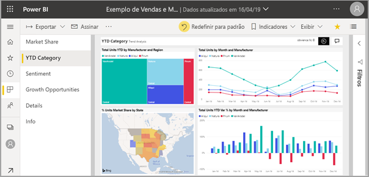
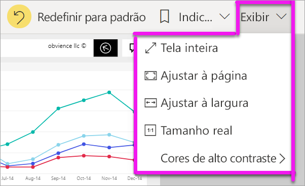
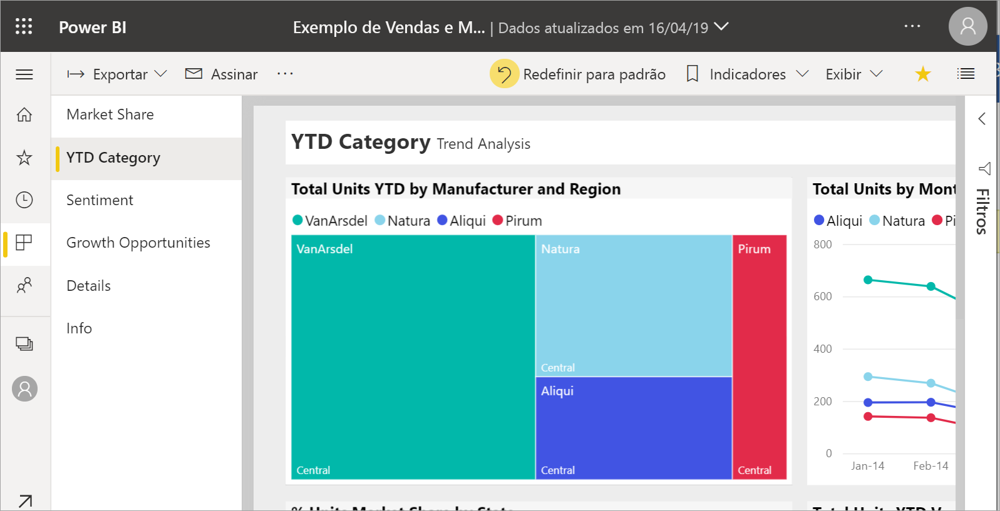
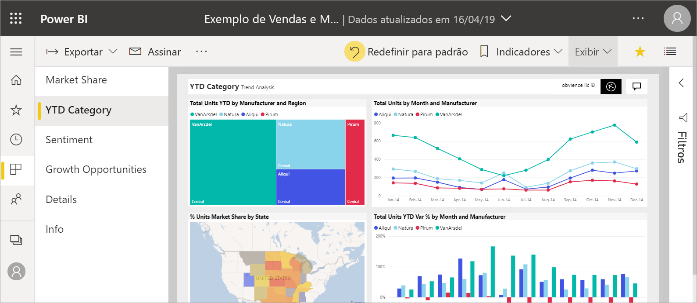
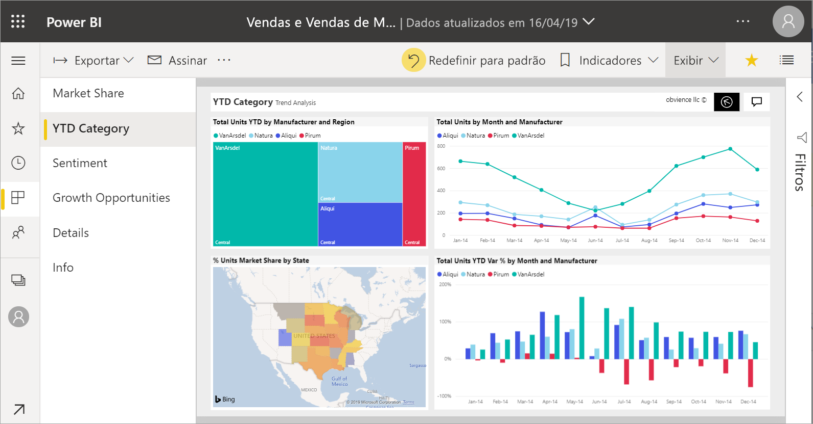
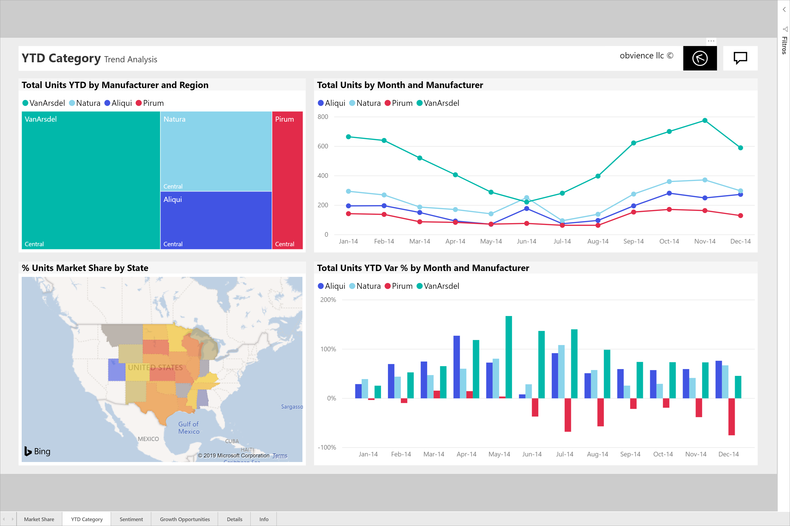

# Alterar a exibição de uma página de relatório

[!INCLUDE [power-bi-service-new-look-include](../includes/power-bi-service-new-look-include.md)]

As pessoas visualizam os relatórios em vários dispositivos diferentes, com diferentes tamanhos de tela e taxas de proporção. Alterar a maneira como uma página de relatório é exibida para atender às suas necessidades.

## Explorar o menu Exibir

As opções no menu **Exibir** oferecem flexibilidade para exibir páginas de relatório no tamanho e na largura que você escolher:

- Digamos que você está exibindo um relatório em um dispositivo pequeno e é difícil ver títulos e legendas.  Selecione **Exibição** > **Tamanho real** para aumentar o tamanho da página do relatório. Use as barras de rolagem para percorrer o relatório.

    

- Outra opção é ajustar o relatório para a largura da tela, selecionando **Ajustar à largura**. Como essa opção é apenas a largura e não a altura, você ainda precisará usar a barra de rolagem vertical.

  

- Se você não desejar barras de rolagem, mas desejar fazer o melhor uso do tamanho da tela, selecione **Ajustar à Página**.

   

- Você também pode escolher entre quatro **Cores de alto contraste**: Alto contraste nº 1, Alto contraste nº 2, Preto em alto contraste e Branco em alto contraste. É um recurso de acessibilidade que você pode usar para que as pessoas portadoras de deficiência visual possam ver melhor os relatórios. O exemplo a seguir é de alto contraste 1. 

    

- A última opção, **Tela inteira**, exibe a página de relatório sem barras de menus e cabeçalhos. Tela inteira pode ser uma boa opção para telas pequenas em que os detalhes são difíceis de ver.  Tela inteira também pode ser uma boa opção ao projetar páginas do relatório em telas grandes para que as pessoas possam ver, mas não interagir.  

    

Quando você sair do relatório, suas configurações de **Exibição** não serão salvas, mas serão revertidas para o padrão. Se for importante para você para salvar essas configurações, use [indicadores](end-user-bookmarks.md).

## Próximas etapas

* [Faça um tour pelo painel Filtros do relatório](end-user-report-filter.md)