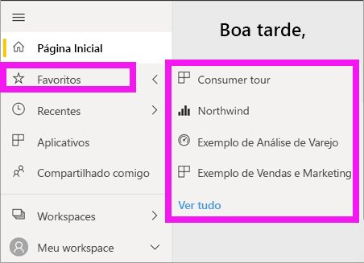

# Navegação: pesquisando, buscando e classificando seu conteúdo no serviço do Power BI

[!INCLUDE [power-bi-service-new-look-include](../includes/power-bi-service-new-look-include.md)]

Há muitas maneiras de navegar pelo seu conteúdo no serviço do Power BI. O conteúdo é organizado dentro do seu workspace por tipo: dashboards e relatórios.  E o conteúdo também é organizado por uso: favoritos, recentes, aplicativos, compartilhado comigo e em destaque. Para uma parada de navegação, a *Página Inicial* do Power BI organiza o conteúdo todo em uma única página. Esses caminhos diferentes em seu conteúdo permitem que você localize rapidamente aquilo de que precisa no serviço do Power BI.  

## Navegação em workspaces

*Consumidores* do Power BI normalmente têm apenas um workspace: **Meu Workspace**. O **Meu workspace** somente terá conteúdo se você tiver baixado os exemplos da Microsoft ou criado ou baixado seus próprios dashboards, relatórios ou aplicativos.  

No **Meu workspace**, o serviço do Power BI separa seu conteúdo por tipo: dashboards, relatórios, pastas de trabalho e conjuntos de dados. Você verá essa organização quando selecionar um workspace. Neste exemplo, **Meu workspace** contém um dashboard, um relatório, nenhuma pasta de trabalho e um conjunto de dados.

________________________________________
## Navegação usando o campo Pesquisar
Use a exibição de conteúdo **Meu workspace** para pesquisar, filtrar e classificar o conteúdo. No campo Pesquisar, digite todo ou parte do nome de um dashboard, relatório, pasta de trabalho ou proprietário.  

Se você tiver apenas alguns conteúdos, não será necessário pesquisar e classificar.  Porém, quando você tem longas listas de dashboards e relatórios, verá que pesquisa e classificação são extremamente úteis. Por exemplo, a lista de relatórios abaixo tem 83 itens. 

Você também pode classificar o conteúdo por nome ou por proprietário. Observe a seta para cima à direita de **Nome**. No momento, estamos classificando 83 itens em ordem alfabética por nome, em ordem crescente. Para alterar a ordem de classificação para decrescente, selecione **Nome**. A seta para cima muda para uma seta para baixo.

Nem todas as colunas podem ser classificadas. Posicione o cursor sobre os títulos de coluna para descobrir quais deles podem ser classificados.

___________________________________________________________________
## Navegação usando o painel de navegação
O painel de navegação classifica o conteúdo de modo a ajudar você a encontrar o que você precisa rapidamente.  

- O conteúdo que é compartilhado com você está disponível em **Compartilhado comigo**.
- Seu conteúdo exibido mais recentemente está disponível em **Recentes**. 
- Seus aplicativos podem ser encontrados selecionando **Aplicativos**.
- **Home** é uma exibição de página única do seu conteúdo mais importante e o conteúdo e fontes de aprendizado sugeridas.

Além disso, você pode marcar o conteúdo como [favorito](end-user-favorite.md) e [em destaque](end-user-featured.md). Escolha um dashboard ou relatório que você acredita que exibirá com mais frequência e defina-o como o conteúdo *em destaque*. Cada vez que você abrir o serviço do Power BI, seu dashboard em destaque será exibido primeiro. Você tem uma série de dashboards e aplicativos que visita com frequência? Ao defini-los como favoritos, eles ficarão sempre disponíveis no seu painel de navegação.

.

## Considerações e solução de problemas
* Para conjuntos de dados, a opção **Classificar por** não está disponível pelo proprietário.

## Próximas etapas
[Classificar visuais em relatórios](end-user-change-sort.md)

Mais perguntas? [Experimente a Comunidade do Power BI](https://community.powerbi.com/)
