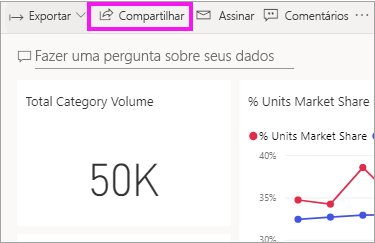
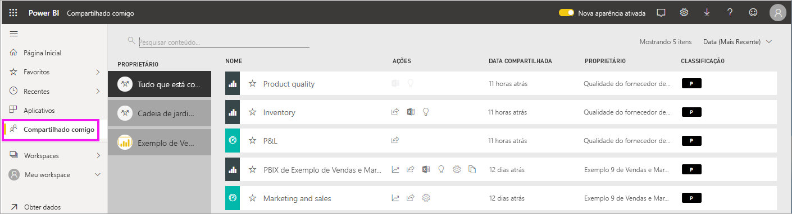
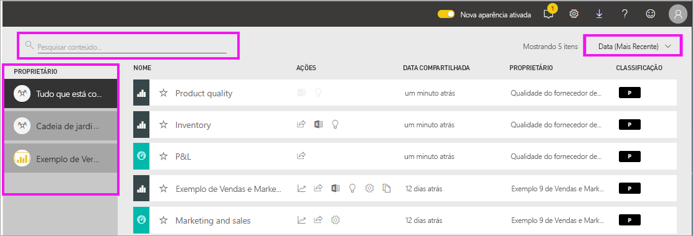

# Exibir os dashboards e relatórios que foram compartilhados comigo

[!INCLUDE[consumer-appliesto-yyny](../includes/consumer-appliesto-yyny.md)]

[!INCLUDE [power-bi-service-new-look-include](../includes/power-bi-service-new-look-include.md)]

Quando um colega compartilhar conteúdo com você usando o botão **Compartilhar**, ele aparecerá no seu contêiner **Compartilhado comigo**. O dashboard ou relatório só estará disponível em **Compartilhado comigo** e não em **Aplicativos**.

Assista à Amanda explicar a lista de conteúdo **Compartilhado comigo** e demonstrar como navegar na lista e filtrá-la. Em seguida, siga as instruções passo a passo abaixo do vídeo para testá-la por conta própria. Para poder exibir os dashboards que são compartilhados com você, você precisa ter uma licença do Power BI Pro. Leia [O que é o Power BI Premium?](../admin/service-premium-what-is.md) para obter detalhes.
    

> [!NOTE]
> Este vídeo usa uma versão mais antiga do serviço do Power BI.
    

<iframe width="560" height="315" src="https://www.youtube.com/embed/G26dr2PsEpk" frameborder="0" allowfullscreen></iframe>

## Interagir com conteúdo compartilhado

Você terá várias opções para interagir com os dashboards e os relatórios compartilhados, dependendo das permissões que o *designer* lhe conceder. Isso inclui ser capaz de fazer cópias do dashboard, abrir o relatório [no Modo de exibição de leitura](end-user-reading-view.md) e compartilhar novamente com outras colegas.

### Ações disponíveis no contêiner **Compartilhado comigo**
As ações disponíveis para você dependerão das configurações atribuídas pelo *designer* de conteúdo. Algumas de suas opções podem incluir:
* Selecionar o ícone de estrela para [adicionar um dashboard ou relatório aos favoritos](end-user-favorite.md) .
* Remover um dashboard ou relatório  .
* Alguns dashboards e relatórios podem ser compartilhados novamente  .
* [Abrir o relatório no Excel](end-user-export.md)  
* [Exibir insights](end-user-insights.md) que o Power BI encontrar nos dados .
  
  > [!NOTE]
  > Para obter informações sobre classificações EGRC, selecione o botão **Classificação** ou [visite a Classificação de dados no dashboard](../create-reports/service-data-classification.md).
  > 

## Pesquisar e classificar dashboards compartilhados
Se sua lista de conteúdo for longa, você terá várias opções para encontrar o que precisa. Você pode usar o campo de pesquisa, classificar por data ou selecionar na coluna **Proprietário**.    

