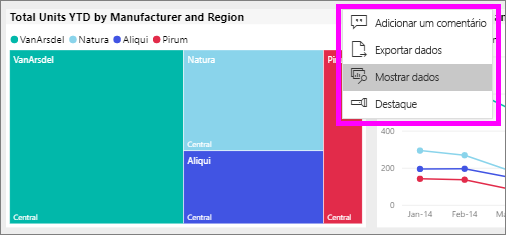
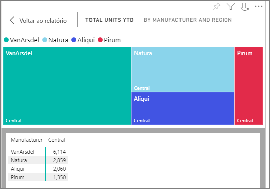

# Mostrar os dados que foram usados para criar o visual

Um visual do Power BI é construído usando dados dos conjuntos de dados subjacentes. Se você estiver interessado em ver o que acontece nos bastidores, o Power BI permitirá *exibir* os dados usados para criar o visual. Quando você seleciona **Mostrar Dados**, o Power BI exibe os dados abaixo (ou ao lado) do visual.

1. No serviço do Power BI, [abra um relatório](end-user-report-open.md) e selecione um visual.  
2. Para exibir os dados por trás do visual, selecione as reticências (...) e escolha **Mostrar dados**.
   
   
3. Por padrão, os dados são exibidos abaixo do visual.
   
   

4. Para alterar a orientação, selecione o layout vertical  no canto superior direito da visualização.
   
   

## Próximas etapas
[Visuais nos relatórios do Power BI](../visuals/power-bi-report-visualizations.md)    
[Relatórios do Power BI](end-user-reports.md)    
