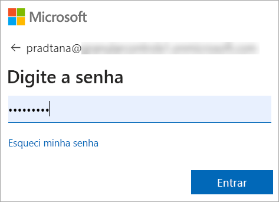
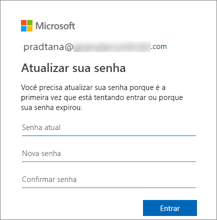
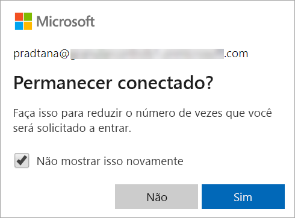
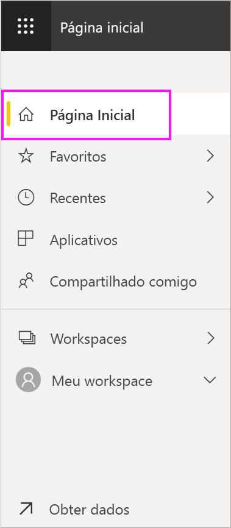

# Entrar no serviço do Power BI

## Contas do Power BI
Antes de poder entrar no Power BI, você precisará de uma conta. Há duas maneiras de obter a conta do Power BI. A primeira é quando sua empresa compra de licenças do Power BI para seus funcionários. E a segunda é quando indivíduos se inscrevem gratuitamente para licenças pessoais ou avaliações gratuitas. Este artigo aborda o primeiro cenário.

## Entrar pela primeira vez

### Etapa 1: abra um navegador
O serviço do Power BI é executado em um navegador.  Portanto, a primeira etapa é abrir seu navegador favorito e digitar **app.powerbi.com**.

### Etapa 2: digite seu endereço de email
Na primeira vez em que entrar, será solicitado que você insira seu endereço de email.  Este é o endereço de email de sua conta corporativa ou de estudante que foi usado no registro do Power BI.  

Procure na caixa de entrada por um email do administrador do Power BI. A maioria dos administradores enviará um email de boas-vindas contendo sua senha temporária. Use essa conta de email para entrar. 

 
### Etapa 3: crie uma nova senha
Se o administrador do Power BI enviou a você uma senha temporária, insira-a no campo **Senha atual**. Se você não recebeu uma senha por email, entre em contato com o administrador do Power BI.

Se você quiser que o Power BI memorize suas credenciais, selecione **Sim**. 

### Etapa 4: examine sua página inicial de aterrissagem
Em sua primeira visita, o Power BI abre a **Página Inicial** de aterrissagem. Se a **Página Inicial** não abrir, selecione-a no painel de navegação. 

Na Página Inicial, você verá todo o conteúdo que tiver permissão para usar. A princípio, pode ser que não haja muito conteúdo em sua página inicial, mas não se preocupe, isso mudará quando você começar a usar o Power BI com seus colegas. 

Se não quiser que o Power BI abra a Página Inicial, você poderá [definir um relatório ou um painel **Em destaque**](end-user-featured.md) para ser aberto. 

## Interagir com o conteúdo de modo seguro
Como um ***consumidor***, outras pessoas compartilharão conteúdo com você e você poderá interagir com esse conteúdo para explorar os dados e tomar decisões de negócios.  Ao filtrar, segmentar, assinar, exportar e redimensionar conteúdo, não se preocupe – seu trabalho não está afetando o conjunto de dados subjacente nem o conteúdo compartilhado original (dashboards e relatórios). O Power BI é um espaço seguro para exploração e experimentação. Isso não significa que você não é possível salvar suas alterações – você pode fazê-lo. Mas essas alterações afetam apenas a **sua** exibição do conteúdo. E reverter para o modo de exibição padrão original é tão fácil quanto clicar em um botão.

## Sair do serviço do Power BI
Quando você fecha ou sai do Power BI, suas alterações são salvas para que você possa recomeçar bem do ponto em que parou.

Para fechar o Power BI, feche a guia do navegador em que você está trabalhando. 

 

Se você compartilha um computador, é recomendável sair sempre que fechar o Power BI.  Para sair, no canto superior direito, selecione sua imagem de perfil e escolha **Sair**. Caso contrário, ao terminar, feche a guia do navegador.

 

## Considerações e solução de problemas
- Se você se inscrever no Power BI como um indivíduo, entre com o endereço de email que usou para se inscrever.

- Algumas pessoas usam o Power BI com mais de uma conta. Nesse caso, ao entrar, será solicitado que você selecione a conta em uma lista. 

## Próximas etapas
[Exibir um aplicativo do Power BI](end-user-app-view.md)
