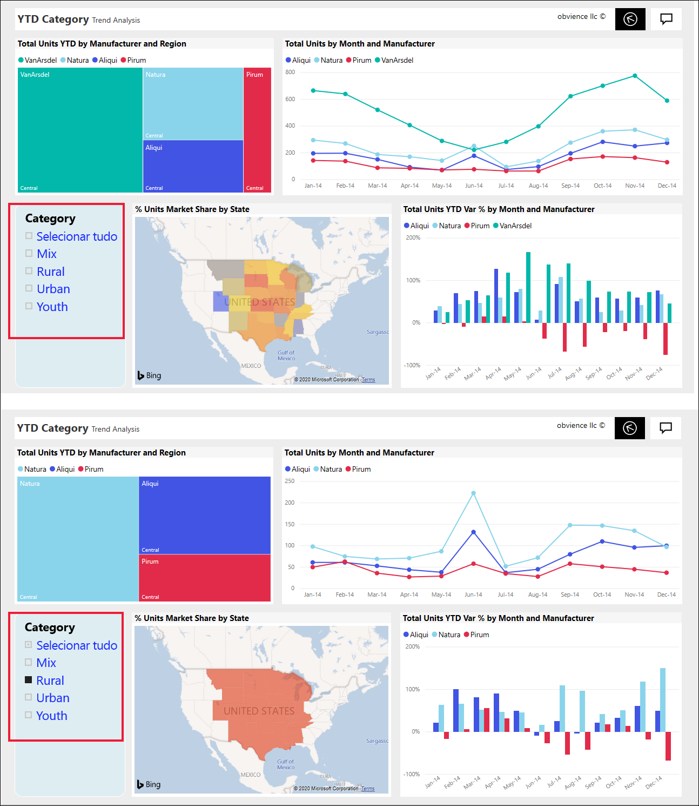
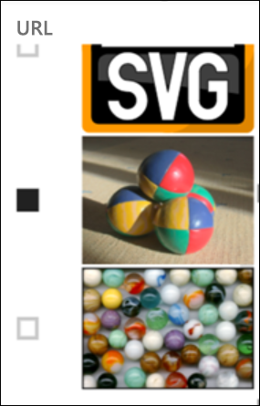
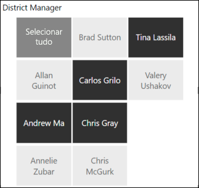
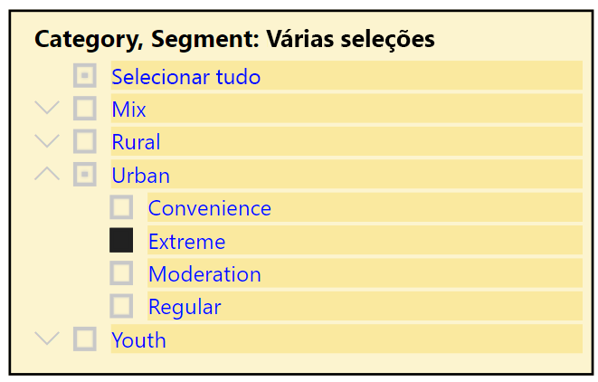
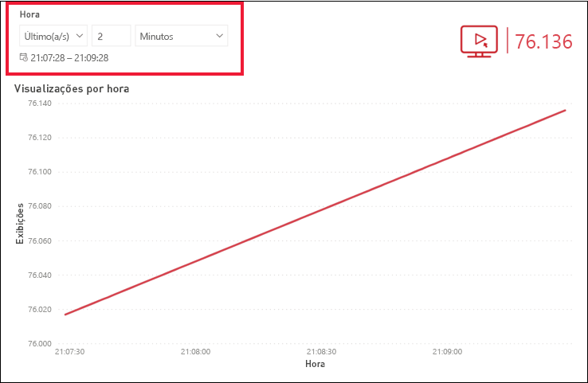
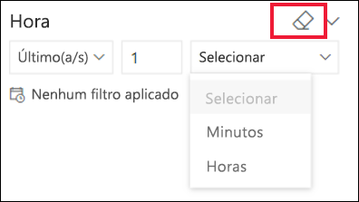

# Segmentações no serviço do Power BI

[!INCLUDE[consumer-appliesto-ynnn](../includes/consumer-appliesto-yynn.md)]

Uma segmentação é um tipo de visual que filtra os outros visuais em uma página de relatório. Ao usar os relatórios do Power BI, você descobrirá muitos tipos de segmentações. A imagem, acima, mostra a mesma segmentação de itens, mas com seleções diferentes. Observe como cada seleção filtra os outros visuais na página.  

## Como usar segmentações
Ao criar relatórios, os *designers* adicionam segmentações para ajudar a contar uma história e oferecer a você ferramentas para explorar seus dados.

### Segmentação de intervalo numérico
 A segmentação de intervalo numérico, acima, ajuda você a explorar o total de vendas por: geografia, unidades em estoque e data do pedido. Use os identificadores para selecionar um intervalo. 

### Segmentação de caixa de seleção vertical básica

Em uma segmentação de caixa de seleção básica, marque uma ou mais caixas de seleção para ver o impacto nos outros visuais da página. Para selecionar mais de uma, use a tecla CTRL. Às vezes, o *designer* de relatório definirá a segmentação para permitir que você selecione apenas um valor por vez. 

### Segmentações de imagem e forma
Quando as opções de segmentação forem imagens ou formas, realizar suas seleções é semelhante ao uso de caixas de seleção. Você pode escolher uma ou mais imagens ou formas para aplicar a segmentação aos outros visuais na página. 

    

    

### Segmentação de hierarquia

Em uma segmentação com uma hierarquia, use as divisas para expandir e recolher a hierarquia. O cabeçalho é atualizado para mostrar suas seleções.

### Segmentação de dados de tempo relativo
Com cenários emergentes de rápida atualização, a capacidade de filtrar para uma janela de tempo menor pode ser muito útil.
Usando a segmentação de dados de tempo relativo, você pode aplicar filtros baseados em tempo para dados de data ou hora em seu relatório. Por exemplo, você pode usar a segmentação de dados de tempo relativo para mostrar apenas exibições de vídeo nos últimos 2 dias, horas ou até mesmo minutos. 

## Desativar uma segmentação
Para desativar uma segmentação, selecione o ícone de borracha.

## Próximas etapas
Para obter mais informações, consulte os seguintes artigos:

[Tipos de visualização no Power BI](end-user-visualizations.md)

