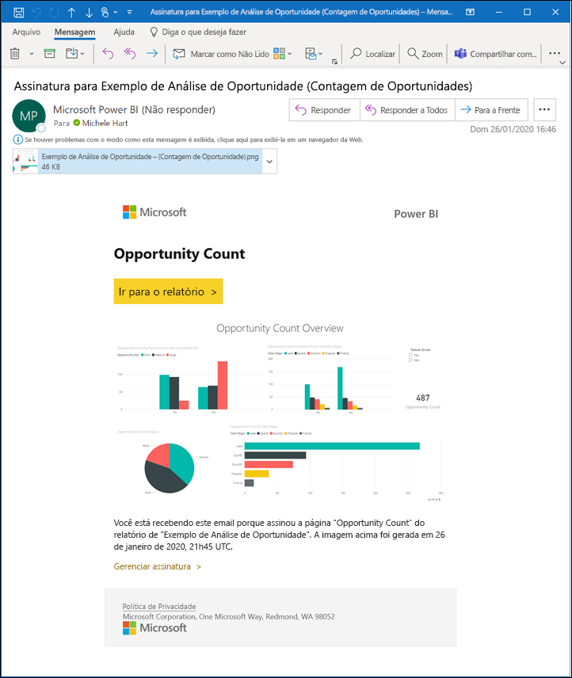
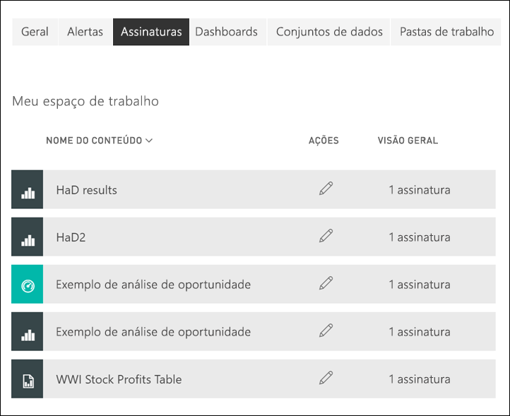

# Assinar um relatório ou painel no serviço do Power BI 

[!INCLUDE[consumer-appliesto-ynny](../includes/consumer-appliesto-ynny.md)]

[!INCLUDE [power-bi-service-new-look-include](../includes/power-bi-service-new-look-include.md)]

Nunca foi tão fácil manter-se atualizado sobre seus dashboards e relatórios mais importantes. Assine os dashboards e as páginas de relatório mais importantes para você e o Power BI enviará um email com um instantâneo para sua caixa de entrada. Informe ao Power BI a frequência com que deseja receber os emails: diária, semanal ou quando os dados forem atualizados. Você pode até mesmo definir um horário específico para o Power BI enviar os emails ou executá-lo agora.  No total, você pode configurar até 24 assinaturas diferentes por relatório ou dashboard.

O instantâneo e o email usarão o idioma definido nas configurações do Power BI (confira [Idiomas e países/regiões com suporte para o Power BI](../fundamentals/supported-languages-countries-regions.md)). Se nenhum idioma for definido, o Power BI usará o idioma de acordo com a configuração de localidade no navegador atual. Para obter ou definir sua preferência de idioma, selecione o ícone de engrenagem  > **Configurações > Geral > Idioma**. 

Quando você receber o email, ele incluirá um link para "acessar o relatório ou o dashboard". Em dispositivos móveis com aplicativos do Power BI instalados, a seleção desse link iniciará o aplicativo (ao contrário da ação padrão de abrir o relatório ou o dashboard no site do Power BI).

## Requisitos
**Criar** uma assinatura para si mesmo exige um certo tipo de [licença](end-user-license.md). Se você não conseguir criar uma assinatura, entre em contato com o administrador do Power BI. A **Assinatura de terceiros** só está disponível para o proprietário do painel ou do relatório. Assinar relatórios paginados é um pouco diferente. Confira [Obter uma assinatura para você e para outras pessoas de um relatório paginado no serviço do Power BI](paginated-reports-subscriptions.md) para obter detalhes. 

## Assine um dashboard ou uma página de relatório
Se você estiver assinando um dashboard ou relatório, o processo será semelhante. O mesmo botão permite que você assine os dashboards e relatórios do serviço do Power BI.
 
.

1. Abra o dashboard ou o relatório.
2. Na barra de menus superior, selecione **Assinar** ou selecione o ícone de envelope .
   

   
    
    A tela à esquerda é exibida quando você está em um dashboard e seleciona **Assinar**. A tela à direita é exibida quando você está em uma página de relatório e seleciona **Assinar**. 
    
    a. Para assinar mais de uma página em um relatório, selecione **Adicionar outra assinatura** e escolha uma página diferente na lista suspensa na parte superior.

    b. Use o controle deslizante amarelo para ativar e desativar a assinatura.  Definir o controle deslizante como Desativado não exclui a assinatura. Para excluir a assinatura, selecione o ícone de cesto de lixo.

    c. Outra opção é adicionar os detalhes da mensagem de email ou o assunto. 

    d. Selecione uma **Frequência** para sua assinatura.  Você pode escolher Diária, Semanal ou Após a atualização de dados (Diária).  Para receber o email de assinatura somente em determinados dias, selecione **Semanal** e escolha em quais dias você gostaria de recebê-lo.  Por exemplo, se você quiser receber o email de assinatura somente em dias úteis, selecione **Semanal** como a sua frequência e desmarque as caixas Sáb e Dom. Se você selecionar **Mensal**, insira o(s) dia(s) do mês em que deseja receber o email da assinatura.   

    e. Se você escolher Diária, Por Hora, Mensal ou Semanal, também poderá escolher um Horário Agendado para a assinatura. Você faz com que ela seja executada na hora exata ou após 15, 30 ou 45 minutos. Selecione manhã (A.M.) ou tarde/noite (P.M.). Você também pode especificar o fuso horário. Se você escolher Por Hora, selecione o Horário Agendado em que deseja iniciar a assinatura e ela será executada de hora em hora a partir de então.  

    f. Agende as datas de início e de término, inserindo-as nos respectivos campos. Por padrão, a hora de início para sua assinatura será a data em que você a criar, enquanto a data de término será um ano depois. É possível alterar para qualquer data no futuro (até o ano 9999) a qualquer momento antes do término da assinatura. Quando uma assinatura atinge uma data de término, ela é interrompida até que você a habilite novamente.  Você receberá notificações antes da data de término agendada, perguntando se você deseja estendê-la.     

    (por exemplo, Para examinar a sua assinatura e testá-la, selecione **Executar agora**.  Isso envia o email a você imediatamente. 

3. Se tudo estiver correto, selecione **Salvar e fechar** para salvar a assinatura. Você receberá um email e um instantâneo do painel ou do relatório no agendamento que definir. Todas as assinaturas com a frequência definida para **Após a atualização de dados** somente enviarão um email após a primeira atualização agendada naquele dia.
   
   
   
    Atualizar a página de relatório não atualiza o conjunto de dados. Somente o proprietário do conjunto de dados pode atualizá-lo manualmente. Para procurar o nome do proprietário dos conjuntos de dados subjacentes, selecione o menu suspenso na barra de menus ou procure o email de assinatura original.
   
    

## Gerenciar suas assinaturas
Você só pode gerenciar as assinaturas criadas por você. Selecione **Assinar** novamente e escolha **Gerenciar todas as assinaturas** no canto inferior esquerdo (veja as capturas de tela acima). As assinaturas específicas exibidas dependerão de qual workspace está ativo no momento. Para ver todas as suas assinaturas de todos os workspaces ao mesmo tempo, verifique se **Meu Workspace** está ativo. Para obter ajuda para entender os workspaces, consulte [Workspaces no Power BI](end-user-workspaces.md). 

Uma assinatura será encerrada se a licença Pro expirar, se o dashboard ou o relatório for excluído pelo proprietário ou se a conta de usuário usada para criar a assinatura for excluída.

## Considerações e solução de problemas
* Para evitar que os emails da assinatura sejam enviados para a pasta de spam, adicione o alias de email do Power BI (no-reply-powerbi@microsoft.com) aos seus contatos. Se estiver usando o Microsoft Outlook, clique com o botão direito do mouse no alias e selecione **Adicionar aos contatos do Outlook**. 
* Os dashboards com mais de 25 blocos fixos ou quatro páginas de relatório dinâmico fixas podem não ser renderizados totalmente nos emails de assinatura enviados aos usuários. Sugerimos que você contate o designer do dashboard e solicite que ele reduza os blocos fixados para menos de 25 e os relatórios dinâmicos fixados para menos de quatro para garantir que o email seja renderizado corretamente.  
* Para assinaturas de email do dashboard, se algum bloco tiver a RLS (Segurança em Nível de Linha) aplicada, esse bloco não será exibido.  
* Se os links em seu email (para o conteúdo) pararem de funcionar, talvez o conteúdo tenha sido excluído. No email, embaixo da captura de tela, você pode procurar se você se assinou ou se alguém assinou você. Se foi outra pessoa, peça para esse colega de trabalho cancelar os emails ou assinar você novamente.
* Para assinaturas de dashboards, ainda não há suporte para alguns tipos de blocos. Eles incluem: blocos de streaming, blocos de vídeo, blocos de conteúdo da Web personalizado. 
* As assinaturas da página de relatório são vinculadas ao nome da página de relatório. Se você assinar uma página de relatório e ela for renomeada, você precisará recriar sua assinatura.
* Se você não conseguir usar o recurso de assinatura, entre em contato com o administrador do sistema. Sua organização pode ter desabilitado esse recurso.  
* Assinaturas de email não dão suporte à maioria dos [visuais personalizados](../developer/visuals/power-bi-custom-visuals.md).  A exceção é para os visuais personalizados do Power BI que foram [certificados](../developer/visuals/power-bi-custom-visuals-certified.md).    
* Assinaturas de email são enviadas com estados de segmentação e filtro padrão do relatório. As alterações feitas nos padrões após a assinatura não serão exibidas no email. Os relatórios paginados são compatíveis com essa funcionalidade e lhe permitem definir os valores de parâmetro específicos por assinatura.  
* No momento, as assinaturas de email não dão suporte a visuais do Power BI da plataforma R.  
* Especificamente para assinaturas de dashboards, alguns tipos de blocos ainda não são compatíveis.  Eles incluem: blocos de streaming, blocos de vídeo, blocos de conteúdo da Web personalizado.     
* As assinaturas poderão falhar em dashboards ou relatórios com imagens extremamente grandes devido aos limites de tamanho de email.    
* O Power BI pausa a atualização automaticamente em conjuntos de dados associados a dashboards e relatórios que não foram visitados há mais de dois meses.  No entanto, se você adicionar uma assinatura a um dashboard ou um relatório, ele não ficará em pausa mesmo que não seja visitado.
* Assim como ocorre com outros produtos de BI, a hora para a qual você define sua assinatura é quando o processamento da assinatura começa.  Após a conclusão do processamento do relatório, a assinatura será enfileirada e enviada aos destinatários do email.  Embora nos esforcemos para processar e entregar todas as assinaturas o mais rápido possível, há momentos de alta demanda em que você pode notar um atraso maior devido ao número de assinaturas que podem ser enviadas de uma só vez.  Para a maioria dos clientes, o atraso não deve ultrapassar mais de 15 minutos para processar e enviar os relatórios deles, embora possa levar até 30 minutos para determinados tempos e locatários que têm uso significativo.  Nunca esperamos que nenhum atraso na entrega seja superior a 60 minutos a contar do momento em que a assinatura é agendada.  Se algum cliente experimentar um atraso nessa dimensão, será necessário verificar se o endereço no-reply-powerbi@microsoft.com está na lista de permissões do provedor de email.  Se ele estiver, ele deve contatar o suporte do Power BI para obter assistência.

## Próximas etapas

[Pesquisar e classificar conteúdo](end-user-search-sort.md)
