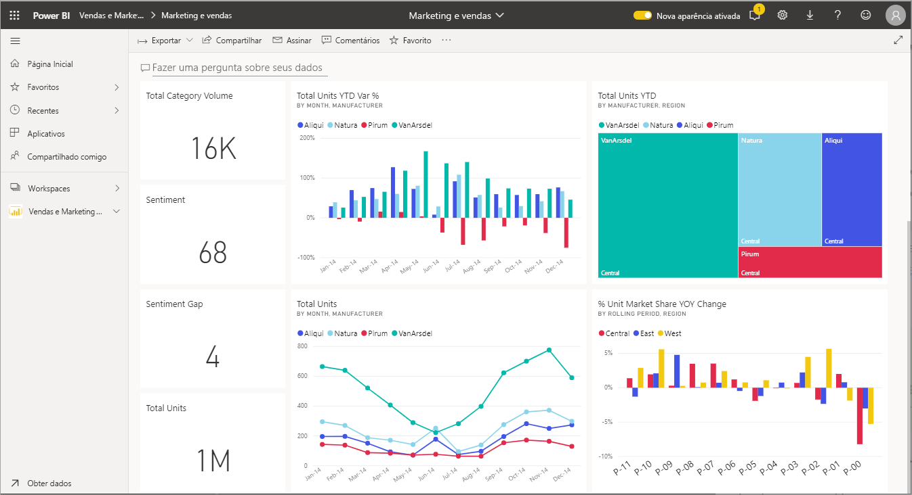
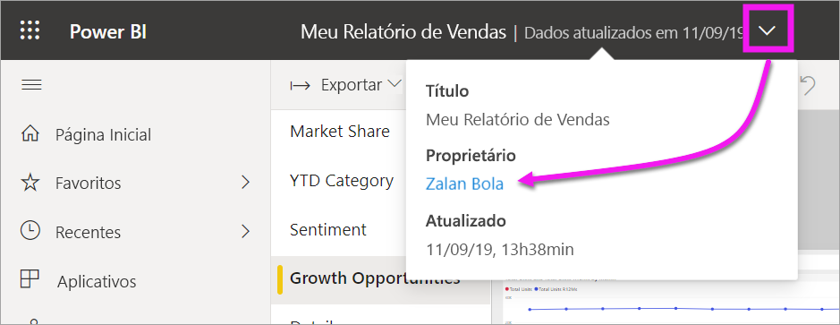

# Interagir com visuais em relatórios, dashboards e aplicativos

Em sua forma mais básica, uma ***visualização*** (ou *visual*), é um tipo de gráfico criado pelos *designers* do Power BI usando os dados presentes nos relatórios e conjuntos de dados. 

Os visuais são encontrados nos dashboards, em relatórios e podem ser criados imediatamente usando a P e R do Power BI. Quando um designer cria um visual em um relatório, ele pode *fixar* esse visual em um dashboard. Um [visual em um dashboard é chamado de *bloco*](end-user-tiles.md). Esse dashboard tem oito blocos. 

> [!TIP]
> É recomendável ler primeiro o tópico de visão geral [Conceitos básicos do Power BI para *consumidores*](end-user-basic-concepts.md) antes de ler este conteúdo mais detalhado.

## O que posso fazer com os visuais?

Os visuais são criados pelos *designers* de relatórios e painéis, e são compartilhados com os *consumidores*. Como um consumidor, você tem várias opções para interagir com os visuais, descobrir os insights e tomar decisões de negócios controladas por dados. A maioria dessas opções está listada na tabela abaixo, com links para instruções passo a passo.

Para muitas dessas opções, o administrador ou o *designer* pode desabilitar sua capacidade de ver ou usar esses recursos. Além disso, alguns desses recursos só funcionam em visuais específicos.  Caso você tenha dúvidas, contate o administrador ou o proprietário do relatório ou do dashboard. Para localizar o proprietário, selecione a lista suspensa do dashboard ou do relatório. 

> [!IMPORTANT]
> Mas primeiro, algumas palavras sobre a P e R. P e R é a ferramenta de pesquisa de idioma natural do Power BI. Você digita a pergunta usando o idioma natural e a P e R a responde na forma de um visual. A P e R é uma maneira para os consumidores criarem seus próprios visuais. No entanto, os visuais que você criar com a P e R não poderão ser salvos. Contudo, se houver algo específico que você deseja aprender com os dados e o designer não incluiu isso em um relatório ou em um dashboard, a P e R será uma ótima opção. Para saber mais sobre a P e R, consulte [P e R para consumidores](end-user-q-and-a.md).

|Tarefa  |Em um dashboard  |Em um relatório  | Em P e R
|---------|---------|---------|--------|
|[Adicionar comentários a um visual por conta própria ou iniciar uma conversa sobre ele com os colegas](end-user-comment.md).     |  sim       |   sim      |  não  |
|[Abrir e explorar o relatório em que o visual foi criado](end-user-tiles.md).     |    sim     |   N/A      |  não |
|[Exibir uma lista dos filtros e das segmentações que afetam o visual](end-user-report-filter.md).     |    não     |   sim      |  sim |
|[Abrir e explorar um visual na P e R (se o *designer* usou a P e R para criar o visual)](end-user-q-and-a.md).     |   sim      |   N/A      |  N/A  |
|[Criar um visual na P e R (para exploração, você não poderá salvá-lo)](end-user-q-and-a.md).     |   sim      |   se o designer adicionou a P e R ao relatório      |  sim  |
|[Pedir ao Power BI para procurar por tendências ou fatos interessantes](end-user-insights.md) nos dados do visual para você.  Esses visuais gerados automaticamente são chamados de *insights*.     |    sim     |  para todo o relatório, não por visual       | não   |
|[Exibir apenas um visual por vez usando o modo de *foco*](end-user-focus.md).     | sim        |   sim      | N/A  |
|[Pesquisar quando o visual foi atualizado pela última vez](end-user-fresh.md).     |  sim       |    sim     | N/A  |
|[Exibir apenas um visual por vez, sem bordas nem painéis de navegação, usando o modo de *tela inteira* ou de *foco*](end-user-focus.md).     |   sim      |  sim       | por padrão  |
|[Imprimir](end-user-print.md).     |  sim       |   sim      | não  |
|[Examinar o visual adicionando e modificando os filtros.](end-user-report-filter.md)     |    não     |   sim      | não  |
|Focalizar um visual para revelar detalhes adicionais e dicas de ferramentas.     |    sim     |   sim      | sim  |
|[Filtro e realce cruzado em outros visuais na página.](end-user-interactions.md)    |   não      |   sim      | N/A  |
|[Mostrar os dados usados para criar o visual](end-user-show-data.md).     |  não       |   sim      | não  |
| [Alterar como um visual é classificado](end-user-change-sort.md). | não  | sim  | pode alterar a classificação reformulando a pergunta  |
| Adicionar um destaque a um visual. | não  | sim  |  não |
| [Exportar para o Excel.](end-user-export.md) | sim | sim | não|
| [Criar um alerta](end-user-alerts.md) para notificar você de quando um valor excede um limite definido.  | sim  | não  | não |
| [Filtro e realce cruzado nos outros visuais da página](end-user-report-filter.md).  | não      | sim  | não  |
| [Fazer drill de um visual que tenha uma hierarquia](end-user-drill.md).  | não  | sim   | não |

## Próximas etapas
Voltar às [Noções básicas para consumidores](end-user-basic-concepts.md)    
[Selecionar um visual para abrir um relatório](end-user-report-open.md)    
[Tipos de visuais disponíveis no Power BI](end-user-visual-type.md)