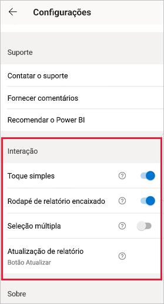
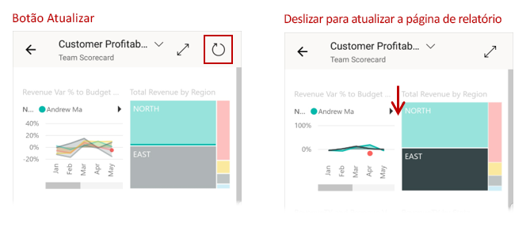
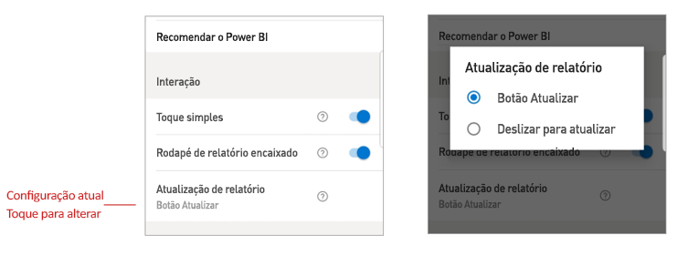

# Definir configurações de interação de relatório

## Visão Geral

O aplicativo móvel Power BI tem várias definições de "interação" configuráveis que permitem controlar como você interage com seus dados e definir como os elementos do aplicativo móvel Power BI se comportam. A tabela a seguir mostra as configurações de interação que estão disponíveis e os dispositivos que as incluem.

|| Telefone Android | iPhone | Tablet Android  | iPad |
|-|:-:|:-:|:-:|:-:|
| [Interação de toque simples versus duplo em visuais de relatório](#single-tap) |✔|✔|||
| [Seleção múltipla versus seleção única de pontos de dados em visuais de relatório](#multi-select) |✔|✔|✔|✔|
| [Rodapé de relatório encaixado versus dinâmico](#docked-report-footer) |✔|✔|||
| [Atualização de relatório iniciada por botão versus deslizar para atualizar](#report-refresh) |✔||||
|

Para obter as configurações de interação, toque na imagem do seu perfil para abrir o [painel lateral](./mobile-apps-home-page.md#header), escolher **Configurações** e localizar a seção **Interação**.

As configurações de interação são descritas nas seções a seguir.

## Configurações de interação

### Toque simples
Quando você baixa o aplicativo móvel do Power BI, ele é definido com a interação de toque simples. Isso significa que, quando você tocar em um visual para executar alguma ação, como a seleção um item de segmentação, o realce cruzado, o clique em um link ou um botão etc., o toque selecionará o visual e executará a ação desejada.

Se preferir, você poderá desativar a interação de toque simples. Você então terá uma interação de toque duplo. Com a interação de toque duplo, você primeiro toca em um visual para selecioná-lo e, em seguida, toca novamente no visual para executar a ação desejada.

### Seleção múltipla

Com a opção de seleção múltipla, é possível selecionar vários pontos de dados em uma página de relatório. Quando a opção de seleção múltipla está ativada, cada ponto de dados em que você toca é adicionado aos outros pontos de dados selecionados, e os resultados combinados são realçados automaticamente em todos os visuais da página. Se a opção de seleção múltipla estiver desativada, quando você tocar para selecionar um ponto de dados, a nova seleção substituirá a seleção atual.

Para cancelar a seleção de um ponto de dados, toque nela novamente.

>[!NOTE]
>O recurso de seleção múltipla não tem suporte em visuais do Power BI.
>
>O modo de seleção múltipla terá suporte do Servidor de Relatórios do Power BI, no próximo lançamento desta plataforma.

### Rodapé de relatório encaixado

A configuração de rodapé de relatório encaixado determina se o rodapé do relatório permanece encaixado (ou seja, fixo e sempre visível) na parte inferior do relatório ou oculto, reaparecendo com base em suas ações no relatório, como rolagem.

Em telefones Android, a configuração de rodapé de relatório encaixado está **ativada** por padrão, o que significa que o rodapé do relatório fica encaixado e sempre visível na parte inferior do relatório. Alterne a configuração para **desativada** se você preferir um rodapé de relatório dinâmico que apareça e desapareça dependendo de suas ações no relatório.

### Atualização de relatório

A configuração de atualização de relatório define como você inicia as atualizações de relatório. Você pode optar por ter um botão de atualização em todos os cabeçalhos de relatório ou usar a ação de pull para atualizar (puxar ligeiramente de cima para baixo) na página do relatório para atualizar o relatório. A figura a seguir ilustra as duas alternativas. 

Em telefones Android, um botão Atualizar é adicionado por padrão.

Para alterar a configuração de atualização do relatório, acesse o item Atualizar Relatório nas configurações de interação. A configuração atual é mostrada. Toque no valor para abrir uma janela pop-up em que você pode escolher um novo valor.

## Configuração remota

Um administrador também pode configurar as interações remotamente usando uma ferramenta de MDM com um arquivo de configuração de aplicativos. Dessa forma, é possível padronizar a experiência de interação do relatório em toda a organização ou para grupos de usuários específicos na organização. Confira [Configurar a interação usando gerenciamento de dispositivo móvel](./mobile-app-configuration.md) para obter detalhes.

## Próximas etapas
* [Como interagir com relatórios](./mobile-reports-in-the-mobile-apps.md#interact-with-reports)
* [Configurar a interação usando o gerenciamento de dispositivo móvel](./mobile-app-configuration.md)
