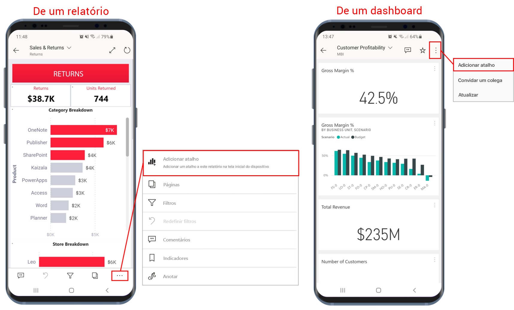
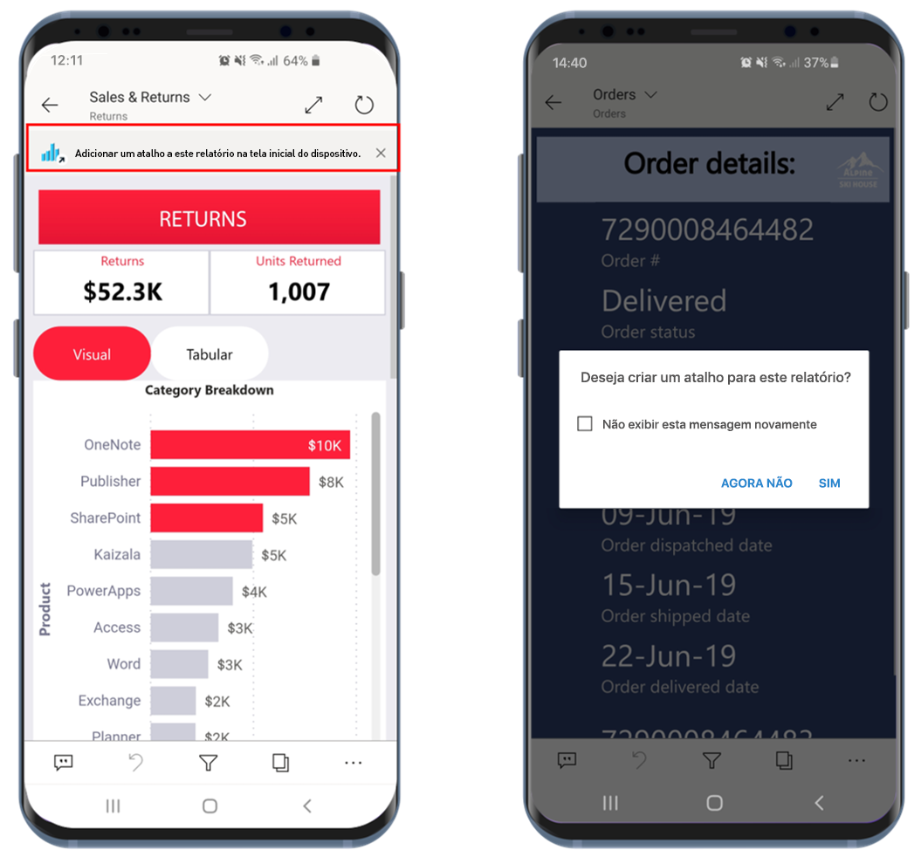
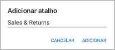
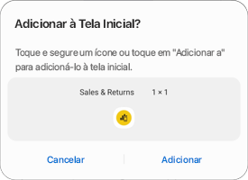
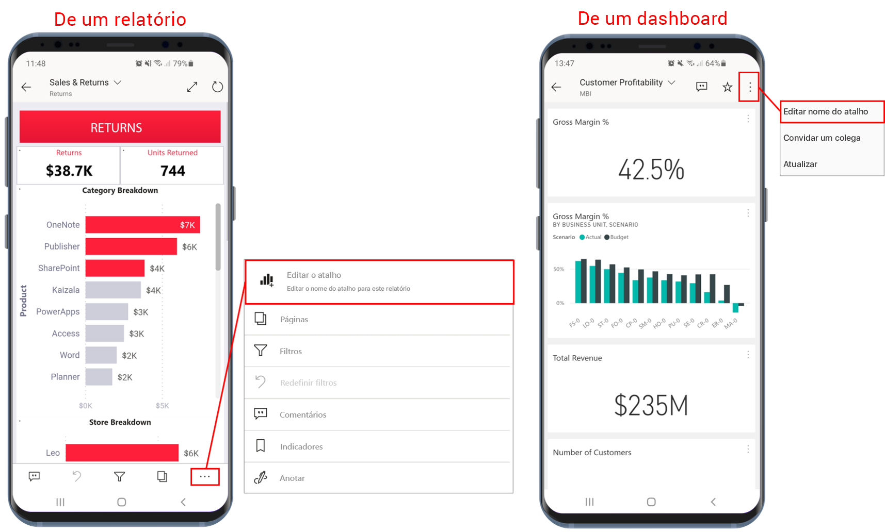
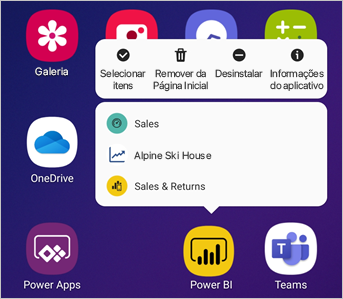

# Usar atalhos de aplicativo do Android no aplicativo do Power BI para Android

Aplica-se a:

|  |  |
|:--- |:--- |
| Telefones Android |Tablets Android |

O aplicativo móvel do Power BI para Android fornece duas maneiras fáceis de acessar diretamente os relatórios ou os dashboards de que você precisa, sem a necessidade de navegar pelo aplicativo: **os atalhos da tela inicial do dispositivo** e **os atalhos do inicializador de aplicativos**.
 * **Atalhos da tela inicial do dispositivo**: você pode criar um atalho para qualquer relatório ou dashboard e fixá-lo na tela inicial do dispositivo. O relatório ou o dashboard não precisa estar em um dos workspaces: você também pode criar atalhos para relatórios e dashboards que estão dentro de aplicativos ou, até mesmo, para relatórios ou dashboards que estão localizados em um locatário externo (B2B).
 * **Atalhos do inicializador de aplicativos**: acesse diretamente os relatórios e os dashboards exibidos com mais frequência com um toque longo no ícone do inicializador de aplicativos na tela inicial do dispositivo para abrir o inicializador de aplicativos. Um menu de acesso rápido fornece atalhos para três itens exibidos com mais frequência. Esses itens mudam de tempos em tempos: o aplicativo móvel do Power BI controla o que você está vendo com mais frequência e altera os atalhos de acordo.

 >[!NOTE]
 >Os atalhos do aplicativo Android estão disponíveis no Android 8 e superior.

## Criar um atalho para qualquer relatório ou dashboard

Você pode criar atalhos para qualquer relatório ou dashboard.

1. Em um relatório, no menu Ações, toque em **Mais opções...** e selecione **Adicionar atalho**. Em um dashboard, toque em **Adicionar atalho** no menu Ações.

   

   Além disso, se o aplicativo do Power BI observar que você está acessando um item com mais frequência, ele vai sugerir a criação de um atalho para o item. Isso ocorre de duas maneiras:
   * Nos relatórios e nos dashboards exibidos com mais frequência, a opção **Adicionar atalho** será exibida em uma barra de notificação quando você abrir o item.
   * Se você usar com frequência um link para obter um relatório (por exemplo, de um email compartilhado, anotação etc.), após algumas vezes de uso desse link, uma janela será aberta perguntando se você deseja criar um atalho. A opção **Sim** abrirá a caixa de diálogo **Adicionar atalho** (veja abaixo), e a opção **Agora não** continuará para levar você ao item que estava tentando acessar.
   
   Essas duas experiências são ilustradas abaixo.

   

 1. Uma caixa de diálogo **Adicionar atalho** fornecerá uma opção com o nome do item. Edite o nome, se desejar. Quando terminar, toque em **ADICIONAR**.

    

1. Você precisará confirmar se deseja adicionar o atalho. Toque em **ADICIONAR** para adicionar o atalho à tela inicial do seu dispositivo.

   

   Um ícone de dashboard ou de relatório de atalho será adicionado à tela inicial do dispositivo com o nome inserido.

   

## Editar o nome do atalho

Para editar o nome de um atalho, em um relatório, no menu Ações, toque em **Mais opções...** e escolha **Editar nome do atalho**. Em um dashboard, toque em **Adicionar atalho**. A caixa de diálogo **Editar nome do atalho** será exibida.

 

## Usar o inicializador do aplicativo móvel do Power BI para acessar o conteúdo exibido com mais frequência

Use o inicializador do aplicativo móvel do Power BI para obter diretamente os itens acessados com mais frequência.

Dê um toque longo no inicializador de aplicativos para ver um menu de acesso rápido para os itens exibidos com mais frequência. Em seguida, toque em um atalho para abrir o item desejado.

Crie um atalho permanente para um dos itens listados apenas arrastando o ícone de atalho desejado para a tela inicial do dispositivo.

## Próximas etapas
* [Localizar e acessar conteúdo com a Pesquisa Google](mobile-app-find-access-google-search.md)
* Se você estiver usando o iOS e procurando atalhos da Siri, confira [Como usar atalhos da Siri no aplicativo Power BI Mobile para iOS](mobile-apps-ios-siri-shortcuts.md).
* [Favoritos nos aplicativos móveis do Power BI](mobile-apps-favorites.md)
