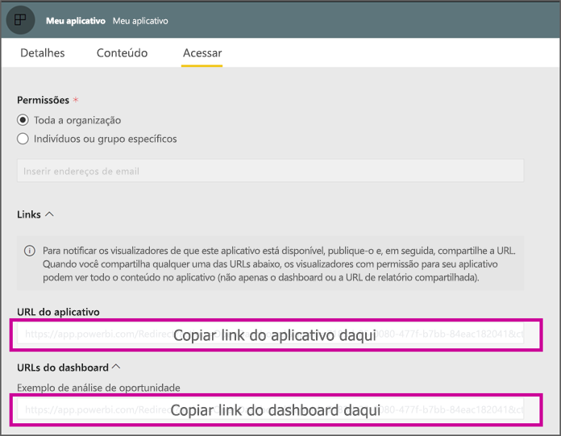

# <a name="create-a-link-to-a-specific-location-in-the-power-bi-mobile-apps"></a>Criar um link para um local específico nos aplicativos móveis do Power BI
Use links para acessar diretamente itens específicos no Power BI: Relatório, Dashboard e Bloco.

Há principalmente dois cenários para o uso de links no Power BI Mobile: 

* Abrir o Power BI **fora do aplicativo** e acessar um conteúdo específico (relatório/dashboard/aplicativo). Isso geralmente é um cenário de integração, quando você deseja abrir o Power BI Mobile em outro aplicativo. 
* Para **navegar** dentro do Power BI. Isso geralmente ocorre quando você deseja criar uma navegação personalizada no Power BI.


## <a name="use-links-from-outside-of-power-bi"></a>Usar links fora do Power BI
Ao usar um link fora do aplicativo do Power BI, o ideal será verificar se ele será aberto pelo aplicativo e, se o aplicativo não estiver instalado no dispositivo, oferecer ao usuário a opção para instalá-lo. Criamos um formato de link especial para dar suporte exatamente a isso. Esse formato de link garantirá que o dispositivo esteja usando o aplicativo para abrir o link e, se o aplicativo não estiver instalado no dispositivo, ele oferecerá ao usuário a opção para acessar a loja e obtê-lo.

O link deverá começar com o seguinte  
```html
https://app.powerbi.com/Redirect?[**QUERYPARAMS**]
```

> [!IMPORTANT]
> Se o conteúdo estiver hospedado em um datacenter especial como Governo, China etc. O link deverá começar com o endereço correto do Power BI, como `app.powerbigov.us` ou `app.powerbi.cn`.   
>


Os **QUERY PARAMS** são:
* **action** (obrigatório) = OpenApp/OpenDashboard/OpenTile/OpenReport
* **appId** = caso deseje abrir um relatório ou um dashboard que faz parte de um aplicativo 
* **groupObjectId** = caso deseje abrir um relatório ou um dashboard que faz parte do workspace (mas não do Meu workspace)
* **dashboardObjectId** = ID de objeto do dashboard (se a ação for OpenDashboard ou OpenTile)
* **reportObjectId** = ID de objeto do relatório (se a ação for OpenReport)
* **tileObjectId** = ID de objeto do bloco (se a ação for OpenTile)
* **reportPage** = caso deseje abrir uma seção de relatório específica (se a ação for OpenReport)
* **ctid** = ID da organização do item (relevante para o cenário B2B. Isso pode ser omitido se o item pertence à organização do usuário).

**Exemplos:**

* Abrir o link do aplicativo 
  ```html
  https://app.powerbi.com/Redirect?action=OpenApp&appId=appidguid&ctid=organizationid
  ```

* Abrir o dashboard que faz parte de um aplicativo 
  ```html
  https://app.powerbi.com/Redirect?action=OpenDashboard&appId=**appidguid**&dashboardObjectId=**dashboardidguid**&ctid=**organizationid**
  ```

* Abrir o relatório que faz parte de um workspace
  ```html
  https://app.powerbi.com/Redirect?Action=OpenReport&reportObjectId=**reportidguid**&groupObjectId=**groupidguid**&reportPage=**ReportSectionName**
  ```

### <a name="how-to-get-the-right-link-format"></a>Como obter o formato de link correto

#### <a name="links-of-apps-and-items-in-app"></a>Links de aplicativos e itens no aplicativo

Para **aplicativos, relatórios e dashboards que fazem parte de um aplicativo**, a maneira mais fácil de obter o link é acessar o workspace e escolher "Atualizar aplicativo". Isso abrirá a experiência "Publicar aplicativo" e na guia Acesso, você encontrará uma seção **Links**. Expandindo essa seção, você verá a lista de aplicativos e todos os links de conteúdo que podem ser usados para acessá-los diretamente.



#### <a name="links-of-items-not-in-app"></a>Links de itens que não estão no aplicativo 

Para relatórios e dashboards que não fazem parte de um aplicativo, você precisa extrair as IDs da URL do item.

Por exemplo, para localizar a ID de objeto de 36 caracteres do **dashboard**, navegue até o dashboard específico no serviço do Power BI 

```html
https://app.powerbi.com/groups/me/dashboards/**dashboard guid comes here**?ctid=**organization id comes here**`
```

Para localizar a ID de objeto de 36 caracteres do **relatório**, navegue até o relatório específico no serviço do Power BI.
Este é um exemplo de relatório de "Meu Workspace"

```html
https://app.powerbi.com/groups/me/reports/**report guid comes here**/ReportSection3?ctid=**organization id comes here**`
```
A URL acima contém também a página de relatório específica **"ReportSection3"** .

Este é um exemplo de um relatório de um workspace (não Meu Workspace)

```html
https://app.powerbi.com/groups/**groupid comes here**/reports/**reportid comes here**/ReportSection1?ctid=**organizationid comes here**
```

## <a name="use-links-inside-power-bi"></a>Usar links no Power BI

Os links no Power BI funcionam nos aplicativos móveis exatamente como no serviço do Power BI.

Caso deseje adicionar um link ao relatório que aponte para outro item do Power BI, basta copiar essa URL de item da barra de endereços do navegador. Leia mais sobre [como adicionar um hiperlink a uma caixa de texto em um relatório](https://docs.microsoft.com/power-bi/service-add-hyperlink-to-text-box).

## <a name="use-report-url-with-filter"></a>Usar a URL de relatório com o filtro
Similarmente ao serviço do Power BI, os aplicativos do Power BI Mobile também dão suporte à URL de relatório que contém um parâmetro de consulta de filtro. Abra um relatório no aplicativo do Power BI Mobile e filtre-o para um estado específico. Por exemplo, esta URL abre o relatório de Vendas e o filtra por Território

```html
https://app.powerbi.com/groups/me/reports/**report guid comes here**/ReportSection3?ctid=**organization id comes here**&filter=Store/Territory eq 'NC'
```

Leia mais sobre [como criar um parâmetro de consulta para filtrar relatórios](https://docs.microsoft.com/power-bi/service-url-filters).

## <a name="next-steps"></a>Próximas etapas
Seus comentários nos ajudam a decidir o que implementar no futuro, portanto, não se esqueça de votar em outros recursos que você gostaria de ver em aplicativos móveis do Power BI. 

* [Aplicativos do Power BI para dispositivos móveis](mobile-apps-for-mobile-devices.md)
* Siga @MSPowerBI no Twitter
* Participe da conversa na [Comunidade do Power BI](https://community.powerbi.com/)
* [O que é o Power BI?](../../fundamentals/power-bi-overview.md)

