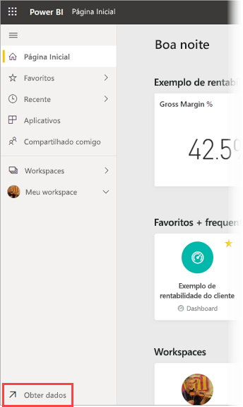
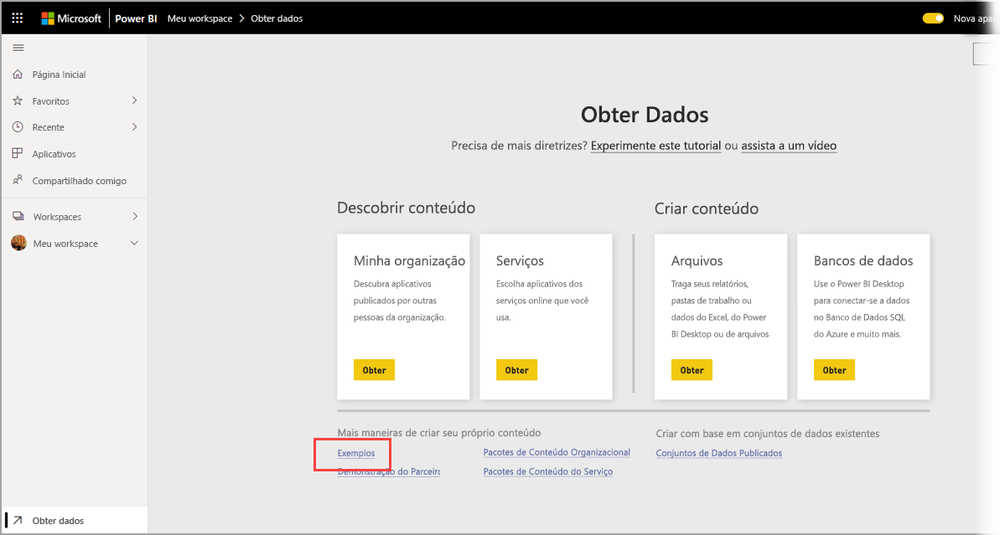
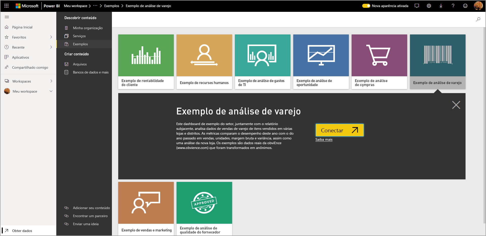
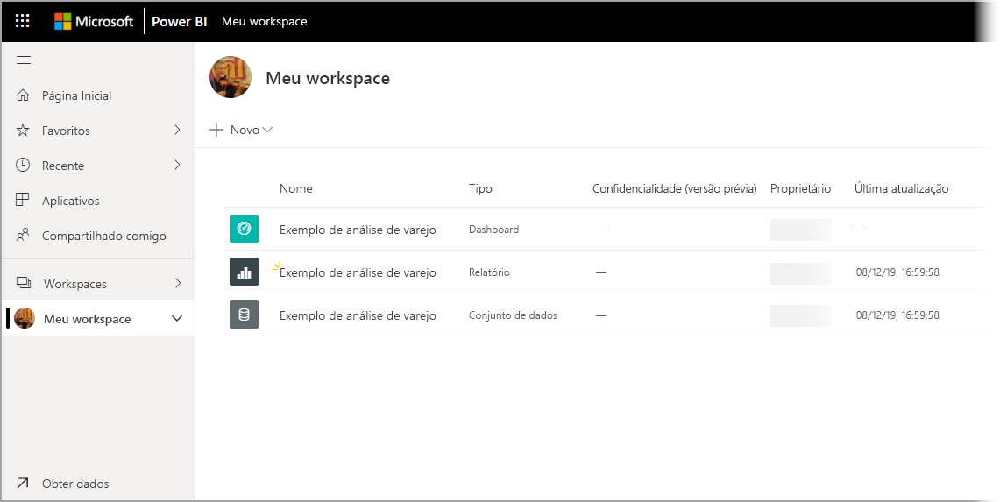

# Como baixar amostras em Meu workspace no serviço do Power BI

Parte da documentação do aplicativo Mobile disponível aqui usa dados de exemplo para fins de ilustração. Para acompanhar o artigo em seu dispositivo, baixe os dados de exemplo em sua conta de serviço do Power BI, na qual você poderá exibi-los no aplicativo Power BI Mobile em seu dispositivo. Este artigo descreve como baixar os dados de exemplo em sua conta de serviço do Power BI. 

## Pré-requisitos

Você precisará ter uma conta de serviço do Power BI para baixar os dados. Caso não esteja inscrito no Power BI, [inscreva-se em uma avaliação gratuita](https://app.powerbi.com/signupredirect?pbi_source=web) antes de começar.

## Baixe uma amostra

1. Abra o [serviço do Power BI](https://app.powerbi.com) no navegador e entre nele.

2. Selecione **Obter dados** no canto inferior esquerdo do painel de navegação. Se o painel de navegação estiver oculto e você não puder ver o link Obter dados, exiba o painel clicando no ícone mostrar/ocultar do painel de navegação .  
   
    

3. Na página Obter Dados, selecione o link **Amostras**.
   
   

4. Selecione uma amostra para download. Lembre-se de escolher a amostra indicada pelo tutorial, pelo início rápido ou pelo artigo que você está usando. Depois de selecioná-la, clique em **Conectar**.
  
   
   
5. O Power BI importa a amostra, adicionando um novo dashboard, relatório e conjunto de dados a Meu Workspace.
   
   
  
Agora você está pronto para exibir as amostras em seu dispositivo móvel.

## Próximas etapas
* [Início rápido](mobile-apps-quickstart-view-dashboard-report.md)
* Perguntas? Consulte a [seção Aplicativos móveis da comunidade do Power BI](https://go.microsoft.com/fwlink/?linkid=839277)
