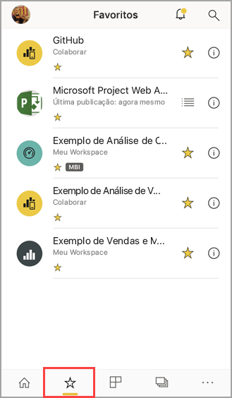
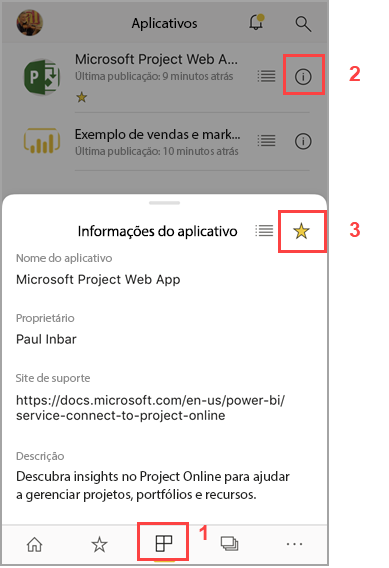
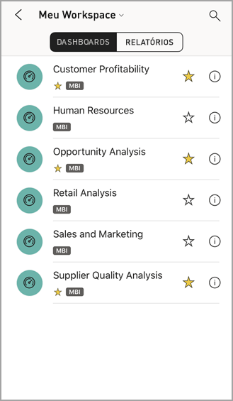
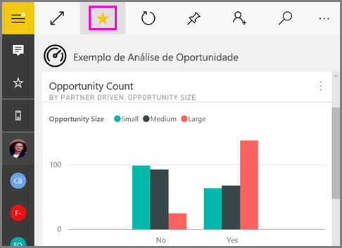
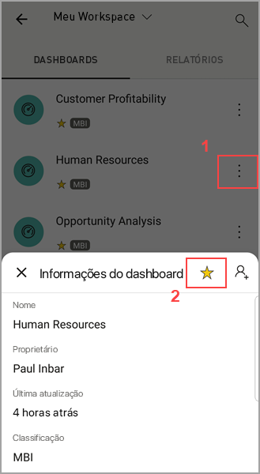
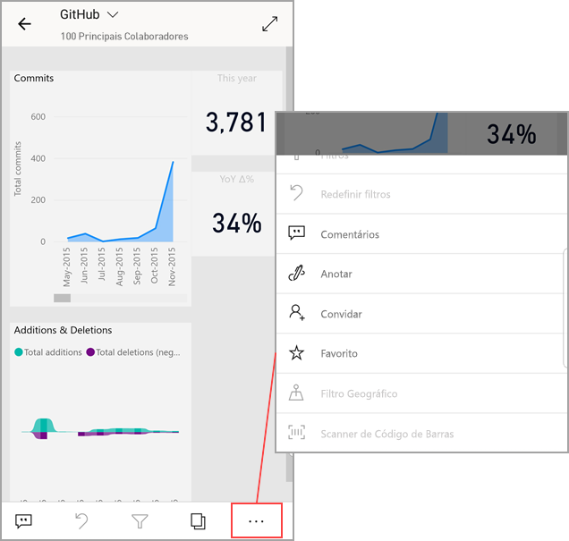

# Tornar favoritos e exibi-los nos aplicativos móveis do Power BI
Aplica-se a:

|  |  |  |  |  |
|:--- |:--- |:--- |:--- |:--- |
| iPhones |iPads |Telefones Android |Tablets Android |Dispositivos Windows 10 |

Leia sobre como criar e exibir seus dashboards, relatórios e aplicativos favoritos do Power BI, além de KPIs e relatórios do Servidor de Relatórios do Microsoft Power BI e do Reporting Services favoritos nos aplicativos móveis.

Ao criar um favorito nos aplicativos móveis do Power BI, você o verá em sua página Favoritos no [serviço do Power BI](https://powerbi.com) e em todos os seus dispositivos móveis.

Para ver sua página Favoritos, toque no ícone Favoritos na barra de navegação:

Você também pode [tornar dashboards do Power BI e aplicativos em favoritos no serviço do Power BI](../end-user-favorite.md). Em seguida, você os vê na página Favoritos no aplicativo móvel.

É possível marcar KPIs e relatórios como favoritos em um portal da Web do Servidor de Relatório do Power BI ou do Reporting Services e, em seguida, exibi-los em uma pasta conveniente em seu dispositivo móvel, juntamente com seus dashboards favoritos do Power BI.

## Tornar um aplicativo favorito
1. Toque no ícone aplicativos na barra de navegação inferior para exibir sua página de aplicativos.

2. Em um dispositivo iOS, toque no botão de informações à direita do nome do aplicativo que você deseja tornar um favorito. Em dispositivos Android, o botão Mais opções (…) é exibido em lugar do botão de informações. 

3. Na seção Informações do aplicativo que é aberta, toque na estrela.
   
    
   
    O aplicativo agora será listado na sua página Favoritos, juntamente com seus outros dashboards, relatórios e aplicativos favoritos.
   
## Tornar um dashboard ou relatório favorito nos aplicativos móveis iOS e Windows 10
Você pode tornar um dashboard ou relatório do Power BI ou um aplicativo favorito na lista de dashboards ou relatórios ou do próprio dashboard ou relatório.

* Na lista de dashboards ou relatórios no aplicativo móvel, toque na estrela vazia ao lado do nome . A estrela fica amarela .
  
    
* Se você estiver em um dashboard, toque no  com a estrela vazia na faixa de opções. Se você estiver em um relatório, a estrela estará localizada em **Mais opções** (…).  A estrela do ícone  fica preta.
  
    

## Tornar um dashboard ou relatório favorito nos aplicativos móveis Android
Você pode tornar um dashboard ou relatório ou um aplicativo favorito na lista de dashboards ou relatórios ou do próprio dashboard ou relatório.

* Na lista de dashboards ou relatórios no aplicativo móvel, toque no botão de reticências verticais de **Mais opções** (…) ao lado do nome, depois toque na estrela de Favoritos na guia de informações que aparece.
  
    

* Em um dashboard, toque na estrela vazia na faixa de opções . A estrela fica cinza-escuro .
  
    

* Se você estiver em um relatório, passe o dedo para baixo para revelar a faixa de opções, toque em **Mais opções** (…) e, em seguida, role para baixo até encontrar a estrela vazia  e toque nela. A estrela do  fica cinza-escuro.
  
    

## Tornar favoritos os relatórios e KPIs do Servidor de Relatório do Power BI e do Reporting Services
É possível exibir seus relatórios e KPIs favoritos do Servidor de Relatório do Power BI e do Reporting Services nos aplicativos móveis do Power BI, mas não é possível torná-los favoritos nos aplicativos móveis. Você [os marca como favoritos no portal da Web](../../report-server/tutorial-explore-report-server-web-portal.md#tag-your-favorites). 

## Próximas etapas
* [Criar dashboards no serviço do Power BI](../end-user-favorite.md) 
* Dúvidas? [Experimente perguntar à Comunidade do Power BI](https://community.powerbi.com/)

