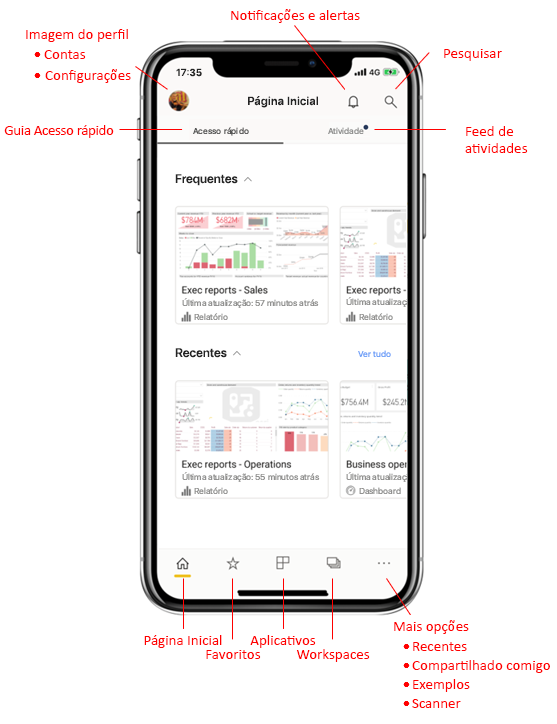
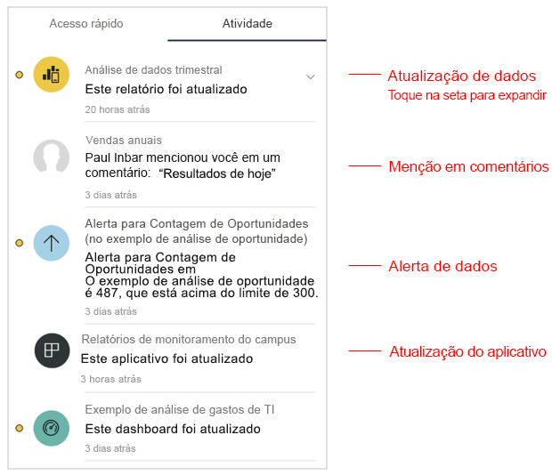
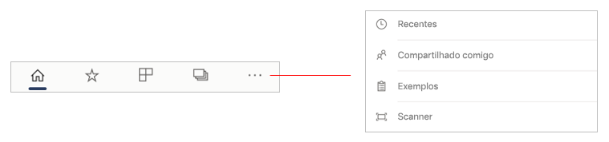
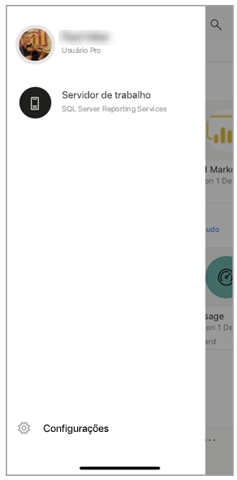
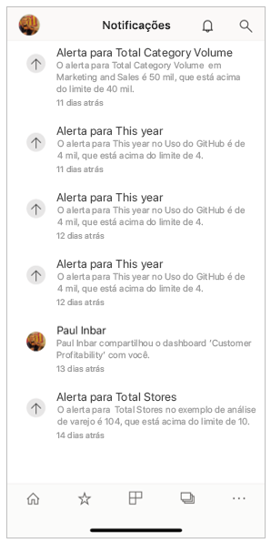
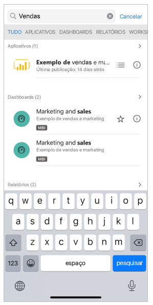

# Um tour rápido pela home page do aplicativo Mobile
Neste tour, você se familiariza com a home page do aplicativo Power BI Mobile e com os recursos de navegação que ele oferece a você, para que você obtenha rapidamente o que precisa.

Aplica-se a:

|  |  |  |
|:--- |:--- |:--- |
| iPhone | iPad | Android | 

Quando abre o aplicativo Power BI Mobile, você é direcionado inicialmente à home page, na qual você tem acesso rápido aos seus relatórios, dashboards e aplicativos visitados com mais frequência ou recentemente. Além disso, há um feed de atividades que mantém você atualizado sobre o que está acontecendo com seu conteúdo de Power BI, bem como auxílios de navegação convenientes para ajudá-lo a obter rapidamente o conteúdo de que você precisa.

 
## Guia Acesso Rápido

A guia de acesso rápido mostra os relatórios, dashboards e aplicativos exibidos com frequência e recentemente, agrupados em duas seções recolhíveis. Para ver uma lista mais longa dos itens exibidos recentemente, toque em **Ver todos** à direita de Recentes. 

## Feed de atividades

O feed de atividades ajuda você a acompanhar o que está acontecendo com o seu conteúdo do Power BI. Ele mostra todas as suas notificações, alertas, comentários e @mentions mais recentes.

As atualizações no feed incluem:
* **Dados atualizados**: quando os dados subjacentes em um dos relatórios ou dashboards em seus itens favoritos ou acessados recentemente são atualizados.
* **Novos comentários**: quando as pessoas criam um comentário em um relatório ou dashboard que está nos seus favoritos ou itens recentemente acessados, ou quando alguém menciona você em um comentário.
* **Alertas de dados**: quando os dados atingem um limite que você definiu anteriormente em um [alerta de dados](../../mobile-set-data-alerts-in-the-mobile-apps.md).
* **Atualizações de aplicativo**: quando um criador de aplicativo publica uma atualização em um aplicativo que você está usando.

 Toque em um item de atividade para ir para o local relevante a fim de explorar mais detalhadamente.

Os itens de atividade são agregados, de modo que todas as atualizações de dados provenientes do mesmo aplicativo ou workspace serão agrupadas em conjunto. Use o  para expandir e ver os itens agregados. O item mais recente sempre estará no topo da lista.

## Barra de navegação

Na parte inferior da página, você encontra a barra de navegação.

A barra de navegação fornece acesso rápido a:

*  **Página inicial** – retorna à home page.
*  **Favoritos** – os relatórios, dashboards e aplicativos que você marcou como [favoritos](../../mobile-apps-favorites.md).
*  **Aplicativos** – os aplicativos que você instalou em sua conta.
*  **Workspaces** – as pastas de trabalho que mantêm os relatórios e dashboards que os criadores de conteúdo estão criando.
*  **Recentes** – os itens que você exibiu recentemente.
*  **Compartilhado comigo** – os itens que outras pessoas compartilharam com você.
*  **Exemplos** – exemplos do Power BI que você pode usar para saber mais sobre as funcionalidades do Power BI.
*  **Scanner** – a câmera do dispositivo que você pode usar como um scanner para digitalizar [códigos de barras](../../mobile-apps-scan-barcode-iphone.md) e [códigos QR](../../mobile-apps-qr-code.md).

## Cabeçalho

Na parte superior da página, o cabeçalho mostra o nome da página, relatório ou dashboard do Power BI no qual você está.

O cabeçalho fornece os seguintes itens de navegação:
* **Imagem de perfil ou avatar** – abre o painel lateral, no qual é possível [alternar entre o serviço do Power BI e as contas de Servidor de Relatório](../../mobile-app-ssrs-kpis-mobile-on-premises-reports.md), bem como acessar as configurações de aplicativo do Power BI Mobile.

    

* **Notificações** – abre a [página de notificações](../../mobile-apps-notification-center.md) em que você pode exibir e acessar suas notificações. Um ponto no sino de notificações indica que você tem novas notificações.

    

* **Pesquisar** – pesquisar conteúdo do Power BI em sua assinatura.

    

## Próximas etapas
Neste Tour, você explorou a home page do aplicativo Power BI Mobile. Leia mais sobre o uso do aplicativo Power BI Mobile. 
* [Explorar dashboards e relatórios](../../mobile-apps-quickstart-view-dashboard-report.md)
* [Explorar relatórios nos aplicativos móveis do Power BI](../../mobile-reports-in-the-mobile-apps.md)
