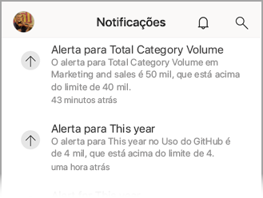
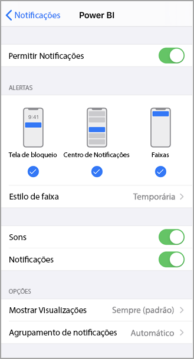
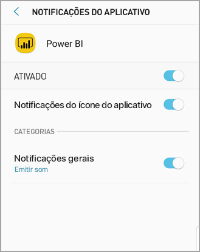

# Obter notificações nos aplicativos móveis do Power BI
Aplica-se a:

|  |  |  |  |  |
|:--- |:--- |:--- |:--- |:--- |
| iPhones |iPads |Telefones Android |Tablets Android |Dispositivos Windows 10 |

As notificações levam diretamente a você informações relacionadas à sua experiência com o Power BI, no serviço do Power BI ou em seu dispositivo móvel. Quando você abre as Notificações, é exibido um feed sequencial de mensagens sobre [alertas definidos](mobile-set-data-alerts-in-the-mobile-apps.md), novos dashboards que foram compartilhados com você, as alterações no workspace do grupo, informações sobre eventos e reuniões do Power BI e muito mais.

> [!NOTE]
> Em um dispositivo iOS, em sua primeira conexão à [versão atualizada dos aplicativos do Power BI](https://powerbi.microsoft.com/mobile/), você verá uma mensagem perguntando se quer receber notificações do Power BI. Você também pode configurar o modo como o Power BI envia notificações a você em **Configurações** de seu dispositivo. 
> 
> 

## Exibir notificações em seu dispositivo móvel
1. Quando você recebe notificações em seu dispositivo móvel, por padrão, o Power BI emite um som e mostra uma faixa de navegação.
   
   
   

   É possível [alterar o modo como o Power BI lhe envia notificações](mobile-apps-notification-center.md#change-or-turn-off-notifications-on-your-mobile-device).
2. Se tiver recebido notificações, quando entrar no Power BI em seu dispositivo móvel, você verá um ponto amarelo no ícone do sino de notificação  (iOS e Android) ou no botão de navegação global  (Dispositivos Windows 10). 

3. Para ver as notificações no Centro de notificações, toque no sino de notificações  (iOS e Android) ou no ícone do Centro de notificações  (Dispositivos Windows 10).
   
    As notificações são exibidas com as mensagens mais recente na parte superior e as mensagens não lidas realçadas. As notificações são mantidas por 90 dias, a menos que você as exclua ou que elas atinjam o limite máximo de 100.
   
   
4. Para ignorar uma notificação em dispositivos iOS e Android, toque, segure e passe o dedo. Em dispositivos Windows 10, clique com o botão direito do mouse em **Ignorar** e escolha essa opção.

## Alterar ou desativar as notificações em seu dispositivo móvel
Você pode alterar o modo como o Power BI envia notificações a você.

1. Em um dispositivo iOS, acesse **Configurações** > **Notificações**. 
   
    Em um telefone Android, vá para **Configurações** > **Notificações**.
   
    Em um dispositivo do Windows em **Configurações**, vá para **Sistema** > **Notificações e ações**.
2. Na lista de aplicativos, selecione **Power BI**. 
3. Aqui você pode desativar as notificações por completo ou escolher as notificações desejadas.
   
    **Em um iPhone**
   
    
   
    **Em um telefone Android**
   
    

    **Em um dispositivo Windows 10**

    

## Próximas etapas
* [Alertas de dados no serviço do Power BI](../../service-set-data-alerts.md)
* [Definir alertas de dados no aplicativo de iPhone (Power BI para iOS)](mobile-set-data-alerts-in-the-mobile-apps.md)
* [Definir alertas de dados no aplicativo móvel do Power BI para Windows 10](mobile-set-data-alerts-in-the-mobile-apps.md)
* [Baixar a versão mais recente dos aplicativos do Power BI](https://powerbi.microsoft.com/mobile/) para dispositivos móveis

