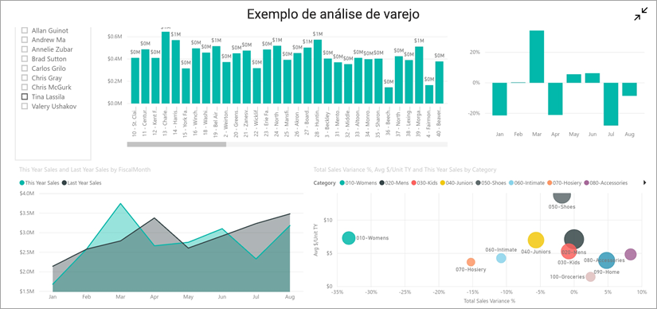
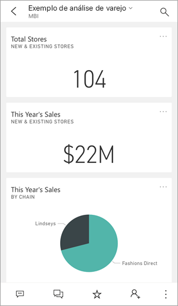
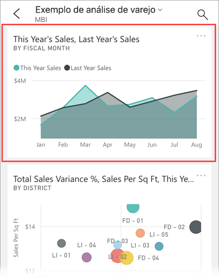
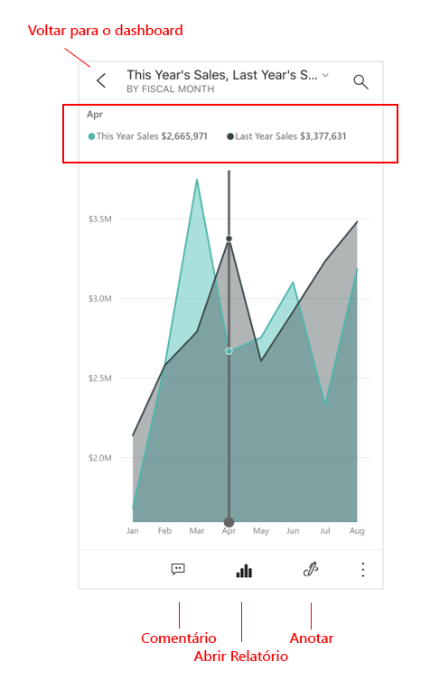
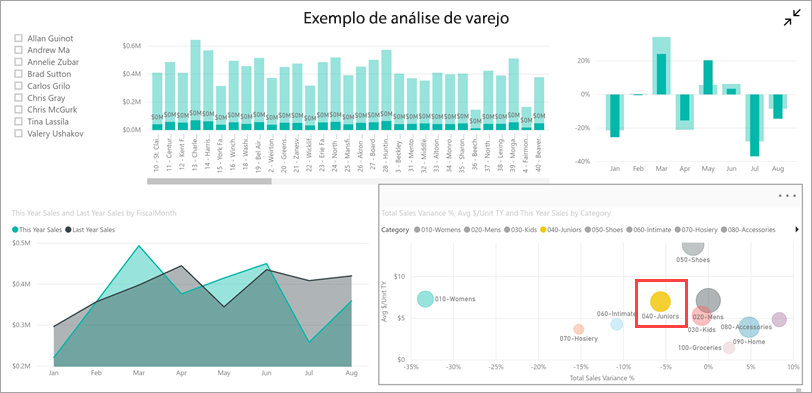
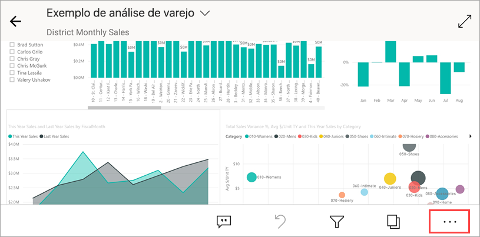
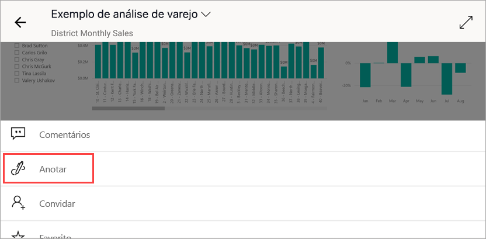
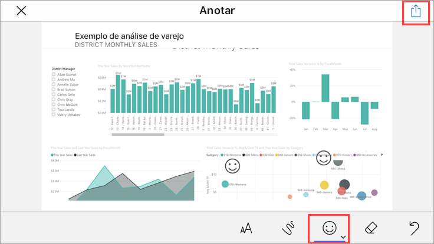
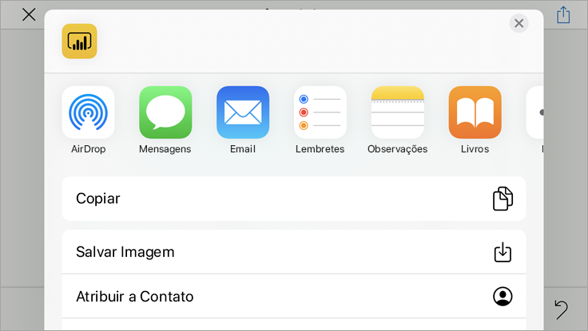
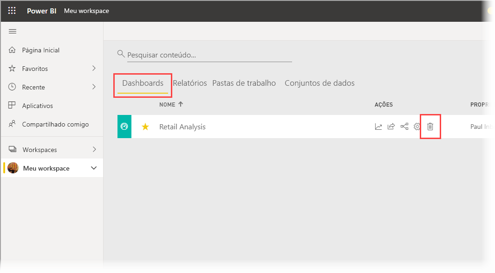

# Início Rápido: Explorar dashboards e relatórios nos aplicativos móveis do Power BI
Neste início rápido, você faz um breve tour do aplicativo do Power BI Mobile e explora um exemplo de dashboard e relatório. O aplicativo do Power BI para iOS é mostrado, mas você pode acompanhar facilmente em outros dispositivos.

Aplica-se a:

|  |  |  |  |
|:--- |:--- |:--- |:--- |
| iPhone | iPad | Android | Windows 10 |

>[!NOTE]
>O suporte de aplicativo móvel Power BI para **telefones que usam o Windows 10 Mobile** será descontinuado em 16 de março de 2021. [Saiba mais](https://go.microsoft.com/fwlink/?linkid=2121400)

Um dashboard é um portal para o ciclo de vida e os processos de sua empresa. Ele é uma visão geral, um lugar centralizado para monitorar o estado atual da empresa. Relatórios são uma exibição interativa de seus dados, com elementos visuais representando diferentes descobertas e ideias obtidas por meio desses dados. 

## Pré-requisitos

* **Inscreva-se no Power BI**: Se você não estiver inscrito no Power BI, [inscreva-se para uma avaliação gratuita](https://app.powerbi.com/signupredirect?pbi_source=web) antes de começar.
* **Instalar o aplicativo do Power BI em seu aplicativo**: Baixe o aplicativo móvel do Power BI** na [App Store](https://apps.apple.com/app/microsoft-power-bi/id929738808) (iOS) ou no [Google Play](https://play.google.com/store/apps/details?id=com.microsoft.powerbim&amp;amp;clcid=0x409) (Android).
* Baixe o **Exemplo de Análise de Varejo**: A primeira etapa do início rápido é baixar o Exemplo de Análise de Varejo no serviço do Power BI. [Saiba como baixar um exemplo](./mobile-apps-download-samples.md) em sua conta do Power BI para começar a usar o serviço. Escolha o Exemplo de Análise de Varejo.

Depois de concluir os pré-requisitos e baixar o Exemplo de Análise de Varejo para sua conta do Power BI, você estará pronto para iniciar este tour rápido.

## Exibir um dashboard em seu dispositivo móvel
1. Em seu dispositivo, abra o aplicativo do Power BI e entre usando as credenciais de sua conta do Power BI, as mesmas usadas no serviço do Power BI no navegador.
 
1. Agora, toque no ícone **Workspaces** , escolha **Meus Workspaces** e, em seguida, toque no Exemplo de Análise de Varejo para abri-lo.

    
   
    Os dashboards do Power BI parecem um pouco diferentes em seu dispositivo móvel do que no serviço do Power BI. Todos os blocos aparecem com a mesma largura e são dispostos um após o outro, de cima para baixo.

5. Toque no ícone de estrela  na barra de ferramentas inferior para fazer deste um dashboard favorito. Quando você marcar um favorito no aplicativo móvel, ele se tornará um favorito no serviço do Power BI e vice-versa.

6. Role para baixo e toque no gráfico de linhas "Vendas deste ano, vendas do ano passado".

    

    Ele é aberto no modo de foco.

7. No modo de foco, toque em **Abr** no gráfico. Os valores referentes a abril aparecem na parte superior do gráfico.

    

8. Toque no ícone de Relatório  na parte inferior da tela (em dispositivos Android, pode estar na parte superior da tela). O relatório relacionado a esse bloco será aberto no modo paisagem.

    

9. Toque na bolha amarela "040 – Juniors" no gráfico de bolhas. Veja como isso realça os valores relacionados nos outros gráficos. 

    

10. Passe o dedo para cima para ver a barra de ferramentas na parte inferior e, em seguida, toque em **Mais opções (…)** .

    

11. Role a lista para baixo e selecione **Anotar**.

    

12. Na barra de ferramentas de anotação, toque no ícone de smiley e, em seguida, toque na página do relatório na qual gostaria de adicionar alguns smileys.
 
    

13. Agora, toque em **Compartilhar** no canto superior direito.

14. Escolha a maneira como você gostaria de compartilhar o relatório.  

    

    Você pode compartilhar esse instantâneo com qualquer pessoa dentro ou para de sua organização. Se a pessoa estiver em sua organização e tiver sua própria conta do Power BI, ela também poderá abrir o relatório de Exemplo de Análise de Varejo.

## Limpar recursos

Depois de concluir este início rápido, você poderá excluir o dashboard, o relatório e o conjunto de dados de Exemplo de Análise de Varejo, se desejar.

1. Abra o serviço do Power BI ([serviço do Power BI](https://app.powerbi.com)) e entre.

2. No painel de navegação, selecione **Meu Workspace**.

3. Selecione a guia de dashboards e, em seguida, clique na lixeira.

    

    Agora, clique na guia de relatórios e faça o mesmo.

4. Agora, selecione a guia de conjuntos de dados, clique em **Mais opções** (…) e escolha **Excluir**. 

    

## Próximas etapas

Neste início rápido, você explorou um dashboard e um relatório de exemplo em seu dispositivo móvel. Leia mais sobre como trabalhar no serviço do Power BI. 

> [!div class="nextstepaction"]
> [Início Rápido: Como explorar o serviço do Power BI](../end-user-experience.md)

