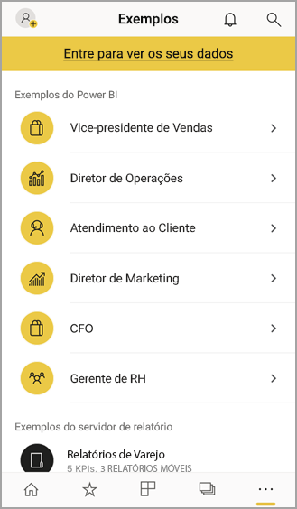

# Introdução ao aplicativo móvel do Power BI em dispositivos iOS
O aplicativo Microsoft Power BI para iOS no iPhone ou no iPad oferece a experiência móvel do BI para Power BI, Servidor de Relatório do Power BI e Reporting Services. Exiba e interaja com os dashboards de sua empresa localmente e na nuvem em qualquer lugar, com acesso móvel dinâmico e habilitado para toque. Explore os dados em dashboards e compartilhe com seus colegas em mensagens de email ou de texto. Além disso, mantenha atualizado com seus dados mais recentes em seu [Apple Watch](mobile-apple-watch.md).  

Crie relatórios do Power BI no Power BI Desktop e publique-os:

* [Publique-os no serviço do Power BI](../../fundamentals/service-get-started.md) e crie dashboards.
* [Publique-os localmente no Servidor de Relatórios do Power BI](../../report-server/quickstart-create-powerbi-report.md).

Em seguida, no aplicativo móvel do Power BI para iOS, você interage com os dashboards e relatórios, localmente ou na nuvem.

Descubra as [novidades nos aplicativos móveis do Power BI](mobile-whats-new-in-the-mobile-apps.md).

## Baixar o aplicativo
[Baixe o aplicativo iOS](https://go.microsoft.com/fwlink/?LinkId=522062 "Baixar o aplicativo iOS") da Apple App Store para seu iPhone ou iPad.

Você pode executar o aplicativo móvel do Power BI para iOS em qualquer dispositivo com o iOS 11 ou posterior. 

## Inscreva-se no serviço do Power BI
Se ainda não se inscreveu, acesse [powerbi.com](https://powerbi.microsoft.com/get-started/) e, em **Power BI – Colaboração e compartilhamento em nuvem**, selecione **Experimentar gratuitamente**.

## Introdução ao aplicativo Power BI
1. Em seu dispositivo iOS, abra o aplicativo Power BI.
2. Para entrar no Power BI, toque na guia **Power BI** e forneça suas credenciais de entrada.  
   Para entrar em seus KPIs e relatórios móveis do Reporting Services, toque na guia **Servidor de relatório** e forneça suas credenciais de entrada.
   
   
   
   Após entrar no aplicativo, basta tocar na imagem de perfil da conta no canto superior esquerdo da tela para alternar entre o Power BI e o servidor de relatório. 

## Experimente os exemplos do Power BI e Reporting Services
Mesmo sem se inscrever, você pode exibir e interagir com os exemplos do Power BI e do Reporting Services.

Para acessar os exemplos, toque em **Mais opções** (…) na barra de navegação e escolha **Exemplos**.

Vários exemplos do Power BI são seguidos por vários exemplos de Servidor de relatório.

   
   
   > [!NOTE]
   > Nem todos os recursos estão disponíveis nos exemplos. Por exemplo, você não pode exibir os relatórios de exemplo subjacentes aos dashboards, não pode compartilhar os exemplos com outras pessoas e não pode torná-los seus favoritos. 
   > 
   >

## Encontre seu conteúdo nos aplicativos móveis do Power BI

Toque na lupa no cabeçalho para começar a pesquisar seu conteúdo do Power BI.

## Exibir seus dashboards e relatórios favoritos
Toque em **Favoritos** () na barra de navegação para exibir a página Favoritos. 

Leia mais sobre [favoritos nos aplicativos móveis do Power BI](mobile-apps-favorites.md).

## Suporte corporativo para aplicativos móveis do Power BI
As organizações podem usar o Microsoft Intune para gerenciar dispositivos e aplicativos, incluindo os aplicativos móveis do Power BI para Android e iOS.

O Microsoft Intune permite que as organizações controlem itens, como exigir um PIN de acesso, controlar como os dados serão manipulados pelo aplicativo e até mesmo criptografar dados de aplicativo quando ele não estiver em uso.

> [!NOTE]
> Se você usar o aplicativo móvel do Power BI em seu dispositivo iOS e sua organização tiver configurado o Microsoft Intune MAM, a atualização de dados em segundo plano será desabilitada. Na próxima vez que você entrar no aplicativo, o Power BI atualiza os dados do serviço do Power BI na Web.
> 

Leia mais sobre [Configurar aplicativos móveis do Power BI com o Microsoft Intune](../../admin/service-admin-mobile-intune.md). 

## Próximas etapas

* [O que é o Power BI?](../../fundamentals/power-bi-overview.md)
* Dúvidas? [Experimente perguntar à Comunidade do Power BI](https://community.powerbi.com/)
