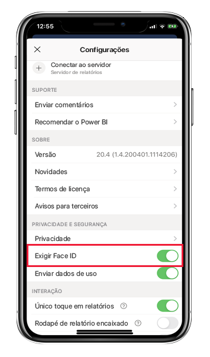
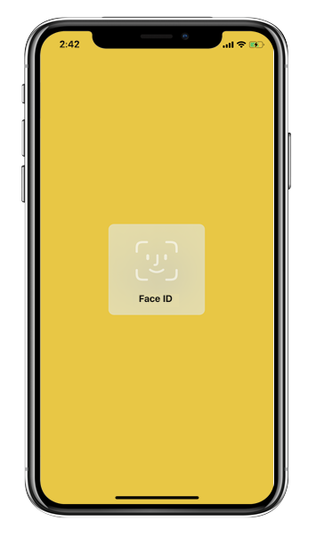
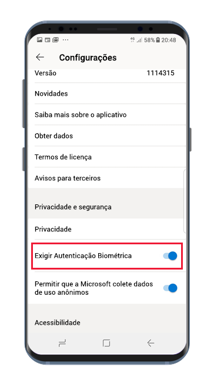
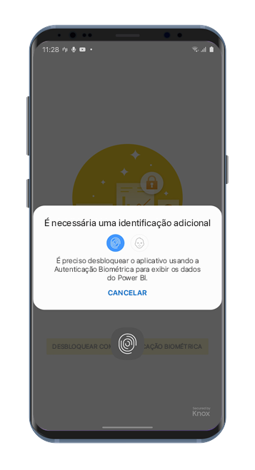

# Proteger o aplicativo do Power BI com Face ID, Touch ID, senha ou dados biométricos 

Em muitos casos, os dados gerenciados no Power BI são confidenciais e precisam ser protegidos e acessados somente por usuários autorizados. 

Os aplicativos do Power BI para iOS e Android permitem que você proteja seus dados configurando uma identificação adicional. Assim, toda vez que o aplicativo for iniciado ou colocado em primeiro plano, a identificação será necessária. No iOS, isso significa fornecer o Face ID, o Touch ID ou uma senha. No Android, isso significa fornecer dados biométricos (ID da Impressão Digital).

Aplica-se a:

|  |  |  |  |
|:--- |:--- |:--- |:--- |
|iPhones |iPads |Telefones Android |Tablets Android |

## Ativar o Face ID, o Touch ID ou a senha no iOS

Para usar uma identificação adicional no aplicativo móvel do Power BI para iOS, acesse a configuração de aplicativo em **Privacidade e Segurança**. Você verá a opção para ativar o Face ID, o Touch ID ou a senha. As opções que você verá dependerão das funcionalidades do seu dispositivo.

Depois que essa configuração for ativada, toda vez que você iniciar o Power BI ou colocá-lo em primeiro plano, ele pedirá que você forneça sua ID antes de acessar o aplicativo.

O tipo de ID que você precisará fornecer dependerá das funcionalidades do seu dispositivo. Se o dispositivo for compatível com o Face ID, você precisará usar o Face ID. Se ele for compatível com o Touch ID, você precisará usar o Touch ID. Se não for compatível com nenhum deles, você precisará fornecer uma senha. A imagem abaixo mostra a tela de autenticação do Face ID.

## Ativar dados biométricos (ID da Impressão Digital) no Android

Para usar uma identificação adicional no aplicativo móvel do Power BI para Android, acesse a configuração de aplicativo em **Privacidade e Segurança**. Você verá a opção para ativar os dados biométricos.

Depois que essa configuração for ativada, toda vez que você iniciar o Power BI ou colocá-lo em primeiro plano, ele pedirá que você forneça seus dados biométricos (ID da Impressão Digital) antes de acessar o aplicativo.

A imagem abaixo mostra a tela de autenticação da impressão digital.

>[!NOTE]
>Para usar a configuração Exigir Autenticação Biométrica do aplicativo móvel, primeiro, você precisará configurar a biometria no seu dispositivo Android. Se o dispositivo não der suporte à biometria, você não poderá proteger o acesso aos dados do Power BI usando essa configuração de aplicativo móvel.
>
>Se o administrador tiver [ativado remotamente o acesso seguro](#mdm-enforcement-of-secure-access-to-your-power-bi-mobile-app) no aplicativo móvel, você precisará configurar a biometria no seu dispositivo para acessar o aplicativo, caso ainda não tenha feito isso. Se o dispositivo não der suporte à biometria, a configuração remota não afetará você. O acesso ao aplicativo móvel permanecerá não seguro.

## Imposição de MDM de acesso seguro ao seu aplicativo móvel do Power BI.

Algumas organizações têm políticas de segurança e requisitos de conformidade que impõem identificação adicional antes de permitir acesso a dados corporativos confidenciais.

Para dar suporte a isso, o aplicativo móvel do Power BI permite aos administradores controlar a configuração de acesso seguro do aplicativo móvel enviando as definições de configuração de aplicativo por push do Microsoft Intune e de outras soluções de MDM (gerenciamento de dispositivo móvel). Os administradores podem usar a política de proteção de aplicativo para ativar essa configuração para todos os usuários ou para um grupo de usuários. Confira [Usar o MDM para configurar remotamente o aplicativo móvel do Power BI](mobile-app-configuration.md#data-protection-settings-ios-and-android) para obter detalhes.

## Próximas etapas
* [Usar o MDM para configurar remotamente o aplicativo móvel do Power BI](mobile-app-configuration.md)
