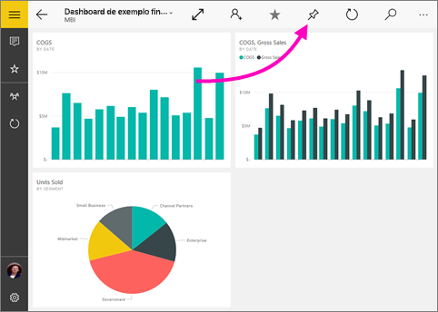
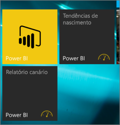

# Fixar um dashboard na tela inicial do Windows 10 por meio do aplicativo móvel do Power BI
É possível fixar dashboards do Power BI na tela inicial do Windows por meio do aplicativo móvel do Power BI para Windows 10. Quando você toca no bloco na tela inicial, o dashboard é aberto no aplicativo móvel do Power BI para Windows 10.

>[!NOTE]
>O suporte de aplicativo móvel Power BI para **telefones que usam o Windows 10 Mobile** será descontinuado em 16 de março de 2021. [Saiba mais](https://go.microsoft.com/fwlink/?linkid=2121400)

## Fixar um dashboard na tela inicial como um bloco
1. Abra um dashboard.
2. Toque em **Fixar na Tela Inicial** .
   
   
   
   Acesse a tela inicial do dispositivo para ver o bloco.
   
   

## Próximas etapas
* [Baixar o aplicativo móvel do Power BI para Windows 10](https://go.microsoft.com/fwlink/?LinkID=526478) na Windows Store  
* [Introdução ao aplicativo móvel do Power BI para Windows 10](mobile-windows-10-phone-app-get-started.md)  
* [O que é o Power BI?](../../fundamentals/power-bi-overview.md)
* Dúvidas? [Experimente perguntar à Comunidade do Power BI](https://community.powerbi.com/)
