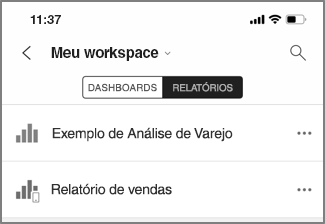
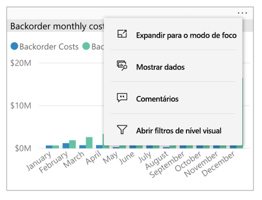
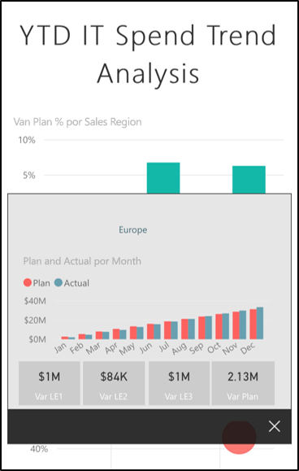
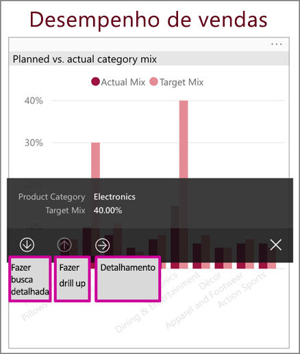
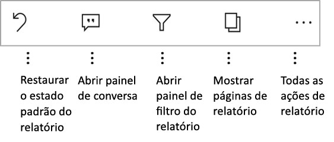
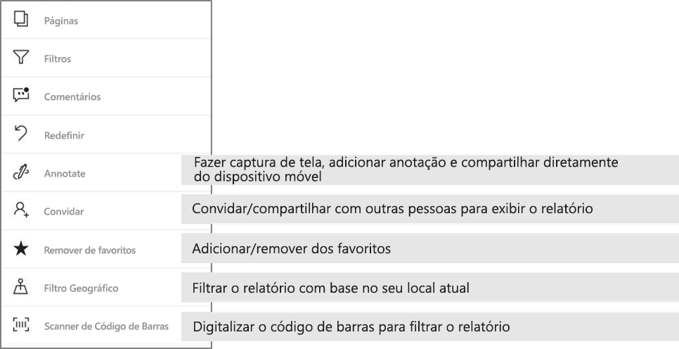

# Explorar relatórios nos aplicativos móveis do Power BI
Aplica-se a:

|  |  |  |  |  |
|:---: |:---: |:---: |:---: |:---: |
| iPhones |iPads |Telefones Android |Tablets Android |Dispositivos Windows 10 |

Um relatório do Power BI é uma exibição interativa de seus dados, com visuais que representam diferentes descobertas e informações obtidas desses dados. A exibição de relatórios nos aplicativos móveis do Power BI é a terceira etapa de um processo de três etapas:

1. [Criar relatórios no Power BI Desktop](../../desktop-report-view.md). Você pode até mesmo [otimizar um relatório para telefones](mobile-apps-view-phone-report.md) no Power BI Desktop.
2. Publique esses relatórios para o serviço do Power BI [(https://powerbi.com)](https://powerbi.com) ou [Servidor de Relatórios do Power BI](../../report-server/get-started.md).  
3. Interagir com esses relatórios nos aplicativos móveis do Power BI.

## Abrir um relatório do Power BI no aplicativo móvel
Os relatórios do Power BI são armazenados em locais diferentes no aplicativo móvel, dependendo de onde eles foram obtidos. Eles podem estar em Aplicativos, Compartilhado comigo, Workspaces (incluindo Meu Workspace) ou em um servidor de relatório. Às vezes, você percorre um dashboard relacionado para obter um relatório e, às vezes, ele é listado.

Em listas e menus, você encontrará um ícone ao lado de um nome de relatório, que o ajuda a entender que o item é um relatório:

Há dois ícones para relatórios em aplicativos do Power BI Mobile:

*  indica um relatório que aparecerá na orientação paisagem no aplicativo. Ele terá a mesma aparência que em um navegador.

*  Indica um relatório que tem pelo menos uma página otimizada para telefone que aparecerá na orientação retrato.

> [!NOTE]
> Quando você segura o telefone na orientação paisagem, sempre obtém o layout de paisagem, mesmo que a página do relatório esteja no layout do telefone.

Para obter um relatório de um dashboard, toque nas reticências (…) no canto superior direito de um bloco e então toque em **Abrir relatório**:
  
  
  
  Nem todos os blocos podem ser abertos como relatórios. Por exemplo, os blocos criados ao fazer uma pergunta na caixa de P e R não abrem relatórios quando você toca neles.
  
## Interagir com relatórios
Depois de abrir um relatório no aplicativo, você pode começar a trabalhar com ele. Você pode fazer muitas coisas com seus relatórios e seus dados. No rodapé do relatório, você encontrará ações que podem ser executadas no relatório. Ao tocar e tocar de modo prolongado nos dados mostrados no relatório, você também pode dividir os dados.

### Usando toque e toque longo
Um toque é o mesmo que um clique com o mouse. Portanto, se desejar realizar um realce cruzado do relatório com base em um ponto de dados, toque nesse ponto de dados.
Quando você toca em um valor de segmentação, o valor é selecionado e o restante do relatório é dividido por esse valor.
Quando você toca em um link, botão ou indicador, a ação definida pelo autor do relatório ocorrerá.

Você provavelmente observou que, quando você toca em um visual, uma borda é exibida. No canto superior direito da borda, você verá reticências (…). Se você tocar nas reticências, verá um menu das ações que você pode executar no visual:

### Dica de ferramenta e ações de detalhamento

Quando você realizar um toque longo (tocar e segurar) em um ponto de dados, será exibida uma dica de ferramenta mostrando os valores que esse ponto de dados representa:

Se o autor do relatório tiver configurado uma dica de ferramenta da página de relatório, a dica de ferramenta padrão será substituída por aquela da página de relatório:

> [!NOTE]
> As dicas de ferramentas de relatório são compatíveis com dispositivos com visores de pelo menos 640 pixels e 320 pixels. Se o dispositivo for menor, o aplicativo usará mostrará as dicas de ferramenta padrão.

Os autores de relatório podem definir hierarquias nos dados e relações entre as páginas de relatório. As hierarquias permitem fazer drill down, fazer drill up e detalhar outra página de relatório usando um visual e um valor. Assim, quando realizar toque longo em um valor, além da dica de ferramenta, as opções de análise relevantes serão exibidas no rodapé:

Quando você toca em uma parte específica de um visual e então toca na opção *Detalhamento*, o Power BI leva a uma página diferente no relatório, filtrada com o valor tocado. O autor de um relatório pode definir uma ou mais opções de detalhamento, cada uma levando a uma página diferente. Nesse caso, você pode escolher para qual opção deseja exibir o detalhamento. O botão voltar retorna à página anterior.

Para obter mais informações, leia sobre como [adicionar detalhamento no Power BI Desktop](../../desktop-drillthrough.md).
   
   > [!IMPORTANT]
   > Nos aplicativos móveis do Power BI, as ações de detalhamento em visuais de matriz e de tabela são habilitadas somente por meio de valores de célula, não por meio de cabeçalhos de coluna ou linha.
   
   
   
### Usando as ações no rodapé do relatório
No rodapé do relatório, você pode executar várias ações na página de relatório atual ou em todo o relatório. O rodapé dá acesso rápido às ações usadas com mais frequência. Você pode acessar outras ações tocando no botão de reticências (…):

Você pode realizar estas ações usando o rodapé:
- Redefinir o filtro de relatório e as seleções de realce cruzado de volta para o estado original.
- Abrir o painel de conversa para exibir comentários ou adicionar comentários ao relatório.
- Abrir o painel de filtro para exibir e modificar o filtro aplicado ao relatório no momento.
- Listar todas as páginas no relatório. Tocar no nome de uma página carregará e apresentará essa página.
Você pode percorrer páginas de relatório passando o dedo da borda da tela para o centro.
- Exibir todas as ações de relatório.

#### Todas as ações de relatório
Ao tocar no botão de reticências (…) no rodapé do relatório, você verá todas as ações que podem ser executadas em um relatório:

Algumas das ações podem ser desabilitadas, pois elas dependem das funcionalidades específicas do relatório.
Por exemplo:

**Filtrar por local atual** estará habilitado se o autor do relatório tiver classificado o relatório com os dados geográficos. Para obter mais informações, leia sobre [como identificar dados geográficos em um relatório](https://docs.microsoft.com/power-bi/desktop-mobile-geofiltering).

A opção **Verificar para filtrar o relatório por código de barras** só estará habilitada se o conjunto de dados no seu relatório estiver marcado como **Código de barras**. Para obter mais informações, leia sobre [como marcar códigos de barras no Power BI Desktop](https://docs.microsoft.com/power-bi/desktop-mobile-barcodes).

**Convidar** estará habilitado somente se você tiver permissão para compartilhar o relatório com outras pessoas. Você terá permissão somente se for o proprietário do relatório ou se o proprietário tiver dado a você a permissão de recompartilhamento.

**Anotar e compartilhar** poderá estar desabilitado se houver uma [política de proteção do Intune](https://docs.microsoft.com/intune/app-protection-policies) em sua organização que proíba o compartilhamento usando um aplicativo móvel do Power BI.

## Próximas etapas
* [Exibir e interagir com relatórios do Power BI otimizados para seu telefone](mobile-apps-view-phone-report.md)
* [Criar uma versão de um relatório otimizado para telefones](../../desktop-create-phone-report.md)
* Dúvidas? [Experimente perguntar à Comunidade do Power BI](http://community.powerbi.com/)

