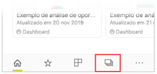
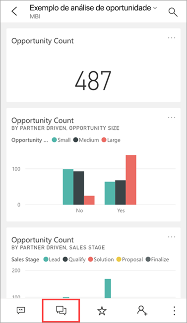
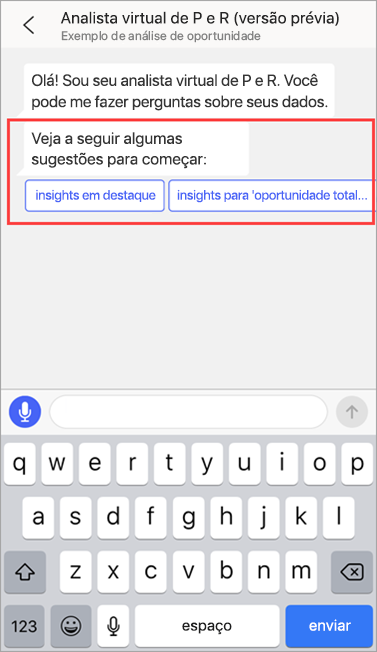
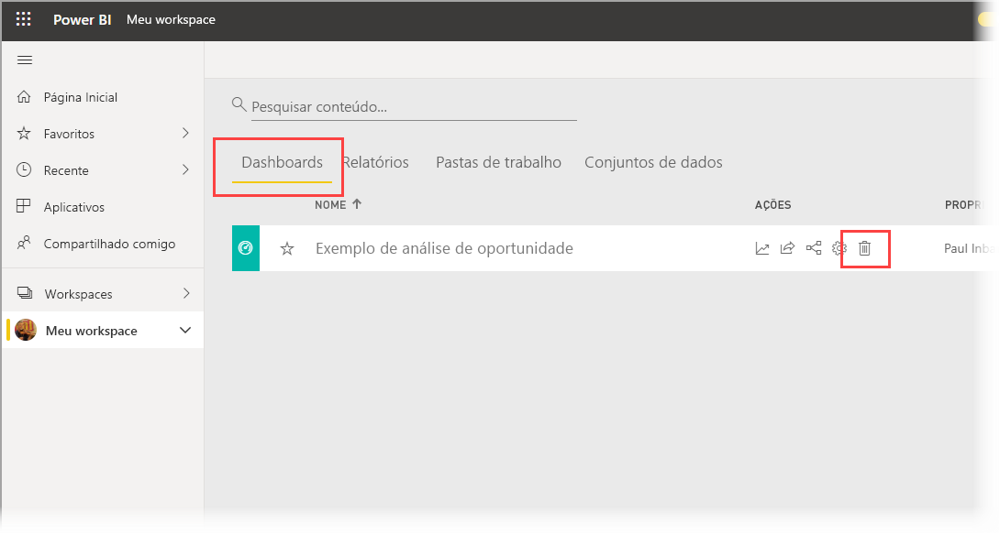
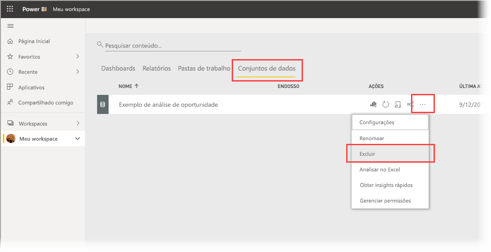

# Tutorial: Faça perguntas sobre seus dados com o analista virtual de P e R nos aplicativos Power BI para iOS

A maneira mais fácil de saber mais sobre os dados é fazer perguntas sobre eles com suas próprias palavras. Neste tutorial, você faz perguntas e exibe informações em destaque sobre dados de exemplo com o analista virtual de P e R no aplicativo móvel do Microsoft Power BI no iPad ou iPhone. 

Aplica-se a:

|  |  |
|:--- |:--- |
| iPhones |iPads |

O analista virtual de P e R é uma experiência de BI para conversas que acessa os dados subjacentes de P e R no [serviço do Power BI](https://powerbi.com). Ele sugere análises de dados e você pode digitar ou falar suas próprias perguntas.

Neste tutorial, você aprenderá a:

> [!div class="checklist"]
> * Instalar o aplicativo móvel do Power BI para iOS
> * Baixar um relatório e um dashboard de exemplo do Power BI
> * Ver quais insights em destaque o aplicativo móvel sugere

## Pré-requisitos

* **Inscreva-se no Power BI**: Se você não estiver inscrito no Power BI, [inscreva-se para uma avaliação gratuita](https://app.powerbi.com/signupredirect?pbi_source=web) antes de começar.
* **Instalar o aplicativo Power BI para iOS**: [Baixe o aplicativo iOS](https://apps.apple.com/app/microsoft-power-bi/id929738808) da Apple App Store para seu iPad, iPhone ou iPod Touch. As versões a seguir dão suporte ao aplicativo Power BI para iOS:
  * iPad com iOS 11 ou posterior.
  * iPhone 5 e posteriores com iOS 11 ou posterior. 
  * iPod Touch com iOS 11 ou posterior.
* **Baixar os dados de exemplo**: A primeira etapa é baixar o **Exemplo de Análise de Oportunidade** no serviço do Power BI. Confira [Como baixar amostras em Meu workspace no serviço do Power BI](./mobile-apps-download-samples.md) para obter instruções de como fazer isso.

Depois de concluir os pré-requisitos e baixar os dados de exemplo, você estará pronto para exibir os exemplos em seu dispositivo iOS.

## Experimentar as informações em destaque
1. Em seu iPhone ou iPad, abra o aplicativo do Power BI e entre usando as credenciais de sua conta do Power BI, que são as mesmas usadas no serviço do Power BI no navegador.

2. Na barra de navegação da página inicial, toque no ícone **Workspaces**.

    

3. Quando a página Workspaces for aberta, toque em **Meus Workspaces** e, em seguida, no dashboard **Exemplo de Análise de Oportunidade** para abri-lo.

3. No dashboard de Exemplo de Análise de Oportunidade, toque no ícone do analista virtual de P e R no menu de ação.

    

    O analista virtual da P e R oferece algumas sugestões para começar.

    

3. Toque em **Informações em destaque**.

4. O analista virtual da P e R sugere alguns insights. Role para a direita e toque em **Informação 2**.

    

   O analista virtual da P e R exibe o Insight 2.

    

5. Toque no gráfico para abri-lo no modo de foco.

    

6. Toque na seta no canto superior esquerdo para voltar para a experiência do analista virtual da P e R.

## Limpar recursos

Quando terminar este tutorial, você pode excluir o dashboard, o relatório e o conjunto de dados de exemplo de Análise de Oportunidade.

1. Abra o serviço do Power BI ([serviço do Power BI](https://app.powerbi.com)) e entre.

2. No painel de navegação, selecione **Meu Workspace**.

3. Clique na guia de dashboards e, em seguida, na linha Exemplo de Análise de Oportunidade, clique na lixeira.

    

    Agora, selecione a guia de relatórios e faça o mesmo.

4. Agora, selecione a guia de conjuntos de dados, clique em **Mais opções** (…) e, em seguida, escolha **Excluir**.

    

## Próximas etapas

Você testou o assistente virtual de P e R nos aplicativos móveis do Power BI para iOS. Saiba mais sobre P e R no serviço do Power BI.
> [!div class="nextstepaction"]
> [Q&A no serviço do Power BI](../end-user-q-and-a.md)