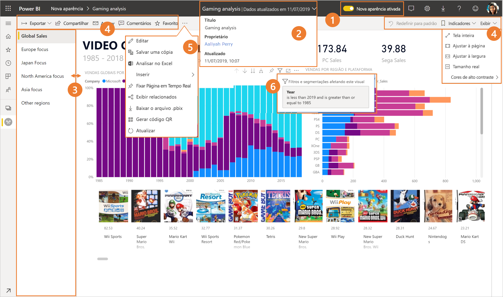
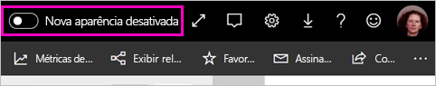
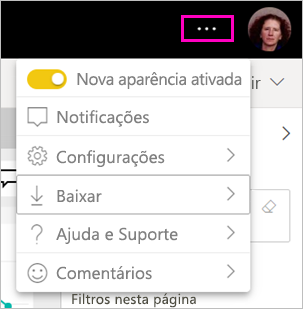
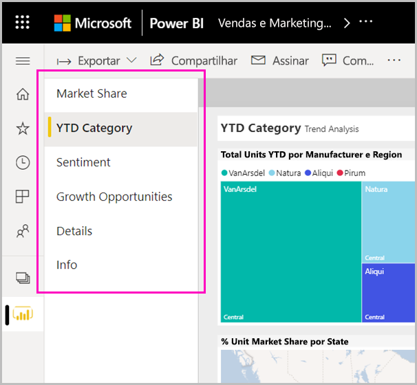

# A "nova aparência"' do serviço do Power BI

O serviço do Power BI (app.powerbi.com) tem uma nova aparência que torna mais fácil exibir e interagir com seus relatórios. A nova aparência é mais simples e se baseia em sua familiaridade com outros produtos da Microsoft. No serviço do Power BI, fizemos do conteúdo do relatório o ponto principal de foco, mudando para um tema de cor mais leve e atualizando os ícones. 

Procurando informações sobre a nova aparência no **Power BI Desktop**? Confira [Usar a faixa de opções atualizada no Power BI Desktop](../create-reports/desktop-ribbon.md).

Aqui está uma visão geral do que mudou na nova aparência. Consulte as seções numeradas para ver os detalhes:

Procurando uma ação específica? Confira [A "nova aparência": Para onde foram as ações?](service-new-look-where-actions.md).

## Tour rápido pelas alterações

Essa animação demonstra, em ação, as alterações na aparência dos relatórios.

## 1. Aceitar a nova aparência

Qualquer usuário serviço do Power BI pode optar por usar a nova aparência. Basta deslizar **Nova aparência desativada** para **Nova aparência ativada**.

Se você precisar retornar à aparência antiga, deslize o controle deslizante  de volta para **desativada**. Se você não visualizar essa opção, selecione o menu de reticências no canto superior direito.

## 2. Exibir detalhes do relatório 

Veja rapidamente detalhes como data da última atualização e informações de contato, à direita na faixa superior.  Abra o menu para exibir detalhes adicionais sobre o relatório. Você pode até mesmo enviar um email para o proprietário do relatório.

## 3. Lista vertical de páginas 
Os nomes de página de relatório agora estão em uma lista em um painel vertical. Eles são proeminentes, não passam despercebidos e sua navegação é semelhante àquela do Word e do PowerPoint. Você pode aumentar ou diminuir o restante da área de relatório redimensionando o painel vertical.

## 4. Barra de ação simplificada 

A barra de ação atualizada na parte superior apresenta todos os comandos mais relevantes para consumidores de relatório. É mais fácil exportar, assinar, colaborar com outras pessoas e se aprofundar por meio de filtros e indicadores.

## 5. Onde estão os comandos de relatório?

Não removemos nenhuma das funcionalidades da antiga aparência. Você pode encontrar os comandos adicionais, tais como editar, salvar uma cópia e assim por diante, expandindo as reticências (o menu ...) na barra de ação. Além disso, você pode acessar as métricas de uso na lista de conteúdo.

### Onde estão as ações do menu Arquivo?

Procurando as ações do menu **Arquivo**? As ações que costumavam ficar no menu **Arquivo** agora também estão no menu **Mais opções** (...). 

## 6. Nova experiência de filtro

Atualizações recentes, tais como a exibição de filtros aplicados e o novo painel filtros, estão disponíveis por padrão com a nova aparência. Mesmo que os seus designers de relatórios não tenham feito a atualização para a nova experiência de filtros, você verá o novo painel de filtros.

## Experiência de 'nova aparência' do dashboard 

Os dashboards também têm uma barra de ação simplificada, assim como relatórios e aplicativos, para uma experiência consistente, mantendo as diferenças funcionais. Aqui está uma explicação sobre as ações em um dashboard.
 

## Nenhuma alteração no modo de edição 

Mantivemos a experiência de criação semelhante àquela do desktop. As alterações da nova aparência só se aplicam ao modo de exibição de leitura.

## Próximas etapas

- [Usar a faixa de opções atualizada no Power BI Desktop](../create-reports/desktop-ribbon.md)
- [Optar por usar a nova aparência para workspaces](../collaborate-share/service-workspaces-new-look.md)
- [Power BI para consumidores](end-user-consumer.md)
