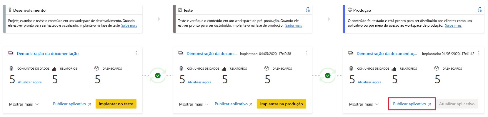
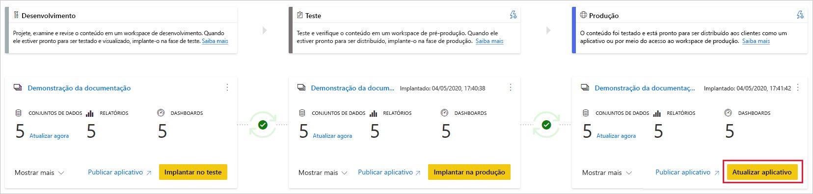

# Compreender o processo de implantação (versão prévia)

O processo de implantação permite clonar o conteúdo de um estágio no pipeline para outro, geralmente do desenvolvimento ao teste e do teste à produção.

Durante a implantação, o Power BI copia o conteúdo do estágio atual para o estágio de destino. As conexões entre os itens copiados são mantidas durante o processo de cópia. O Power BI também aplica as regras do conjunto de dados configuradas ao conteúdo atualizado no estágio de destino. A implantação do conteúdo pode demorar um pouco, dependendo do número de itens que estão sendo implantados. Durante esse período, você pode navegar para outras páginas no portal do Power BI, mas não pode usar o conteúdo no estágio de destino.

## Implantar conteúdo em um estágio vazio

Quando você implanta conteúdo em um estágio vazio, os metadados dos relatórios, painéis e conjuntos de dados no workspace do qual você está implantando são copiados para o estágio no qual você está implantando. Um novo workspace para o estágio no qual você implantou é criado com uma capacidade Premium.

Há duas maneiras de implantar o conteúdo de um estágio para o estágio seguinte. Você pode implantar todo o conteúdo ou [selecionar quais itens do conteúdo implantar](deployment-pipelines-get-started.md#selective-deployment).

Você também pode implantar o conteúdo de versões anteriores, de um estágio posterior no pipeline de implantação, para um anterior.

Após a conclusão da implantação, atualize os conjuntos de dados para poder usar o conteúdo copiado recentemente. A atualização do conjunto de dados é necessária porque os dados não são copiados de um estágio para outro. Para entender quais propriedades do item são copiadas durante o processo de implantação e quais não são copiadas, consulte a seção [Propriedades do item copiadas durante a implantação](#item-properties-copied-during-deployment).

### Criar um workspace de capacidade Premium

Durante a primeira implantação, os pipelines de implantação verificam se você tem permissões de capacidade Premium.  

Se você tiver permissões de capacidade, o conteúdo do workspace será copiado para o estágio no qual você está implantando e um novo workspace para esse estágio será criado na capacidade Premium.

Se você não tiver permissões de capacidade, o workspace será criado, mas o conteúdo não será copiado. Você pode pedir a um administrador de capacidade para adicionar seu workspace a uma capacidade ou solicitar permissões de atribuição para a capacidade. Posteriormente, quando o workspace for atribuído a uma capacidade, você poderá implantar o conteúdo nesse workspace.

### Propriedade de conteúdo e workspace

O usuário responsável pela implantação se torna automaticamente o proprietário do conjunto de dados clonado e o único administrador do novo workspace.

## Implantar conteúdo em um workspace existente

A implantação de conteúdo em um pipeline de produção de trabalho, em um estágio que tem um workspace existente, inclui o seguinte:

* Implantar novo conteúdo como uma adição, em um estágio que já contém conteúdo.

* Novo conteúdo implantado para substituir o conteúdo antigo, em um estágio de trabalho atual.

### Processo de implantação

O conteúdo do estágio atual é copiado para o estágio de destino. O Power BI identifica o conteúdo existente no estágio de destino e o substitui. Para identificar qual item de conteúdo precisa ser substituído, os pipelines de implantação usam a conexão entre o item pai e seus clones. Essa conexão é mantida quando um novo conteúdo é criado. A operação de substituição substitui apenas o conteúdo do item. A ID, a URL e as permissões do item permanecem inalteradas.

No estágio de destino, [propriedades do item que não são copiadas](deployment-pipelines-process.md#item-properties-that-are-not-copied) permanecem como no estado anterior à implantação. Novos conteúdos e novos itens são copiados do estágio atual para o estágio de destino.

### Atualizar o conjunto de dados

Os dados no conjunto de dados de destino são mantidos quando possível. Se não houver alterações em um conjunto de dados, os dados serão mantidos como antes da implantação.

Com pequenas alterações, como a adição de uma tabela ou de medidas, o Power BI mantém os dados originais e a atualização é otimizada para atualizar apenas o que é necessário. Para interromper alterações de esquema ou alterações na conexão da fonte de dados, é necessária uma atualização completa.

### Requisitos para a implantação em um estágio com um workspace existente

Desde que o conteúdo implantado resida em uma [capacidade premium](../admin/service-premium-what-is.md), um usuário que atenda às seguintes condições poderá implantá-lo em um estágio com um workspace existente:

* Um [usuário Pro](../admin/service-admin-purchasing-power-bi-pro.md) que é membro de ambos os workspaces nos estágios de implantação de origem e de destino.

* Um proprietário de todos os conjuntos de dados no workspace de destino que estão prestes a serem implantados.

Para saber mais, reveja a seção [Permissões](#permissions).

## Itens implantados

Quando você implanta conteúdo de um estágio de pipeline para outro, o conteúdo copiado contém os seguintes itens do Power BI:

* Conjuntos de dados

* Relatórios

* Dashboards

### Itens sem suporte

Os pipelines de implantação não oferecem suporte aos seguintes itens:

* Conjuntos de dados que não se originam de um .pbix

* Relatórios baseados em conjuntos de dados sem suporte

* O workspace não pode usar um aplicativo de modelo

* Relatórios paginados

* Fluxos de dados

* Conjuntos de dados por push

* Pastas de trabalho

## Propriedades do item copiadas durante a implantação

Durante a implantação, as seguintes propriedades do item são copiadas e substituem as propriedades do item no estágio de destino:

* Fontes de dados (com suporte para [regras do conjunto de dados](deployment-pipelines-get-started.md#step-4---create-dataset-rules))

* Parâmetros (com suporte para [regras do conjunto de dados](deployment-pipelines-get-started.md#step-4---create-dataset-rules))

* Visuais de relatório

* Páginas de relatório

* Blocos de dashboard

* Metadados do modelo

* Relações de item

### Propriedades de item que não são copiadas

As seguintes propriedades de item não são copiadas durante a implantação:

* Dados ꟷ os dados não estão sendo copiados, somente metadados são copiados

* URL

* ID

* Permissões ꟷ para um workspace ou um item específico

* Configurações do workspace ꟷ cada estágio tem seu próprio workspace

* Conteúdo e configurações do aplicativo ꟷ para implantar seus aplicativos, consulte [Implantação de aplicativos do Power BI](#deploying-power-bi-apps)

As seguintes propriedades do conjunto de dados também não são copiadas durante a implantação:

* Atribuição de função
    
* Agendamento de atualização
    
* Credenciais da fonte de dados
    
* Configurações de cache de consulta (podem ser herdadas da capacidade)
    
* Configurações de endosso

## Implantar aplicativos do Power BI

[Aplicativos do Power BI](../consumer/end-user-apps.md) são a maneira recomendada de distribuir conteúdo para liberar os consumidores do Power BI. Usando pipelines de implantação, você pode gerenciar aplicativos do Power BI em um pipeline de implantação, para ter mais controle e flexibilidade no que diz respeito ao ciclo de vida do seu aplicativo.

Crie um aplicativo para cada estágio do pipeline de implantação, para que você possa testar cada atualização de aplicativo do ponto de vista do usuário final. Um pipeline de implantação permite que você gerencie esse processo facilmente. Use o botão Publicar ou Exibir no cartão do workspace para publicar ou exibir o aplicativo em um estágio específico do pipeline.

No estágio de produção, o botão de ação principal no canto inferior esquerdo abre a página de atualização do aplicativo no Power BI, para que qualquer atualização de conteúdo fique disponível para os usuários do aplicativo.

>[!IMPORTANT]
>O processo de implantação não inclui a atualização do conteúdo ou das configurações do aplicativo. Para alterar o conteúdo ou as configurações, você precisa atualizar manualmente o aplicativo no estágio de pipeline necessário.

## Permissões

Permissões de pipeline e permissões de workspace são concedidas e gerenciadas separadamente. Por exemplo, um usuário com acesso ao pipeline que não possui permissões de workspace poderá visualizar o pipeline e compartilhá-lo com outras pessoas. No entanto, esse usuário não poderá exibir o conteúdo do workspace no pipeline ou na página do workspace, e não poderá executar implantações.

### Usuário com acesso ao pipeline

Usuários com acesso ao pipeline têm as seguintes permissões:

* Exibir o pipeline
    
* Compartilhar o pipeline com outras pessoas
    
* Editar e excluir o pipeline

>[!NOTE]
>O acesso ao pipeline não concede permissões para exibir ou executar ações no conteúdo do workspace.

### Visualizador do workspace

Os visualizadores do workspace com *acesso ao pipeline* também podem fazer o seguinte:

* Consumir conteúdo

>[!NOTE]
>Visualizadores do workspace não podem acessar o conjunto do workspace ou editar o conteúdo.

### Colaborador do workspace

Os colaboradores do workspace com *acesso ao pipeline* também podem fazer o seguinte:

* Consumir conteúdo

* Comparar estágios

* Exibir os conjuntos de dados

### Membro do workspace

Os membros do workspace que têm *acesso ao pipeline* também podem fazer o seguinte:

* Exibir conteúdo do workspace
    
* Comparar estágios
    
* Implantar relatórios e painéis

* Remover workspaces

### Administrador do espaço de trabalho

Os administradores do workspace que têm *acesso ao pipeline* podem executar as mesmas ações de um *membro do workspace*, além do seguinte:

* Atribuir workspaces

* Remover workspaces

### Proprietário de conjunto de dados

Os proprietários de conjuntos de dados que são membros ou administradores do workspace também podem fazer o seguinte:

* Atualizar conjuntos de dados
    
* Configurar regras

>[!NOTE]
>Esta seção descreve permissões de usuário em pipelines de implantação. As permissões listadas nesta seção podem ter aplicações diferentes em outros recursos do Power BI.

## Limitações

Esta seção lista a maioria das limitações nos pipelines de implantação.

* O workspace deve residir em uma [capacidade premium](../admin/service-premium-what-is.md).

* Os itens do Power BI, como relatórios e painéis que possuem [rótulos de sensibilidade](../admin/service-security-sensitivity-label-overview.md) do Power BI, não podem ser implantados.

* O número máximo de itens do Power BI que podem ser implantados em uma única implantação é 300.

* Para obter uma lista de limitações do workspace, confira [Limitações de atribuição do workspace](deployment-pipelines-get-started.md#workspace-assignment-limitations).

* Para obter uma lista de itens sem suporte, confira [Itens sem suporte](#unsupported-items).

### Limitações de conjunto de dados

* Os conjuntos de dados configurados com [atualização incremental](../admin/service-premium-incremental-refresh.md) não podem ser implantados.

* Não é possível implantar conjuntos de dados que usam a conectividade em tempo real.

* Durante a implantação, se o conjunto de dados de destino estiver usando uma [conexão dinâmica](../connect-data/desktop-report-lifecycle-datasets.md), o conjunto de dados de origem também deverá usar esse modo de conexão.

* Após a implantação, não há suporte para o download de um conjunto de dados (do estágio em que ele foi implantado).

* Para obter uma lista de limitações da regra de conjunto de dados, confira [limitações da regra de conjunto de dados](deployment-pipelines-get-started.md#dataset-rule-limitations).

## Próximas etapas

>[!div class="nextstepaction"]
>[Introdução aos pipelines de implantação](deployment-pipelines-overview.md)

>[!div class="nextstepaction"]
>[Melhores práticas para pipelines de implantação](deployment-pipelines-best-practices.md)

>[!div class="nextstepaction"]
>[Introdução aos pipelines de implantação](deployment-pipelines-get-started.md)

>[!div class="nextstepaction"]
>[Solução de problemas de pipelines de implantação](deployment-pipelines-troubleshooting.md)