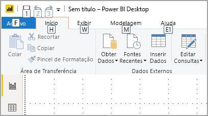
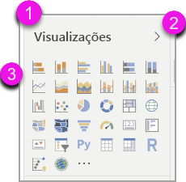
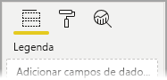
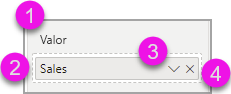
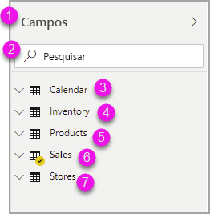
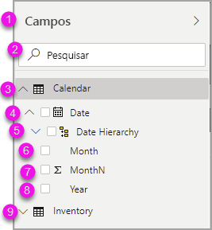
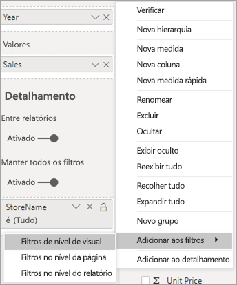
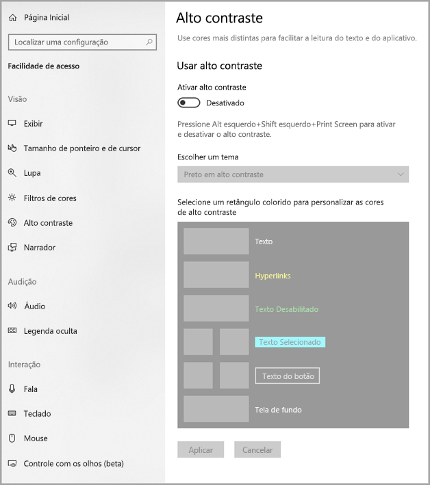

# Criando relatórios no Power BI usando ferramentas de acessibilidade

Para criadores de relatórios que usam ferramentas de acessibilidade para criá-los, o Power BI tem muitos recursos internos que podem ajudar no processo.

Este artigo descreve os vários tipos de ferramentas de acessibilidade disponíveis para criadores de relatórios no Power BI Desktop.

## Navegação no nível de aplicativo
Ao navegar no Power BI Desktop, você pode mover o foco para as áreas principais do aplicativo pressionando **Ctrl + F6**. A mudança de foco na área principal do Power BI Desktop progride na seguinte ordem:

1. Objetos na tela
2. Guias de página
3. Painéis (cada um separadamente, da esquerda para a direita, considerando os que estão abertos)
4. Navegador de exibição
5. Rodapé
6. Entrar
7. Barra amarela de aviso/erro/atualizações

Na maioria dos casos, usar **Enter** para selecionar ou entrar em uma área e, em seguida, usar **Esc** para sair são os procedimentos comuns no Power BI.

## Navegação da faixa de opções

Pressione **Alt** para ver as pequenas caixas chamadas *Dicas de Tecla* sobre cada comando disponível na exibição atual da faixa de opções. Em seguida, você pode pressionar a letra mostrada na *Dica de Tecla* que está sobre o comando que você deseja usar. 

Por exemplo, na imagem a seguir, a tecla **Alt** foi pressionada para exibir as Dicas de Tecla, que contêm as letras dos comandos acessíveis disponíveis. Em seguida, pressionar **M** abriria a guia **Modelagem** na faixa de opções.

Dependendo da letra que pressionar, você verá Dicas de Tecla adicionais. Por exemplo, se a guia **Página Inicial** estiver ativa e você pressionar **W**, a guia **Exibir** será mostrada junto com as Dicas de Tecla dos grupos dessa guia **Exibição** da faixa de opções. Continue pressionando as letras exibidas nas Dicas de Tecla até pressionar a letra do comando específico que deseja usar. Para mover para o conjunto anterior de Dicas de Tecla, pressione **ESC**. Para cancelar a ação que você está realizando e ocultar as Dicas de Tecla, pressione a tecla **Alt**.

## Navegação do painel Visual

Para navegar no painel **Visualizações**, primeiro você deve verificar se o foco está no painel, pressionando **Ctrl + F6** até chegar ao painel. Quando um usuário navega pelo painel Visualizações, o foco chega primeiro no cabeçalho. Começando na parte superior, veja a ordem de tabulação mostrada na imagem a seguir:

1. O título do cabeçalho
2. O quilate expandir/recolher
3. O primeiro ícone de visual

Ao chegar aos visuais, você pode usar as teclas de direção para navegar até um visual específico e pressionar **Enter** para selecioná-lo. Se você estiver usando um leitor de tela, ele anunciará se você tiver criado um novo gráfico e informará o tipo dele ou dirá que você alterou um gráfico de um tipo específico para outro tipo de gráfico. 

Após a seção de visuais do painel, a ordem de foco mudará para o painel dinâmico, conforme mostrado na imagem a seguir.

Quando o foco está no painel dinâmico, pressionar Tab chegará somente no ícone do painel que está selecionado. Para alternar para outros painéis, use as teclas de direção.

## Caixa de campos

Quando o foco está no painel dinâmico, conforme descrito na seção anterior, pressionar Tab novamente avançará o foco para a **Caixa de Campos**. 

Na **Caixa de Campos** a ordem de foco se move para:

* cada título de caixa (primeiro)
* seguido por um determinado campo de cada caixa (em seguida)
* o botão suspenso para abrir o menu de campo (depois disso)
* então, o botão de remoção (último)

A imagem a seguir mostra essa ordem da progressão do foco.

Um leitor de tela lerá o nome da caixa e a respectiva dica de ferramenta. Para cada campo em uma caixa, um leitor de tela lê o nome do campo e sua dica de ferramenta. Se uma caixa estiver vazia, o foco deverá se mover para a caixa totalmente vazia. O leitor de tela deve ler o nome da caixa, a dica de ferramenta e informar que ela está vazia.

Quando o menu de campo é aberto, você pode se mover nele usando **Tab** ou **Shift + Tab** ou as teclas de direção **Para cima** / **Para baixo**. Um leitor de tela anunciará os nomes das opções.

Se você quiser mover um campo de um bucket do campo para outro bucket, use o teclado e use a opção **Mover para** no menu da caixa de campos, conforme mostrado na imagem a seguir.

## Painel Formatação

A ordem de foco do painel **Formatação** se move da parte superior para baixo, em ordem de cartão. O foco passa pelo nome do cartão, seguido pelo respectivo botão de alternância **Ligar/Desligar**, se existir. Quando o foco está no nome do cartão, um leitor de tela lê o nome do cartão e indica se o cartão está expandido ou recolhido. Você pode pressionar **Enter** para expandir ou recolher o cartão. A tecla **Enter** também funciona para mudar o botão de alternância **Ativar** ou **Desativar**.

Se um cartão estiver aberto, pressionar **Tab** passará pelos controles do cartão antes de ir para o próximo cartão. Para os controles de um cartão, um leitor de tela anuncia o título, o valor atual e o tipo de controle.  

## Navegação na lista de campos

Você pode pressionar **Tab** para navegar pela lista de **Campos**. Assim como no painel de formatação, se as tabelas estiverem recolhidas, a ordem de foco fará o ciclo da seguinte maneira:

1. O cabeçalho da lista **Campos**
2. A barra de pesquisa
3. Cada nome de tabela

Para expandir todas as tabelas na caixa **Campos**, pressione **Alt + Shift + 9**. Para recolher todas as tabelas, pressione **Alt + Shift + 1**. Para expandir uma única tabela, pressione a tecla **Seta para a direita**. Para recolher uma única tabela, pressione a tecla **Seta para a esquerda**. Assim como no painel de formatação, se uma tabela estiver expandida, pressionar Tab e navegar pela lista de campos incluirá os campos que estão sendo mostrados. Um leitor de tela anunciará se você expandiu ou recolheu uma tabela.

Você pode ativar a marca de seleção de um campo navegando até o campo desejado e pressionando **Enter**.   Um leitor de tela anunciará o campo no qual o foco está e se o campo está marcado ou desmarcado.

Usuários de mouse normalmente arrastam e soltam campos na tela ou nos buckets de filtro relevantes que desejam. Se você quiser usar o teclado, poderá adicionar um campo a um bucket de filtro inserindo o menu de contexto de um campo pressionando **Shift + F10**, usando as teclas de direção para navegar até **Adicionar aos filtros** e, em seguida, pressionando **Enter** no tipo de filtro ao qual você deseja adicionar o campo.

## Navegação do painel de seleção
O painel **Seleção** tem a seguinte progressão de ordem de foco:

1. Título do cabeçalho
2. Botão Sair
3. Alternador de ordem de Camada/Tabulação
4. Mover para cima no botão de camada
5. Mover para baixo no botão de camada
6. Mostrar botão
7. Ocultar botão
8. Objetos

Você pode percorrer a ordem de foco e pressionar **Enter** para selecionar o elemento no qual está interessado.  

Ao chegar ao alternador de ordem de camada/tabulação, use as teclas de seta para a esquerda e para a direita para alternar entre a ordem de camada e a ordem de tabulação.

Quando chegar aos objetos no painel **Seleção**, pressione **F6** para ativar o painel **Seleção**. Depois de ativar o painel **Seleção**, use as teclas de seta para cima/para baixo para navegar até os diferentes objetos no painel **Seleção**.
Quando navegar até um objeto de interesse, há algumas ações diferentes que você pode executar:

* Pressione **Ctrl + Shift + S** para ocultar/mostrar um objeto
* Pressione **Ctrl + Shift + F** para mover um objeto para cima na ordem da camada
* Pressione **Ctrl + Shift + B** para mover um objeto para baixo na ordem da camada
* Pressione **CTRL + Espaço** para selecionar vários objetos

## Caixas de diálogo do Power BI Desktop

Todas as caixas de diálogo do Power BI Desktop podem ser acessadas por meio de navegação por teclado e funcionam com leitores de tela.

As caixas de diálogo do Power BI Desktop incluem as seguintes:

* Caixa de diálogo Medidas Rápidas
* Caixa de diálogo Formatação Condicional e Barras de Dados
* Caixa de diálogo Explorador de Perguntas e Respostas
* Caixa de diálogo Introdução
* Menu Arquivo e caixa de diálogo Sobre
* Barra de aviso
* Caixa de diálogo Restaurar Arquivo
* Caixa de diálogo Rostos tristes

## Compatibilidade com alto contraste

Quando você usa os modos de alto contraste no Windows, essas configurações e a paleta selecionada também são aplicadas aos relatórios no Power BI Desktop.

O Power BI Desktop detecta automaticamente qual tema de alto contraste o Windows está usando e aplica essas configurações a seus relatórios. Essas cores em alto contraste continuam no relatório quando ele é publicado no serviço do Power BI ou em outro lugar.

## Próximas etapas

A coleção de artigos sobre a acessibilidade no Power BI é a seguinte:

* [Visão geral da acessibilidade no Power BI](desktop-accessibility-overview.md) 
* [Criação de relatórios acessíveis do Power BI](desktop-accessibility-creating-reports.md) 
* [Consumo de relatórios no Power BI com ferramentas de acessibilidade](desktop-accessibility-consuming-tools.md)
* [Atalhos de teclado com acessibilidade para relatórios do Power BI](desktop-accessibility-keyboard-shortcuts.md)
* [Lista de verificação de acessibilidade do relatório](desktop-accessibility-creating-reports.md#report-accessibility-checklist)

