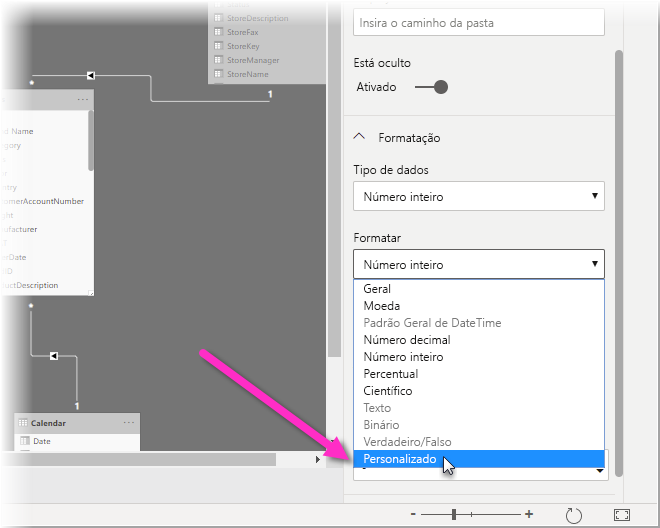
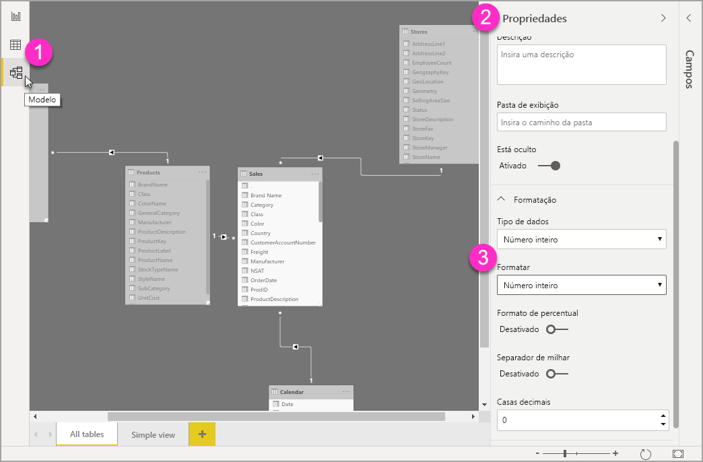

# Usar cadeias de caracteres de formato personalizado no Power BI Desktop

Com cadeias de caracteres de formato personalizado no **Power BI Desktop**, é possível personalizar a aparência dos campos em visuais e ter a certeza de que seus relatórios fiquem do jeito que você quer.

## Como usar cadeias de caracteres de formato personalizado

Para criar cadeia de caracteres de formato personalizado, selecione o campo na exibição **Modelagem** e, em seguida, selecione **Formato** no painel **Propriedades**.

Depois de selecionar **Personalizado** no menu suspenso **Formato**, você poderá fazer a seleção em uma lista de cadeias de caracteres de formato usadas com mais frequência. 

## Sintaxe de formato personalizado permitida

As cadeias de caracteres de formato personalizado seguem a sintaxe de estilo VBA, comum ao Excel e a outros produtos da Microsoft, mas não dão suporte a todas as sintaxes usadas em outros produtos. 

As tabelas a seguir definem a sintaxe aceita no Power BI.

A seguinte tabela mostra **símbolos de data** aceitos:

| **Símbolo** | **Intervalo** |
| --- | --- |
| _d_ | 1-31 (dia do mês, sem zero à esquerda) |
| _dd_ | 01-31 (dia do mês, com um zero à esquerda) |
| _m_ | 1-12 (mês do ano, sem zero à esquerda, começando com Janeiro = 1) |
| _mm_ | 01-12 (mês do ano, com um zero à esquerda, começando com Janeiro = 01) |
| _mmm_ | Exibe nomes de meses abreviados (nomes de meses islâmicos não são abreviados) |
| _mmmm_ | Exibe nomes de meses completos |
| _aa_ | 00-99 (dois últimos dígitos do ano) |
| _aaaa_ | 100-9999 (ano de três ou quatro dígitos) |

A seguinte tabela mostra **símbolos de hora** aceitos:

| **Símbolo** | **Intervalo** |
| --- | --- |
| _h_ | 0-23 (1-12 com acréscimo de &quot;AM&quot; ou &quot;PM&quot;) (hora do dia, sem zero à esquerda) |
| _hh_ | 00-23 (01-12 com acréscimo de &quot;AM&quot; ou &quot;PM&quot;) (hora do dia, com um zero à esquerda) |
| _n_ | 0-59 (minuto da hora, sem zero à esquerda) |
| _nn_ | 00-59 (minuto da hora, com um zero à esquerda) |
| _m_ | 0-59 (minuto da hora, sem zero à esquerda). Somente se precedido por _h_ ou _hh_ |
| _mm_ | 00-59 (minuto da hora, com um zero à esquerda). Somente se precedido por _h_ ou _hh_ |
| _s_ | 0-59 (segundo do minuto, sem zero à esquerda) |
| _ss_ | 00-59 (segundo do minuto, com um zero à esquerda) |

Você pode ver um [exemplo](https://docs.microsoft.com/office/vba/language/reference/user-interface-help/format-function-visual-basic-for-applications#example) de como formatar cadeias de caracteres de valor personalizado.

Uma expressão de formato definido pelo usuário para números pode ter de uma a três seções separadas por ponto-e-vírgula. Se você incluir pontos-e-vírgulas sem nada entre eles, a seção ausente não será exibida (ficará assim &quot;&quot;). Se o ponto-e-vírgula não for especificado, será usado o formato positivo.

Veja a seguir os exemplos de diferentes formatos para diferentes cadeias de caracteres de valor:

|   | **Cadeias de caracteres de formato** |   |   |   |
| --- | --- | --- | --- | --- |
| **Valores** | **0.00;-0.0;&quot;Zero&quot;** | **0,00;;** | **0,00;-0,0;** | **0,00;** |
| **-1,234** | -1,2 | &quot;&quot; | -1,2 | &quot;&quot; |
| **0** | &quot;Zero&quot; | &quot;&quot; | &quot;&quot; | 0,00 |
| **1,234** | 1,23 | 1,23 | 1,23 | 1,23 |

A tabela a seguir identifica os **formatos de data e hora nomeados**:

| **Nome do formato** | **Descrição** |
| --- | --- |
| **Data Geral** | Exibe uma data e/ou hora, por exemplo, 3/4/93 17:34. Se não houver parte fracionária, exibe somente uma data, por exemplo, 3/4/93. Se não houver parte inteira, exibe apenas a hora, por exemplo, 17:34. A exibição da data é determinada pelas configurações do sistema. |
| **Data por Extenso** | Exibe uma data de acordo com o formato de data por extenso do sistema. |
| **Data Abreviada** | Exibe uma data usando o formato de data abreviado do sistema. |
| **Hora Detalhada** | Exibe a hora usando o formato de hora detalhada do sistema; inclui horas, minutos e segundos. |
| **Hora Abreviada** | Exibe uma hora usando o formato de 24 horas, por exemplo, 17:45. |

Formatos numéricos nomeados

A tabela a seguir identifica os **formatos numéricos nomeados**:

| **Nome do formato** | **Descrição** |
| --- | --- |
| **Número Geral** | Exibe o número sem separador de milhar. |
| **Moeda** | Exibe o número com separador de milhar, se apropriado; exibe dois dígitos à direita do separador decimal. A saída se baseia nas configurações de localidade do sistema. |
| **Fixo** | Exibe pelo menos um dígito à esquerda e dois dígitos à direita do separador decimal. |
| **Padrão** | Exibe o número com separador de milhar, pelo menos um dígito à esquerda e dois dígitos à direita do separador decimal. |
| **Porcentagem** | Exibe o número multiplicado por 100 com um sinal de porcentagem ( **%** ) à direita; sempre exibe dois dígitos à direita do separador decimal. |
| **Científico** | Usa a notação científica padrão. |

A tabela a seguir identifica caracteres que você pode usar para criar **formatos de data/hora definidos pelo usuário**.

| **Caractere** | **Descrição** |
| --- | --- |
| ( **:** ) | Separador de hora. Em algumas localidades, outros caracteres podem ser usados para representar o separador de hora. O separador de horas separa hora, minutos e segundos quando os valores de hora são formatados. O caractere real usado como o separador de hora na saída formatada é determinado pelas configurações do sistema. |
| ( **/** ) | Separador de data. Em algumas localidades, outros caracteres podem ser usados para representar o separador de data. O separador de data separa o dia, o mês e o ano quando os valores de data são formatados. O caractere real usado como o separador de data na saída formatada é determinado pelas configurações do sistema. |
| d | Exibe o dia como um número sem zero à esquerda (1-31). |
| dd | Exibe o dia como um número com um zero à esquerda (01-31). |
| ddd | Exibe o dia como uma abreviação (dom-sáb). Localizado. |
| dddd | Exibe o dia como um nome completo (domingo-sábado). Localizado. |
| m | Exibe o mês como um número sem zero à esquerda (1-12). Se m vier em seguida de h ou hh, será exibido o minuto em vez do mês. |
| mm | Exibe o mês como um número sem zero à esquerda (01-12). Se m vier em seguida de h ou hh, será exibido o minuto em vez do mês. |
| mmm | Exibe o mês como uma abreviação (jan-dez). Localizado. |
| mmmm | Exibe o mês como um nome de mês completo (janeiro-dezembro). Localizado. |
| aa | Exibe o ano como um número de 2 dígitos (00-99). |
| aaaa | Exibe o ano como um número de 4 dígitos (100-9999). |
| h | Exibe a hora como um número sem zero à esquerda (0-23). |
| hh | Exibe a hora como um número com um zero à esquerda (00-23). |
| n | Exibe o minuto como um número sem zero à esquerda (0-59). |
| nn | Exibe o minuto como um número com um zero à esquerda (00-59). |
| s | Exibe o segundo como um número sem zero à esquerda (0-59). |
| ss | Exibe o segundo como um número com um zero à esquerda (00-59). |
| AM/PM | Usa o relógio de 12 horas e exibe AM em letras maiúsculas em qualquer hora antes do meio-dia; exibe PM em letras maiúsculas em qualquer hora entre meio-dia e 11:59 PM. |

A tabela a seguir identifica caracteres que você pode usar para criar **formatos de número definidos pelo usuário**.

| **Caractere** | **Descrição** |
| --- | --- |
| Nenhum | Exibe o número sem formatação. |
| ( **0** ) | Espaço reservado de dígito. Exibe um dígito ou um zero. Se a expressão tiver um dígito na posição em que 0 aparece na cadeia de caracteres de formato, exibe-o; caso contrário, exibe um zero nessa posição. Se o número tiver menos dígitos do que zeros (em qualquer lado do decimal) na expressão de formato, exibe zeros à esquerda ou à direita. Se o número tiver mais dígitos à direita do separador decimal do que zeros à direita do separador decimal na expressão do formato, arredonde o número para a mesma quantidade de casas decimais que há de zeros. Se o número tiver mais dígitos à esquerda do separador decimal do que zeros à esquerda do separador decimal na expressão do formato, exibe os dígitos extras sem modificação. |
| ( **#** ) | Espaço reservado de dígito. Exibe um dígito ou nada. Se a expressão tiver um dígito na posição em que # aparece na cadeia de caracteres de formato, exibe-o; caso contrário, não exibe nada nessa posição. Esse símbolo funciona como o espaço reservado do dígito 0, exceto pelo fato de que os zeros à esquerda e à direita não serão exibidos se o número tiver os mesmos dígitos ou menos do que caracteres # em qualquer lado do separador decimal na expressão do formato. |
| ( **.** ) | Espaço reservado de decimal. Em algumas localidades, uma vírgula é usada como o separador decimal. O espaço reservado decimal determina quantos dígitos são exibidos à esquerda e à direita do separador decimal. Se a expressão do formato contiver apenas sinais de número à esquerda desse símbolo, números menores que 1 começarão com um separador decimal. Para mostrar um zero à esquerda exibido com números fracionários, use 0 como o espaço reservado do primeiro dígito à esquerda do separador decimal. O caractere real usado como espaço reservado decimal na saída formatada depende do Formato de Número reconhecido pelo seu sistema. |
| ( **%)** | Espaço reservado de porcentagem. A expressão é multiplicada por 100. O caractere de porcentagem ( **%** ) é inserido na posição em que ele aparece na cadeia de caracteres de formato. |
| ( **,** ) | Separador de milhar. Em algumas localidades, um ponto é usado como um separador de milhar. O separador de milhar separa milhares de centenas em um número que tem quatro ou mais casas à esquerda do separador decimal. O uso padrão do separador de milhar será especificado se o formato contiver um separador de milha cercado por espaços reservados de dígito ( **0** ou **#** ). Dois separadores de milhar adjacentes ou um separador de milhar imediatamente à esquerda do separador decimal (com ou sem um decimal especificado) significa &quot;escala de número dividindo-o por 1000, arredondada conforme a necessidade&quot;. Por exemplo, você pode usar a cadeia de caracteres de formato &quot;##0,,&quot; para representar 100 milhões como 100. Os números inferiores a 1 milhão são exibidos como 0. Dois separadores de milhar adjacentes em qualquer posição que não seja imediatamente à esquerda do separador decimal são tratados simplesmente como especificação do uso de um separador de milhar. O caractere real usado como o separador de milhar na saída formatada depende do Formato de Número reconhecido pelo seu sistema. |
| ( **:** ) | Separador de hora. Em algumas localidades, outros caracteres podem ser usados para representar o separador de hora. O separador de horas separa hora, minutos e segundos quando os valores de hora são formatados. O caractere real usado como o separador de hora na saída formatada é determinado pelas configurações do sistema. |
| ( **/** ) | Separador de data. Em algumas localidades, outros caracteres podem ser usados para representar o separador de data. O separador de data separa o dia, o mês e o ano quando os valores de data são formatados. O caractere real usado como o separador de data na saída formatada é determinado pelas configurações do sistema. |
| ( **E- E+ e- e+** ) | Formato científico. Se a expressão do formato contiver pelo menos um espaço reservado de dígito ( **0** ou **#** ) à direita de E-, E+, e- ou e+, o número será exibido em formato científico e E ou e será inserido entre o número e seu expoente. O número de espaços reservados de dígito à direita determina o número de dígitos no expoente. Use E- ou e- para colocar um sinal de menos ao lado de expoentes negativos. Use E+ ou e+ para colocar um sinal de menos ao lado de expoentes negativos e um sinal de mais ao lado de expoentes positivos. |
| **- + $**  ( ) | Exibe um caractere literal. Para exibir um caractere diferente dos listados, preceda-o com uma barra invertida (\)) ou coloque-o entre aspas duplas (&quot; &quot;). |
| ( * *\** ) | Exibe o próximo caractere na cadeia de caracteres de formato. Para exibir um caractere que tem significado especial como um caractere literal, preceda-o com uma barra invertida (\)). A barra invertida em si não é exibida. Usar uma barra invertida é como colocar o próximo caractere entre aspas duplas. Para exibir uma barra invertida, use duas barras invertidas (\\). Exemplos de caracteres que não podem ser exibidos como caracteres literais são os caracteres de formatação de data e de formatação de hora (a, c, d, h, m, n, p, q, s, t, w, / e :), os caracteres de formatação numérica (#, 0, %, E, e, vírgula e ponto) e os caracteres de formatação de cadeia de caracteres (@, &amp;, \&lt;, \&gt; e !). |
| (&quot;ABC&quot;) | Exibe a cadeia de caracteres entre aspas duplas (&quot; &quot;). |

## Próximas etapas
Você também pode estar interessado nos seguintes artigos:

* [Cadeias de caracteres de formato VBA](https://docs.microsoft.com/office/vba/language/reference/user-interface-help/format-function-visual-basic-for-applications#example)
* [Medidas no Power BI Desktop](../transform-model/desktop-measures.md)
* [Tipos de dados no Power BI Desktop](../connect-data/desktop-data-types.md)
* [Formatação condicional em tabelas](desktop-conditional-table-formatting.md)
