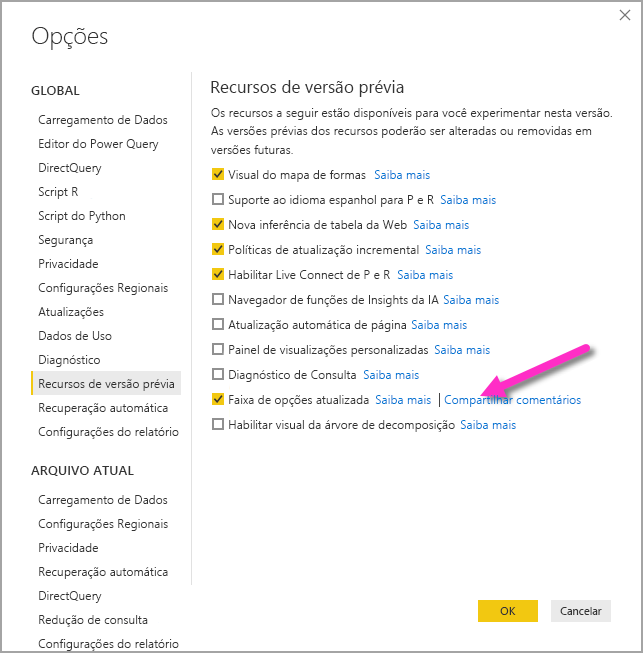

# Usar a faixa de opções atualizada no Power BI Desktop

Da atualização de março de 2020 em diante, o Power BI Desktop está revisando sua faixa de opções para alinhar melhor a aparência e experiência dele com outros produtos da Microsoft, como o Microsoft Office. A faixa de opções atualizada aparece em atualizações mensais de novembro de 2019 em diante como uma versão prévia do recurso; da atualização de março de 2020 em diante, a nova faixa de opções é a experiência padrão.

## Como habilitar a faixa de opções atualizada

Da atualização de março de 2020 em diante, a faixa de opções atualizada está ativada por padrão. Para versões do Power BI Desktop anteriores a essa (começando com a atualização de novembro de 2019), a faixa de opções atualizada no Power BI era uma versão prévia do recurso e deve estar habilitada. Para habilitá-los nessas atualizações anteriores, selecione **Arquivo > Opções e configurações > Opções** e, em seguida, selecione **Versões prévias do recurso** na coluna esquerda. No painel direito, há uma seleção **Faixa de opções atualizada**. Marque a caixa ao lado de **Faixa de opções atualizada** para ativar o recurso de visualização. Será preciso reiniciar o Power BI Desktop para que a alteração do recurso de visualização tenha efeito.

> [!NOTE]
> Para versões do Power BI Desktop que começam com março de 2020, não há a necessidade de habilitar a faixa de opções atualizada porque, a partir de março de 2020, a nova faixa de opções é a experiência padrão.

## Recursos da nova faixa de opções

Os benefícios da atualização de nossa faixa de opções destinam-se a tornar a experiência no Power BI Desktop, bem como em outros produtos da Microsoft, fácil e familiar. 

Esses benefícios podem ser agrupados nas seguintes categorias:

* **Melhoria na aparência e organização** — os ícones e a funcionalidade na faixa de opções atualizada do Power BI Desktop são alinhados à aparência e organização dos itens da faixa de opções encontrados nos aplicativos do Office.

    

* **Uma galeria de Temas intuitiva** — a galeria de Temas, encontrada na faixa de opções **Exibição**, tem a aparência conhecida da galeria de temas do PowerPoint. Assim, as imagens na faixa de opções mostram a aparência das alterações do tema se aplicadas ao relatório, como as combinações de cores e fontes. 

    

* **Conteúdo dinâmico da faixa de opções com base na sua exibição** — na faixa de opções existente do Power BI Desktop, os ícones ou comandos que não estavam disponíveis ficavam simplesmente esmaecidos, criando uma experiência abaixo do ideal. Com a faixa de opções atualizada, os ícones são exibidos e organizados dinamicamente, para que você sempre saiba quais opções estão disponíveis no contexto.

* **Uma faixa de opções de uma única linha, quando recolhida, economiza espaço** — outro benefício da faixa de opções atualizada é a capacidade de recolher a própria faixa de opções em uma única linha, exibindo dinamicamente os itens da faixa de opções com base no seu contexto. 

    

* **Dicas de Teclas para navegar por botões e selecioná-los** – para ajudar a navegar pela faixa de opções, você pode pressionar **Alt + Tecla Windows** para ativar dicas de tecla. Depois de ativadas, você poderá pressionar as teclas mostradas em seu teclado para navegar.

    

* **Cadeias de caracteres de formato personalizado** – além de definir cadeias de caracteres de formato personalizado no painel *Propriedades*, você também pode defini-las na faixa de opções. Selecione a medida ou coluna que você deseja personalizar e uma guia contextual **Ferramentas de medida** ou **Ferramentas de coluna** será exibida, dependendo de sua seleção. Na seção de formatação da guia, você pode digitar a cadeia de caracteres de formato personalizado diretamente na caixa suspensa.

    

* **Acessibilidade** – a barra de título, a faixa de opções e o menu Arquivo estão totalmente acessíveis. Pressione Ctrl + F6 para navegar até a seção da faixa de opções. Uma vez lá, você pode usar **Tab** para se mover entre as barras superior e inferior e usar as teclas de seta para se mover entre elementos.

Além dessas alterações visíveis, uma faixa de opções atualizada também nos permite fazer futuras atualizações no Power BI Desktop e sua faixa de opções, como as seguintes:

* Criar controles mais flexíveis e intuitivos na faixa de opções, como a galeria de visuais
* Adicionar os temas *preto* e *cinza escuro* do Office para Power BI Desktop
* Melhorar a acessibilidade

## Próximas etapas
Há todos os tipos de dados aos quais você pode se conectar usando o Power BI Desktop. Para obter mais informações sobre fontes de dados, confira os seguintes recursos:

* [O que é o Power BI Desktop?](../fundamentals/desktop-what-is-desktop.md)
* [Fontes de dados no Power BI Desktop](../connect-data/desktop-data-sources.md)
* [Formatar e combinar dados com o Power BI Desktop](../connect-data/desktop-shape-and-combine-data.md)
* [Conectar-se a pastas de trabalho do Excel no Power BI Desktop](../connect-data/desktop-connect-excel.md)   
* [Inserir dados diretamente no Power BI Desktop](../connect-data/desktop-enter-data-directly-into-desktop.md)   
