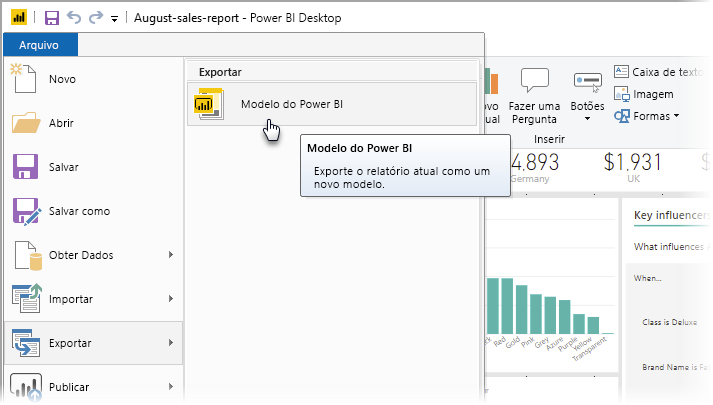
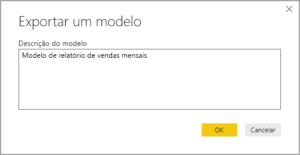
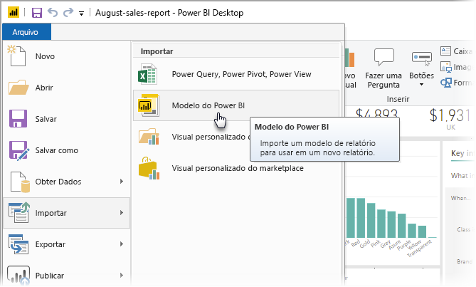
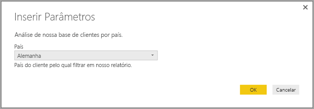
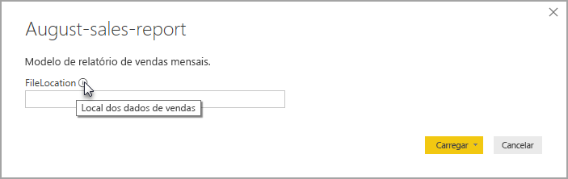

# Criar modelos de relatório para o Power BI Desktop

Com o **Power BI Desktop,** é possível criar relatórios atraentes que compartilham insights entre toda a organização. Com os **modelos** do Power BI Desktop, você pode agilizar o trabalho, criando um modelo de relatório, com base em um modelo existente, que você ou outros usuários na organização podem usar como ponto de partida para consultas, modelo de dados e layout de um novo relatório. Os modelos no **Power BI Desktop** ajudam você a iniciar rapidamente a criação de relatórios e a padronizá-la.

## Como criar modelos

Os modelos de relatório do Power BI contêm as seguintes informações do relatório do qual foram gerados:

* **Páginas**, visuais e outros elementos visuais do relatório
* A **definição do modelo de dados**, incluindo o esquema, relações, medidas e outros artefatos de definição de modelo
* Todas as **definições de consulta**, tais como consultas, parâmetros de consulta e outros elementos de consulta

O que *não* está incluído nos modelos são os dados do relatório. 

Os modelos de relatório usam a extensão de arquivo .PBIT (compare com os relatórios do Power BI Desktop, que usam a extensão .PBIX). 

Para criar um modelo de relatório, selecione **Arquivo > Exportar > Modelo do Power BI** no menu, que exibe a janela a seguir, a qual solicita que você forneça uma descrição para o modelo. Neste exemplo, nossa descrição do modelo é *Modelo de relatório de vendas mensal*.

Selecione **OK** e será solicitado que você forneça um local de arquivo para armazenar o arquivo de modelo .PBIT.

Pronto, o modelo de relatório do Power BI foi criado no local de arquivo que você especificou, com a extensão .PBIT.

> [!NOTE]
> Os arquivos de modelo de relatório do Power BI geralmente são muito menos que um relatório do Power BI Desktop, porque os modelos não contêm nenhum dado – somente as definições de relatório propriamente ditas. 

## Usando modelos

Para usar um modelo de relatório do Power BI, basta abri-lo no Power BI Desktop e começar a usá-lo. Você pode abrir modelos de relatório do Power BI de duas maneiras:

* Clique duas vezes em qualquer arquivo .PBIT para iniciar automaticamente o Power BI Desktop e carregar o modelo
* Dentro do Power BI Desktop, selecione **Arquivo > Importar > Modelo do Power BI**

Quando você abre um modelo de relatório, uma caixa de diálogo aparece com valores para todos os parâmetros definidos no relatório no qual o modelo se baseia. Por exemplo, se um relatório analisar clientes com base em país ou região e tiver um parâmetro *País* para especificar a base de clientes, um prompt será exibido para que você selecione um valor para *País* na lista de valores que foram especificados ao definir o parâmetro. 

Depois que os parâmetros necessários forem fornecidos, será solicitado que você forneça o local dos dados subjacentes associados ao relatório. O criador de relatórios atual pode então se conectar aos dados com base nas credenciais dele.

Depois que os parâmetros e os dados são especificados, um relatório é criado contendo todas as páginas, visuais, artefatos de modelo de dados e consultas que faziam parte do relatório no qual o modelo se baseia. 

É só isso. É fácil criar e usar modelos de relatório no Power BI Desktop, permitindo que você reproduza facilmente layouts atraentes e outros aspectos de relatório e compartilhe-os com outras pessoas.

## Próximas etapas
Você também pode estar interessado em aprender sobre **Parâmetros de Consulta**:
* [Você está usando Parâmetros de Consulta no Power BI Desktop?](https://docs.microsoft.com/power-query/power-query-query-parameters)

Além disso, há inúmeras coisas que você pode fazer com o Power BI Desktop. Para obter mais informações sobre seus recursos, consulte as seguintes fontes:

* [O que é o Power BI Desktop?](../fundamentals/desktop-what-is-desktop.md)
* [Visão geral de Consulta com o Power BI Desktop](../transform-model/desktop-query-overview.md)
* [Tipos de dados no Power BI Desktop](../connect-data/desktop-data-types.md)
* [Formatar e combinar dados com o Power BI Desktop](../connect-data/desktop-shape-and-combine-data.md)
* [Tarefas comuns de consulta no Power BI Desktop](../transform-model/desktop-common-query-tasks.md)    
