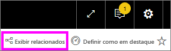
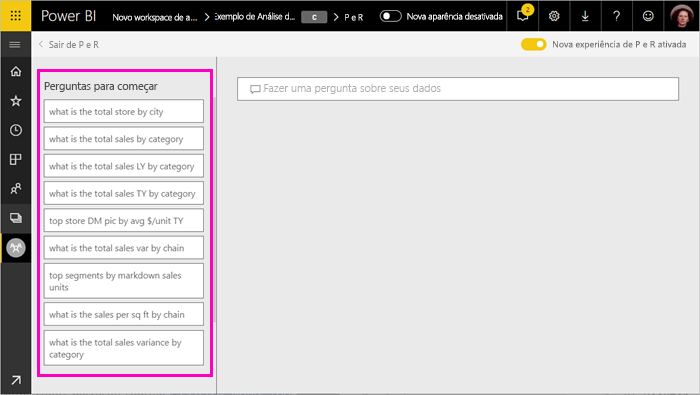
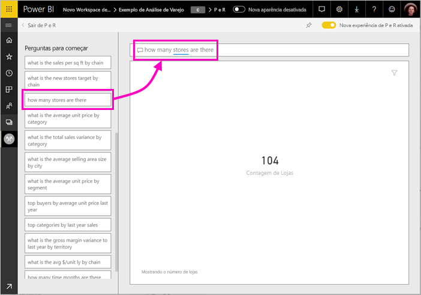
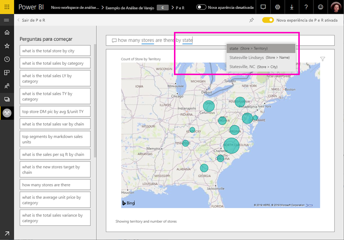
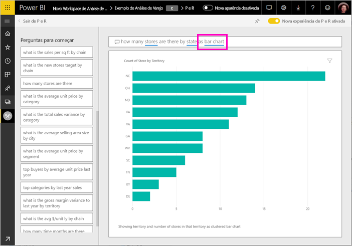
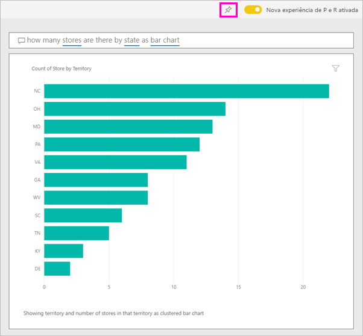

# Usar P e R do Power BI para explorar seus dados e criar visuais

Às vezes, a maneira mais rápida de obter uma resposta de seus dados é fazer uma pergunta usando o idioma natural. O recurso de P e R do Power BI permite que você explore seus dados com suas próprias palavras.  A primeira parte deste artigo mostra como você usa P e R em painéis no serviço do Power BI. A segunda parte mostra o que você pode fazer com P e R ao criar relatórios no serviço do Power BI ou no Power BI Desktop. Para saber mais, confira o artigo [P e R para consumidores](../consumer/end-user-q-and-a.md). 

[P e R nos aplicativos móveis do Power BI](../consumer/mobile/mobile-apps-ios-qna.md) e [P e R com o Power BI Embedded](../developer/embedded/qanda.md) são abordadas em artigos separados. 

P e R é interativa, até mesmo divertida. Muitas vezes, uma pergunta leva a outras, pois as visualizações revelam caminhos interessantes a serem seguidos. Veja Amanda demonstrando o uso de P e R para criar visualizações, aprofundando-se nesses elementos visuais e fixando-os nos dashboards.

<iframe width="560" height="315" src="https://www.youtube.com/embed/qMf7OLJfCz8?list=PL1N57mwBHtN0JFoKSR0n-tBkUJHeMP2cP" frameborder="0" allowfullscreen></iframe>

## Parte 1: Usar a P e R em um painel no serviço do Power BI

No serviço do Power BI (app.powerbi.com), um painel contém blocos fixados de um ou mais conjuntos de dados, portanto, você pode fazer perguntas sobre os dados contidos em qualquer um desses conjuntos de dados. Para ver quais relatórios e conjuntos de dados foram usados para criar o painel, selecione **Exibir relacionados** na barra de menus.

A caixa de perguntas de P e R está localizada no canto superior esquerdo do dashboard, em que você digita sua pergunta usando seu idioma natural. Não está vendo a caixa de P e R? Confira [Considerações e solução de problemas](../consumer/end-user-q-and-a.md#considerations-and-troubleshooting) no artigo **P e R para consumidores**.  P e R reconhece as palavras que você digita e descobre onde (em qual conjunto de dados) encontrar a resposta. P e R também ajuda a sua pergunta com preenchimento automático, ajuste e outros auxílios textuais e visuais.

A resposta à sua pergunta é exibida como uma visualização interativa e atualizações como modificar a pergunta.

1. Abra um dashboard e coloque o cursor na caixa de perguntas. No canto superior direito, selecione **Nova experiência de P e R**.

    

1. Mesmo antes de começar a digitar, a P e R exibe uma nova tela com sugestões para ajudá-lo a formar sua pergunta. Você vê frases e perguntas completas que contêm os nomes das tabelas nos conjuntos de dados subjacentes e poderá até mesmo ver perguntas completas listadas se o proprietário de conjunto de dados tiver criado [perguntas em destaque](service-q-and-a-create-featured-questions.md),

   

   Você pode escolher uma dessas perguntas como ponto de partida e continuar refinando a pergunta para encontrar a resposta específica. Ou use um nome de tabela para ajudar você a redigir uma nova pergunta.

2. Selecione na lista de perguntas ou comece digitando sua própria pergunta e selecione uma das sugestões na lista suspensa.

   

3. Conforme você digita uma pergunta, P e R escolhe a melhor visualização para exibir sua resposta.

   

4. A visualização é alterada dinamicamente conforme você modifica a pergunta.

   

1. Quando você digita uma pergunta, o Power BI procura a melhor resposta em qualquer conjunto de dados que tenha um bloco nesse dashboard.  Se todos os blocos forem do *conjuntodedadosA*, sua resposta será proveniente do *conjuntodedadosA*.  Se houver blocos do *datasetA* e do *datasetB*, P e R pesquisará a melhor resposta nesses dois conjuntos de dados.

   > [!TIP]
   > Por isso, tenha cuidado. Se você tiver apenas um bloco do *datasetA* e removê-lo do dashboard, a P e R deixará de ter acesso ao *datasetA*.
   >

5. Quando estiver satisfeito com o resultado, fixe a visualização em um dashboard selecionando o ícone para fixar no canto superior direito. Se o dashboard tiver sido compartilhado com você ou for parte de um aplicativo, não será possível fixar.

   

## Parte 2: Usar P e R em um relatório no serviço do Power BI ou no Power BI Desktop

Use P e R para explorar o conjunto de dados e adicionar visualizações ao relatório e aos dashboards. Um relatório se baseia em um único conjunto de dados e pode ser totalmente em branco ou conter páginas repletas de visualizações. Mas apenas o fato de um relatório estar em branco não significa que não exista nenhum dado para você explorar – o conjunto de dados é vinculado ao relatório e está esperando que você explore e crie visualizações.  Para ver qual conjunto de dados está sendo usado para criar um relatório, abra o relatório no modo de exibição de Leitura do serviço do Power BI e selecione **Exibir relacionados** na barra de menus.

Para usar P e R em relatórios, você deverá ter permissões de edição para o relatório e para o conjunto de dados subjacente. No artigo [P e R para consumidores](../consumer/end-user-q-and-a.md), nós nos referimos a isso como um cenário de *criador*. Portanto, se você estiver *consumindo* um relatório que foi compartilhado com você, P e R não estará disponível.

1. Abra um relatório no Modo de exibição de edição (serviço do Power BI) ou na Exibição de relatório (Power BI Desktop) e selecione **Fazer uma pergunta** na barra de menus.

    **Power BI Desktop**    
    

    **Serviço**    
    

2. Uma caixa de perguntas de P e R é exibida na tela do relatório. No exemplo a seguir, a caixa de perguntas é exibida na parte superior de outra visualização. Isso é bom, mas pode ser melhor adicionar uma página em branco ao relatório antes de fazer uma pergunta.

    

3. Coloque o cursor na caixa de pergunta. Conforme você digita, a P e R exibe sugestões para ajudá-lo a formular a sua pergunta.

   

4. Ao digitar uma pergunta, o P e R do Power BI escolhe a melhor [visualização ](../visuals/power-bi-visualization-types-for-reports-and-q-and-a.md)para exibir sua resposta; e a visualização muda dinamicamente à medida que você modifica a pergunta.

   

5. Quando você tiver a visualização que desejar, selecione ENTER. Para salvar a visualização com o relatório, selecione **Arquivo > Salvar**.

6. Interaja com a nova visualização. Não importa como você criou a visualização – a mesma interatividade, formatação e recursos estão disponíveis.

   

   Se você criou a visualização no serviço do Power BI, você pode até mesmo [fixá-la a um dashboard](service-dashboard-pin-tile-from-q-and-a.md).

## Informe à P e R qual visualização deve ser usada
Com P e R, você pode não apenas solicitar que seus dados falem por si próprios, mas também dizer ao Power BI como você deseja que a resposta seja exibida. Basta adicionar "como um <visualization type>" ao final da sua pergunta.  Por exemplo, "mostrar o volume de inventário pela fábrica como um mapa" e "mostrar inventário total como um cartão de crédito".  Experimente.

## Considerações e solução de problemas
- Se você tiver conectado a um conjunto de dados usando uma conexão dinâmica ou um gateway, será necessário [habilitar a P e R para esse conjunto de dados](service-q-and-a-direct-query.md).

- Você abriu um relatório e não viu a opção de P e R. Se você está usando o serviço do Power BI, certifique-se de abrir o relatório no modo de exibição de Edição. Se você não puder abrir o Modo de exibição de edição, isso significa que você não tem permissões de edição para esse relatório e poderá usar P e R com esse relatório específico.

## Próximas etapas

- [P e R para consumidores](../consumer/end-user-q-and-a.md)   
- [Dicas para fazer perguntas nas Perguntas e respostas](../consumer/end-user-q-and-a-tips.md)   
- [Preparar uma pasta de trabalho para Perguntas e respostas](service-prepare-data-for-q-and-a.md)  
- [Preparar um conjunto de dados local para P e R](service-q-and-a-direct-query.md)   
- [Fixar um bloco ao dashboard de Perguntas e respostas](service-dashboard-pin-tile-from-q-and-a.md)
