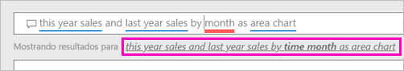
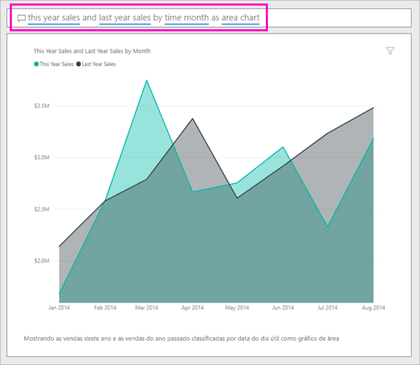

# Criar um visual com P e R do Power BI

Às vezes, a maneira mais rápida de obter uma resposta de seus dados é fazer uma pergunta usando o idioma natural.  Neste artigo, examinamos duas maneiras diferentes de criar a mesma visualização: primeiro, fazendo uma pergunta com P e R e, segundo, criando essa funcionalidade em um relatório. Usamos o serviço do Power BI para criar o visual no relatório, mas o processo é quase idêntico ao uso do Power BI Desktop.

Para acompanhar, você deve usar um relatório que você possa editar, então usaremos um dos exemplos disponíveis com o Power BI.

## Criar um visual com P e R

Como poderíamos criar esse gráfico de linha usando P e R?

1. Em seu workspace do Power BI, selecione **Obter Dados** \> **Exemplos** \> **Exemplo de Análise de Varejo** > **Conectar**.

1. Abra o dashboard Exemplo de Análise de Varejo e coloque o cursor na caixa de P e R, **Faça uma pergunta sobre seus dados**.

    

2. Na caixa de P e R, digite algo como esta pergunta:
   
    **vendas deste ano e do ano passado por mês como gráfico de área**
   
    Ao digitar uma pergunta, o P e R do Power BI escolhe a melhor visualização para exibir sua resposta, e a visualização muda dinamicamente, na medida em que você modifica a pergunta. Além disso, P e R e ajuda a formatar sua pergunta com sugestões, preenchimento automático e a correção ortográfica. P e R recomenda uma pequena alteração na redação: "vendas deste ano e do ano passado por *mês temporal* como gráfico de área".  

    

4. Selecione a frase para aceitar a sugestão. 
   
   Quando terminar de digitar sua pergunta, o resultado será o mesmo gráfico que você vê no dashboard.
   
   

4. Para fixar o gráfico no dashboard, selecione o ícone de marcador  no canto superior direito.

## Criar um visual no editor de relatório

1. Navegue de volta para o dashboard de exemplo Análise de Varejo.
   
2. O dashboard contém o mesmo bloco de gráfico de área para "Vendas do ano passado e vendas deste ano”.  Selecione este bloco. Não selecione o bloco que você criou com P e R. Selecioná-lo abre P e R. O bloco do gráfico de área original foi criado em um relatório para que ele fosse aberto na página que contém essa visualização.

    

1. Abra o relatório no modo Exibir Edição selecionado **Editar Relatório**.  Se você não for proprietário de um relatório, não terá a opção de abri-lo na exibição de Edição.
   
    
4. Selecione o gráfico de área e examinar as configurações do painel **Campos** .  O criador de relatório criou esse gráfico selecionando esses três valores (**Vendas do Ano Passado** e **Vendas Deste Ano > Valor** na tabela **Vendas** e **FiscalMonth** na tabela **Tempo**) e os organizando nas seções **Eixo** e **Valores**.
   
    

    Você vê que eles acabaram tendo o mesmo visual. Criá-lo dessa maneira não foi muito complicado. Mas criá-lo com P e R foi muito mais fácil!

## Próximas etapas

- [Use P e R em dashboards e relatórios](power-bi-tutorial-q-and-a.md)  
- [P e R para consumidores](../consumer/end-user-q-and-a.md)
- [Faça seus dados funcionarem bem com P e R no Power BI](service-prepare-data-for-q-and-a.md)

Mais perguntas? [Experimente a Comunidade do Power BI](https://community.powerbi.com/)
