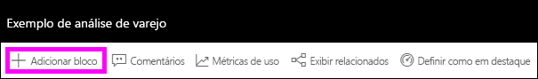
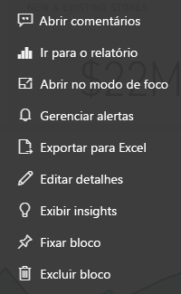

# Introdução aos blocos de dashboard para designers do Power BI

Um bloco é um instantâneo dos dados fixados no painel. Um bloco pode ser criado de relatórios, conjuntos de dados, dashboards, caixas de P e R, relatórios do SSRS (SQL Server Reporting Services) e muito mais.  Essa captura de tela mostra vários blocos diferentes fixados a um dashboard.

Os dashboards e blocos de dashboard são um recurso do serviço do Power BI e não do Power BI Desktop. Você não pode criar dashboards em dispositivos móveis, mas pode [exibir e compartilhar](../consumer/mobile/mobile-apps-view-dashboard.md) os dashboards lá.

Além da fixar blocos, você pode criar blocos autônomos diretamente no dashboard usando o controle [Adicionar bloco](service-dashboard-add-widget.md). Os blocos autônomos incluem: caixas de texto, imagens, vídeos, dados de streaming e conteúdo da Web.

Precisa de ajuda para compreender os blocos de construção que compõem o Power BI? Confira [Conceitos básicos para designers no serviço do Power BI](../fundamentals/service-basic-concepts.md).

> [!NOTE]
> Se a visualização original usada para criar o bloco for alterada, o bloco não será alterado.  Por exemplo, se você fixou um gráfico de linhas de um relatório e, em seguida, você alterar o gráfico de linhas para um gráfico de barras, o bloco do dashboard continuará mostrando um gráfico de linhas. Os dados são atualizados, mas o tipo de visualização não.
> 
> 

## Fixar um bloco
Há diversas maneiras de adicionar (fixar) um bloco em um dashboard. Você pode fixar blocos de:

* [Perguntas e respostas do Power BI](service-dashboard-pin-tile-from-q-and-a.md)
* [Um relatório](service-dashboard-pin-tile-from-report.md)
* [Outro dashboard](service-pin-tile-to-another-dashboard.md)
* [uma pasta de trabalho do Excel no OneDrive for Business](service-dashboard-pin-tile-from-excel.md)
* [Quick Insights (Insights Rápidos)](service-insights.md)
* [Um relatório paginado local no Servidor de Relatórios do Power BI ou no SQL Server Reporting Services](https://docs.microsoft.com/sql/reporting-services/pin-reporting-services-items-to-power-bi-dashboards)

Além disso, blocos autônomos para imagens, caixas de texto, vídeos, dados de streaming e o conteúdo da Web podem ser criados diretamente no dashboard usando a opção [Adicionar bloco](service-dashboard-add-widget.md).

  

## Interagir com blocos em um painel
Depois de adicionar um bloco a um dashboard, você poderá movê-lo e redimensioná-lo ou alterar sua aparência e comportamento.

### Mover e redimensionar um bloco
Pegue um bloco e [mova-o no dashboard](service-dashboard-edit-tile.md). Passe o mouse sobre o  e selecione-o para redimensionar o bloco.

### Passe o mouse sobre um bloco para alterar a aparência e o comportamento
1. Passe o mouse sobre o bloco para exibir as reticências.
   
    
2. Selecione as reticências para abrir o menu de ação do bloco.
   
    
   
    A partir daqui, você pode:
   
     * [Adicionar comentários ao dashboard](../consumer/end-user-comment.md).
     * [Abrir o relatório usado para criar este bloco](../consumer/end-user-reports.md).  
     * [Exibir no modo de foco](../consumer/end-user-focus.md).   
     * [Exportar os dados usados no bloco](../visuals/power-bi-visualization-export-data.md).
     * [Editar o bloco e a legenda e adicionar um hiperlink](service-dashboard-edit-tile.md). 
     * [Executar insights](service-insights.md). 
     * [Fixar o bloco em outro dashboard](service-pin-tile-to-another-dashboard.md).
     * [Excluir o bloco](service-dashboard-edit-tile.md).

3. Para fechar o menu de ação, selecione uma área em branco no dashboard.

### Selecionar um bloco
Quando você seleciona um bloco, o que acontece em seguida depende de como você o criou. Caso contrário, selecionar o bloco leva você para o relatório, pasta de trabalho do Excel Online, relatório do Reporting Services local ou pergunta de P & R usada para criar o bloco. Ou, se ele tiver um [link personalizado](service-dashboard-edit-tile.md), a seleção do bloco levará você para esse link.

> [!NOTE]
> Os blocos de vídeo criados diretamente no dashboard usando **Adicionar bloco** são uma exceção. Selecionar um bloco de vídeo (que foi criado dessa forma) faz com que o vídeo seja reproduzido diretamente no dashboard.   
> 
> 

## Considerações e solução de problemas

* Se o relatório usado para criar a visualização não tiver sido salvo, selecionar um bloco não produzirá nenhuma ação.
* Se o bloco tiver sido criado de uma pasta de trabalho no Excel Online, você precisará de pelo menos permissões de Leitura para essa pasta de trabalho. Caso contrário, a seleção do bloco não abrirá a pasta de trabalho no Excel Online.
* Digamos que você crie um bloco diretamente no dashboard usando **Adicionar bloco** e defina um hiperlink personalizado para ele. Se for o caso, quando você selecionar o título, o subtítulo ou o bloco abrirá essa URL. Caso contrário, por padrão, quando você seleciona um bloco criado diretamente no dashboard para uma imagem, um código da Web ou uma caixa de texto, nada acontece.
* Isso pode ser criado com base nos relatórios paginados locais no Servidor de Relatórios do Power BI ou no SQL Server Reporting Services. Se você não tiver permissão para acessar o relatório local, selecionar o bloco levará você a uma página que indica que você não tem acesso (rsAccessDenied).
* Digamos que você selecione um bloco criado com base em um relatório paginado local no Servidor de Relatórios do Power BI ou no SQL Server Reporting Services. Se você não tiver acesso à rede na qual o servidor de relatório está localizado, a seleção de um bloco criado com base nesse relatório paginado levará você até uma página que indica que não é possível localizar o servidor (HTTP 404). O dispositivo precisa ter acesso à rede para o servidor de relatório exibir o relatório.
* Se a visualização original usada para criar o bloco for alterada, o bloco não será alterado. Por exemplo, se você fixar um gráfico de linhas de um relatório e, em seguida, alterar o gráfico de linhas para um gráfico de barras, o bloco do painel continuará mostrando um gráfico de linhas. Os dados são atualizados, mas o tipo de visualização não.

## Próximas etapas
- [Criar um cartão (bloco de número grande) para seu dashboard](../visuals/power-bi-visualization-card.md)
- [Introdução a dashboards para designers do Power BI](service-dashboards.md)  
- [Atualizar dados no Power BI](../connect-data/refresh-data.md)
- [Conceitos básicos para designers no serviço do Power BI](../fundamentals/service-basic-concepts.md)
- [Integrar blocos do Power BI em documentos do Office](https://powerbi.microsoft.com/blog/integrating-power-bi-tiles-into-office-documents/)
- [Fixar itens do Reporting Services em dashboards do Power BI](/sql/reporting-services/pin-reporting-services-items-to-power-bi-dashboards)

Mais perguntas? [Experimente a Comunidade do Power BI](https://community.powerbi.com/).
