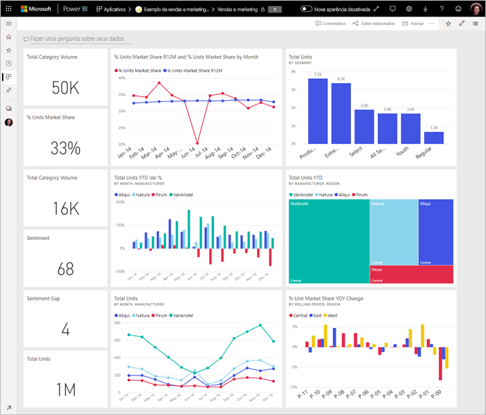

# Dicas para criar um painel bom no Power BI
Agora que você criou um painel e adicionou alguns blocos, pense em como tornar seu painel não apenas bonito, mas também funcional. Em geral, isso significa fazer destacar as informações mais importantes e torná-las claras e organizadas.

> [!TIP]
> Gosta deste dashboard? Você pode baixá-lo, bem como os relatórios relacionados, no AppSource. Vá até **Obter dados** > **Serviços**. Procure **Exemplo da Microsoft – Vendas e Marketing** > **Obter agora**.

Veja algumas dicas para trabalhar com dashboards.

## Vídeo de práticas recomendadas de design de dashboard

Assista a este vídeo, [Práticas recomendadas de design de dashboard no Power BI](https://www.youtube.com/watch?v=-tdkUYrzrio), para obter dicas de design de Marco Russo, da SQLBI.com.

## Considere seu público-alvo
Quais são as principais métricas que ajudarão a tomar decisões? Como o painel será usado? Quais suposições aprendidas ou culturais podem afetar nas opções de design? Quais informações o público-alvo precisa para ser bem-sucedido?

Tenha em mantel que um painel é uma visão geral, um local para monitorar o estado atual dos dados. O dashboard é baseado em conjuntos de dados e relatórios subjacentes, e esses itens frequentemente contêm muitos detalhes. Os leitores podem detalhar os relatórios no seu painel. Portanto, não coloque os detalhes no dashboard, a menos que seja o que seus leitores precisam monitorar.

Onde o painel será exibido? Se for em um monitor grande, você poderá colocar mais conteúdo nele. Mas se os leitores o exibirem em tablets, um dashboard com menos blocos será mais legível.

## Conte uma história em uma tela
Porque os painéis devem mostrar informações importantes em um relance, é melhor ter todas as peças em uma única tela. É possível evitar as barras de rolagem no seu painel?

O painel está muito cheio?  Deixe apenas informações essenciais e que podem ser lidas e interpretadas com facilidade.

## Fazer uso do modo de tela inteira
Ao apresentar um dashboard, exiba-o no [modo de tela inteira](../consumer/end-user-focus.md), sem distrações.

## Destaque as informações mais importantes
Se o texto e visualizações no painel são do mesmo tamanho, os leitores terão dificuldade para se concentrar no que é mais importante. Por exemplo, as visualizações de cartão são uma boa maneira de exibir um número importante em destaque:  

Mas não se esqueça de fornecer contexto.  

Leia sobre como [criar um bloco com apenas um número](../visuals/power-bi-visualization-card.md).

## Posicione as informações mais importantes
A maioria das pessoas lê de cima para baixo. Sendo assim, coloque o nível mais alto de dados no canto superior esquerdo e mostre mais detalhes à medida que você move na direção que o público-alvo usa para ler (esquerda para direita, de cima para baixo).

## Usar a visualização da direita para os dados
Evite a variedade de visualização para fins diversos.  As visualizações devem ter uma visão geral e ser fácil de "ler" e interpretar.  Alguns dados e visualizações, uma visualização gráfica simples é suficiente. Mas podem chamar outros dados para uma visualização mais complexa - Certifique-se de fazer uso de títulos e rótulos e outras personalizações para ajudar o leitor.  

* Tenha cuidado ao usar visuais bonitos, mas difíceis de ler, como gráficos 3D. 
* Talvez seja uma decepção saber que gráficos de pizza, gráficos de rosca, medidores e outros tipos de gráfico circular não são práticas recomendadas de visualização de dados. Gráficos de pizza são recomendados se eles tiver menos de oito categorias. Como seres humanos não são capazes de comparar valores lado a lado, é mais difícil comparar valores em um gráfico de pizza do que em gráficos de barras e colunas. Os gráficos de pizza pode ser bons para exibir relações de parte de inteiro em vez de comparar as partes. E gráficos de medidor são ótimos para exibir o status atual no contexto de uma meta.
* Seja consistente com escalas de gráfico de eixos, ordenação de dimensão do gráfico e também as cores usadas para os valores de dimensão em gráficos.
* Certifique-se de codificar os dados quantitativos perfeitamente. Não exceda numerais de três ou quatro ao exibir números. Exiba medidas com um ou dois números à esquerda do ponto decimal e dimensione em milhares ou milhões, ou seja, 3,4 milhões, e não 3.400.000.
* Não misture os níveis de precisão e tempo. Certifique-se de que períodos de tempo são bem compreendidos. Não é necessário um gráfico que tem o mês passado ao lado de gráficos filtrados de um determinado mês do ano.
* Não misture medidas grandes e pequenas na mesma escala, como em uma linha ou um gráfico de barras. Por exemplo, uma medida pode estar em milhões e outras medidas em milhares. Com uma escala tá grande, seria difícil ver as diferenças da medida que está em milhares. Se você precisar combinar, escolha uma visualização que permite o uso de um segundo eixo.
* Não sobrecarregue os gráficos com rótulos de dados que não são necessários. Os valores em gráficos de barras normalmente são compreendidos sem exibir o número real.
* Preste atenção em como os [gráficos são classificados](../consumer/end-user-change-sort.md). Se você deseja chamar a atenção para o número mais alto ou mais baixo, classifique pela medida. Se você quiser que as pessoas localizem rapidamente uma categoria específica dentro de muitas outras categorias, classifique pelo eixo.  

Para obter diretrizes específicas da visualização, veja [Tipos de visualização no Power BI](../visuals/power-bi-visualization-types-for-reports-and-q-and-a.md).  

## Saiba mais sobre design de dashboards
Para dominar a arte do design do painel excelente, considere a possibilidade de aprendizado princípios básicos de Gestalt de percepção visual e como comunicar claramente as informações acionáveis no contexto. Felizmente, existe uma infinidade de recursos já amplamente disponíveis e espalhados em nossos blogs. Alguns dos nossos livros favoritos incluem:

* *Information Dashboard Design* de Stephen Few  
* *Show Me the Numbers* de Stephen Few  
* *Now You See It* de Stephen Few  
* *Envisioning Information* de Edward Tufte  
* *Advanced Presentations* bay Design de Andrew Abela   

## Próximas etapas
[Criar um painel por meio de um relatório](service-dashboard-create.md)  
[Conceitos básicos para designers no serviço do Power BI](../fundamentals/service-basic-concepts.md)  
Mais perguntas? [Experimente a Comunidade do Power BI](https://community.powerbi.com/)
