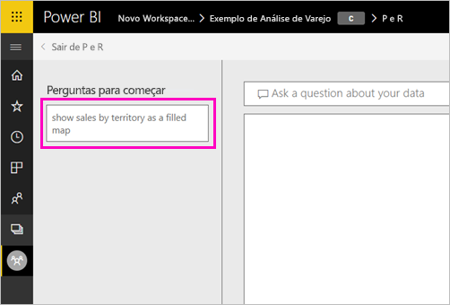

# Criar perguntas em destaque para as P e R do Power BI
Se você possui um conjunto de dados, você pode adicionar suas próprias perguntas em destaque a esse conjunto de dados. E a P e R do Power BI mostrará essas perguntas para seus colegas que consomem relatórios com base nesse conjunto de dados.  As perguntas em destaque fornecem aos seus colegas algumas ideias sobre os tipos de perguntas que eles podem fazer sobre o conjunto de dados. As perguntas em destaque que você adiciona cabe a você – adicione perguntas populares, perguntas que exibem resultados interessantes ou perguntas que podem ser difíceis de formular.

> [!NOTE]
> As P e R em destaque estão disponíveis para uso no [aplicativo do Microsoft Power BI para iOS nos dispositivos iPod Touch, iPhones e iPads](../consumer/mobile/mobile-apps-ios-qna.md) e nas P e R do Power BI Desktop. A criação de perguntas só está disponível no serviço do Power BI (app.powerbi.com).
> 

## Criar uma pergunta em destaque

Este artigo usa a [amostra de Vendas de Análise de Varejo](sample-datasets.md). Siga estas instruções passo a passo para tentar explorar um conjunto de dados por conta própria.

1. No painel, selecione a caixa de pergunta de P e R.   Observe que a P e R já está sendo útil, exibindo uma lista de termos que aparecem no conjunto de dados.
2. Para adicionar a esta lista, selecione o ícone de engrenagem no canto superior direito do Power BI.  
   
3. Selecione **Configurações** &gt; **Conjunto de Dados** &gt; **Exemplo de Análise de Varejo** &gt; **Perguntas da P e R em Destaque**.  
4. Selecione **Adicionar uma pergunta**.
   
   
5. Digite sua pergunta na caixa de texto e selecione **Aplicar**.   Opcionalmente, adicione outra pergunta selecionando **Adicionar uma pergunta**.  
   
6. Navegue de volta até o dashboard do Power BI para o Exemplo de Análise de Varejo e coloque o cursor na caixa de pergunta P e R.   
   
7. A nova pergunta em destaque, **Vendas por território como um mapa**, é a primeira na lista. Selecione-a.  
8. O Power BI cria a resposta e a exibe como uma visualização de mapa preenchida.  
   

## Próximas etapas

- [P e R para consumidores](../consumer/end-user-q-and-a.md)  
- [Use P e R em dashboards e relatórios](power-bi-tutorial-q-and-a.md)  
- [Conceitos básicos para designers no serviço do Power BI](../fundamentals/service-basic-concepts.md)  

Mais perguntas? [Experimente a Comunidade do Power BI](https://community.powerbi.com/)
