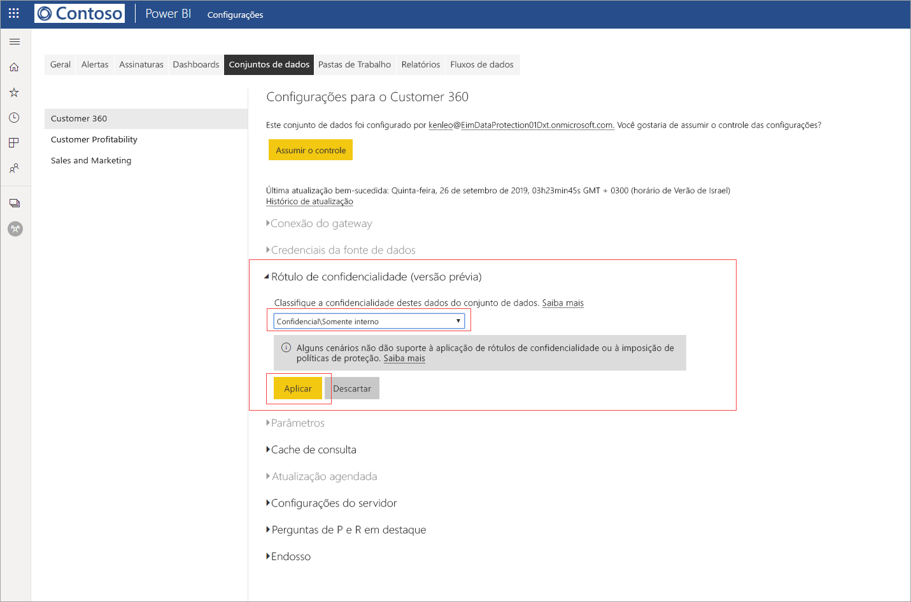

# Aplicar rótulos de confidencialidade de dados no Power BI (versão prévia)

Quando os rótulos de confidencialidade são habilitados no serviço do Power BI, você pode proteger seus dashboards, relatórios, conjuntos de dados e fluxos de dados contra acesso não autorizado e vazamentos aplicando rótulos de confidencialidade de dados a eles. Rotular seus dados corretamente usando rótulos de confidencialidade de dados garante que apenas pessoas autorizadas possam acessar seus dados.

Quando a proteção de dados está habilitada, os rótulos de confidencialidade aparecem na coluna de confidencialidade na exibição de lista dos dashboards, relatórios, conjuntos de dados e fluxos de dados.

> [!NOTE]
> A aplicação de rótulos de confidencialidade a dashboards, relatórios, conjuntos de dados e fluxos de dados do Power BI requer determinadas licenças e permissões. Confira [Aplicando rótulos de confidencialidade](#applying-sensitivity-labels) para obter detalhes.

## Aplicar rótulos de confidencialidade

Para aplicar rótulos de confidencialidade no Power BI, você e sua organização precisam ter os seguintes requisitos em vigor:

* Sua organização precisa ter definido rótulos de confidencialidade na [central de segurança do Microsoft 365](https://security.microsoft.com/) ou na [central de conformidade do Microsoft 365](https://compliance.microsoft.com/).
* Você precisa pertencer a um grupo de segurança que tenha permissões para aplicar rótulos de confidencialidade de dados, conforme descrito no artigo intitulado [Habilitar rótulos de confidencialidade de dados no Power BI (versão prévia)](../admin/service-security-enable-data-sensitivity-labels.md#enable-data-sensitivity-labels).
* Você precisa ter uma licença do Power BI Pro e permissões de edição nos recursos que deseja rotular. 
* Você precisa ter uma licença Premium P1 ou Premium P2 da Proteção de Informações do Azure. A Proteção de Informações do Microsoft Azure pode ser adquirida de forma independente ou por meio de um dos pacotes de licenciamento da Microsoft. Confira [preço da Proteção de Informações do Azure](https://azure.microsoft.com/pricing/details/information-protection/) para obter detalhes.

Para aplicar ou alterar um rótulo de confidencialidade em um relatório, clique no ícone de configurações do relatório no item de lista do workspace e, em seguida, vá para a seção de confidencialidade de dados no painel lateral de configurações. Escolha o rótulo de confidencialidade apropriado e salve as configurações.

O rótulo de confidencialidade atualizado é exibido na coluna de confidencialidade. 

A aplicação ou alteração de um rótulo de confidencialidade em um dashboard segue o mesmo processo descrito para relatórios. 

Você também pode definir rótulos de confidencialidade em conjuntos de dados e fluxos de dados. A imagem a seguir mostra como definir um rótulo de confidencialidade em um conjunto de dados; as etapas para fluxos de dados são semelhantes.

Para definir um rótulo de confidencialidade em um conjunto de dados, selecione a guia conjuntos de dados, clique nos três pontos no conjunto de dados ao qual deseja aplicar um rótulo e escolha **Configurações**.

Na página de configurações do conjunto de dados, abra a seção do rótulo de confidencialidade, escolha o rótulo de confidencialidade desejado e clique em **Aplicar**.

A aplicação ou alteração de um rótulo de confidencialidade em um fluxo de dados segue o mesmo processo descrito para conjuntos de dados.

## Proteção de dados em arquivos exportados

Quando você [exporta dados de um relatório](https://docs.microsoft.com/power-bi/consumer/end-user-export) que tem um rótulo de confidencialidade, o rótulo de confidencialidade é herdado pelo arquivo gerado (Excel, PowerPoint e PDF; CSV não tem suporte). O rótulo de confidencialidade ficará visível no arquivo e o acesso ao arquivo será restrito àqueles que têm permissões suficientes.

## Considerações e limitações

A aplicação dos rótulos de confidencialidade de dados tem as seguintes considerações:

* Aplicar e exibir os rótulos de confidencialidade da Proteção de Informações da Microsoft no Power BI exige uma licença Premium P1 ou Premium P2 da Proteção de Informações do Azure. A Proteção de Informações do Microsoft Azure pode ser adquirida de forma independente ou por meio de um dos pacotes de licenciamento da Microsoft. Confira [preço da Proteção de Informações do Azure](https://azure.microsoft.com/pricing/details/information-protection/) para obter detalhes.
* Os rótulos de confidencialidade podem ser aplicados apenas a dashboards, relatórios, conjuntos de dados e fluxos de dados.
* A imposição de controles de proteção e rótulo em arquivos exportados tem suporte apenas para arquivos do Excel, do PowerPoint e PDF. O rótulo e a proteção não são impostos quando os dados são exportados para arquivos .CSV, Assinaturas de email, Visuais incorporados e impressões.
* Um usuário que exporta um arquivo do Power BI tem permissões para acessar e editar esse arquivo de acordo com as configurações do rótulo de confidencialidade. O usuário que exporta os dados não obtém permissões de proprietário para o arquivo. 
* Atualmente, os rótulos de confidencialidade não estão disponíveis para [relatórios paginados]( https://docs.microsoft.com/power-bi/paginated-reports-report-builder-power-bi) e pastas de trabalho. 
* No momento, não é possível excluir um rótulo de um ativo do Power BI após ele ter sido aplicado.
* Os rótulos de confidencialidade em ativos do Power BI ficam visíveis apenas na lista do workspace e nas exibições de linhagem; atualmente, os rótulos não ficam visíveis nas exibições favoritos, compartilhados comigo, recentes ou de aplicativo. Observe, no entanto, que um rótulo aplicado a um ativo do Power BI, mesmo que não esteja visível, sempre persistirá em dados exportados para arquivos do Excel, do PowerPoint e PDF.
* O rótulo de confidencialidade *Configuração de criptografia de arquivo*, configurado na [central de segurança do Microsoft 365](https://security.microsoft.com/) ou na [central de conformidade do Microsoft 365](https://compliance.microsoft.com/), aplica-se somente a arquivos *exportados do* Power BI; ele não é imposto *dentro* do Power BI.
* A [proteção de HYOK](https://docs.microsoft.com/azure/information-protection/configure-adrms-restrictions) não tem suporte para rótulos aplicados no Power BI.
* A exibição e a aplicação de rótulos em aplicativos do Office têm [requisitos de licenciamento](https://docs.microsoft.com/microsoft-365/compliance/sensitivity-labels-office-apps#common-requirements).
* Os rótulos de confidencialidade têm suporte apenas para locatários na nuvem global (pública). Os rótulos de confidencialidade não têm suporte para locatários em outras nuvens.

## Próximas etapas

Este artigo descreveu como aplicar rótulos de confidencialidade de dados no Power BI. Os artigos a seguir fornecem mais detalhes sobre a proteção de dados no Power BI. 

* [Visão geral da proteção de dados no Power BI](../admin/service-security-data-protection-overview.md)
* [Habilitar rótulos de confidencialidade de dados no Power BI](../admin/service-security-enable-data-sensitivity-labels.md)
* [Usando controles do Microsoft Cloud App Security no Power BI](../admin/service-security-using-microsoft-cloud-app-security-controls.md)