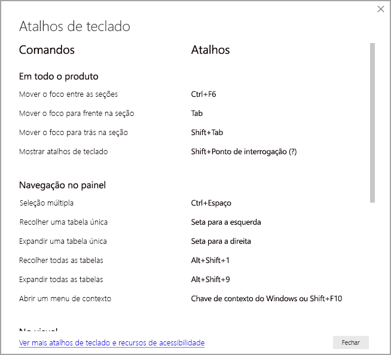

# Consumo de relatórios no Power BI com ferramentas de acessibilidade
O Power BI tem muitos recursos internos para ajudar pessoas com deficiências a consumir os relatórios do Power BI Desktop e interagir com eles de maneira mais fácil. Essas ferramentas ajudam os usuários a obter as mesmas informações de um relatório que aqueles que não usam a tecnologia assistencial.

Você deve estar familiarizado com alguns termos para ler corretamente este artigo:

* **Foco** é onde o mouse se encontra na página. O foco geralmente é indicado por uma borda azul ao redor do objeto em foco.
* **Tela** é a área do seu relatório na página.

As seções a seguir descrevem as ferramentas de acessibilidade disponíveis para o consumo de relatórios do Power BI.

## Navegação pelo teclado

Quando você inicia o Power BI Desktop ou o serviço do Power BI, ao pressionar o **Tab** uma dica de ferramenta aparece no canto superior direito. O link intitulado **dicas para usar o Power BI com um leitor de tela** direciona você para este artigo, fornecendo informações sobre como consumir um relatório com auxilio das ferramentas de acessibilidade. Clique no link **Ir para o conteúdo principal** para ser direcionado diretamente à tela do relatório.

Ao pressionar **?** será exibida uma caixa de diálogo com os atalhos de teclado usados com mais frequência no Power BI. Para ver uma lista completa dos atalhos de teclado disponíveis no Power BI, clique no link da parte inferior da caixa de diálogo e você será direcionado à documentação do Power BI sobre [atalhos de teclado](desktop-accessibility-keyboard-shortcuts.md).

Você pode alternar o foco entre as guias da página do relatório ou entre os objetos de uma determinada página do relatório usando **Ctrl + F6**. Quando o foco estiver em uma página de relatório carregada, use a tecla **Tab** para alternar o foco para cada objeto em uma página, o que inclui todas as caixas de texto, imagens, formas e gráficos. 

Em geral, comandos de uso comum no Power BI são o **Enter** para selecionar ou entrar e o **ESC** para sair.

### Navegação por teclado para visuais

Muitos criadores de relatório do Power BI estão criando relatórios que contêm grandes quantidades de dados. Ao percorrer um visual, pode ser muito irritante ter que navegar por cada um dos elementos existentes. A navegação por teclado para visuais foi projetada como uma hierarquia de três níveis. Esses três níveis são descritos nos parágrafos a seguir.

Para navegar pelo primeiro nível, ao acessar um visual pressione **CTRL + seta para a direita** para entrar no visual. Depois de entrar no visual, você poderá pressionar a tecla **Tab** para percorrer as áreas principais do visual. As áreas principais que você pode percorrer são a área de plotagem de dados, as categorias de eixo (se aplicável ao visual) e a legenda (se existir no visual).

O .gif a seguir mostra como um usuário percorre o primeiro nível de um visual:

O segundo nível da hierarquia está dentro de uma das áreas principais (área de plotagem de dados, categorias do eixo x ou legenda) do visual. Ao consumir um relatório, você poderá acessar uma dessas áreas principais e percorrer os pontos de dados ou as categorias existentes naquela seção do visual. Depois de decidir qual área deseja explorar ainda mais, você pode pressionar **Enter** para percorrer aquela área específica.

Se quiser selecionar todos os pontos de dados de uma série, navegue até a legenda e pressione **Enter**. Uma vez na legenda, você poderá pressionar a tecla **Tab** para navegar pelas diferentes categorias da legenda. Pressione **Enter** para selecionar uma série específica.

Se quiser selecionar pontos de dados específicos, navegue até a área de plotagem e pressione **Enter**. Uma vez na área de plotagem de dados, você poderá pressionar a tecla **Tab** para navegar pelos pontos de dados. Se o visual tiver várias séries, você poderá pressionar a **seta para cima** ou a **seta para baixo** a fim de pular para os pontos de dados da outra série.

Se quiser selecionar todos os pontos de dados de um eixo de categoria, navegue até os rótulos de eixo e pressione **Enter**. Uma vez nos rótulos de eixo, você poderá pressionar a tecla **Tab** para navegar pelos nomes dos rótulos. Pressione **Enter** para selecionar o nome de um rótulo.

Após entrar na navegação de uma camada, você poderá pressionar **ESC** para sair dessa camada. O. gif a seguir mostra como um usuário pode entrar e sair dos níveis de um visual e selecionar os pontos de dados, os rótulos de categoria do eixo x, ir para uma série diferente e selecionar todos os pontos de dados de uma série.

Se você verificar que não consegue navegar para um objeto ou visual usando o teclado, isso pode ser porque o autor do relatório decidiu ocultar esse objeto da ordem de tabulação. Normalmente, os autores de relatório ocultam objetos decorativos da ordem de tabulação. Se você achar que não é possível percorrer um relatório de maneira lógica usando a tecla Tab, entre em contato com o autor do relatório. Os autores de relatório podem definir a ordem de tabulação dos objetos e dos visuais.

### Navegação por teclado para segmentações

As segmentações também têm a funcionalidade de acessibilidade interna. Ao selecionar uma segmentação, para ajustar o valor dela use **CTRL + seta para a direita** a fim de percorrer os vários controles dentro da segmentação. Por exemplo, quando você pressiona inicialmente **CTRL + seta para a direita**, o foco está na borracha. Em seguida, pressionar a **barra de espaços** é equivalente a clicar no botão de borracha, que apaga todos os valores da segmentação.

Você pode percorrer os controles de uma segmentação pressionando a tecla **Tab**. Pressionar a tecla **Tab** na borracha muda para o botão suspenso. Pressionar **Tab** outra vez move para o primeiro valor da segmentação (se houver vários valores para a segmentação, como um intervalo).

### Alternância de páginas

Quando o foco estiver nas guias da página do relatório, use as teclas **Tab** ou de **Seta** para mover o foco de uma página de relatório para a próxima. O leitor de tela lê o título da página do relatório e se ele está selecionado no momento. Para carregar a página do relatório que está em foco, use a tecla **Enter** ou a **barra de espaços**.

### Acesso ao cabeçalho do visual
Ao navegar entre os visuais, você pode pressionar **Alt + Shift + F10** para mover o foco para o cabeçalho de visual. O cabeçalho de visual contém várias opções, incluindo classificação, exportação dos dados por trás do gráfico e modo de Foco. Os ícones exibidos no cabeçalho do visual dependerão das opções que o autor do relatório decidiu mostrar.

## Leitor de tela

Ao exibir um relatório, recomendamos deixar o modo de exame desativado. O Power BI deve ser tratado mais como um aplicativo e menos como um documento, portanto, ele foi configurado com uma navegação personalizada para facilitar a navegação. Ao usar um leitor de tela com o Power BI Desktop, você também deve verificar se o leitor de tela está aberto antes de abrir Power BI Desktop.

Ao percorrer os objetos, o leitor de tela lerá o tipo de objeto e o título do objeto (se houver). O leitor de tela também lerá uma descrição desse objeto (texto Alt) se houver sido fornecida pelo autor do relatório.

### Mostrar dados
Você pode pressionar **Alt + Shift + F11** para apresentar uma versão acessível da janela **Mostrar dados**. Essa janela permite que você explore os dados usados no visual em uma tabela HTML, usando os mesmos atalhos de teclado que normalmente são usados com o leitor de tela.

O recurso **Mostrar dados** é uma tabela HTML que só pode ser acessada em um leitor de tela com esse atalho de teclado. Se você abrir o **Mostrar dados** da opção no cabeçalho do visual, uma tabela *não* compatível com o leitor de tela será exibida.  Ao usar o **Mostrar dados** por meio dos atalhos de teclado, ative o modo de exame para aproveitar todas as teclas de acesso fornecidas pelo leitor de tela.

Para sair da exibição **Mostrar dados** e retornar ao relatório, pressione **ESC**.

## Modos de alto contraste

O serviço do Power BI tenta detectar as configurações de alto contraste selecionadas para o Windows. A eficácia e a precisão dessa detecção dependem do navegador que mostra a serviço do Power BI. Se você deseja definir o tema manualmente no serviço do Power BI, selecione **Exibição > Cores de alto contraste** e, em seguida, selecione o tema que deseja aplicar ao relatório.

## Próximas etapas

A coleção de artigos sobre a acessibilidade no Power BI é a seguinte:

* [Visão geral da acessibilidade no Power BI](desktop-accessibility-overview.md) 
* [Criação de relatórios acessíveis do Power BI](desktop-accessibility-creating-reports.md) 
* [Criação de relatórios do Power BI com ferramentas de acessibilidade](desktop-accessibility-creating-tools.md)
* [Atalhos de teclado com acessibilidade para relatórios do Power BI](desktop-accessibility-keyboard-shortcuts.md)
* [Lista de verificação de acessibilidade do relatório](desktop-accessibility-creating-reports.md#report-accessibility-checklist)

