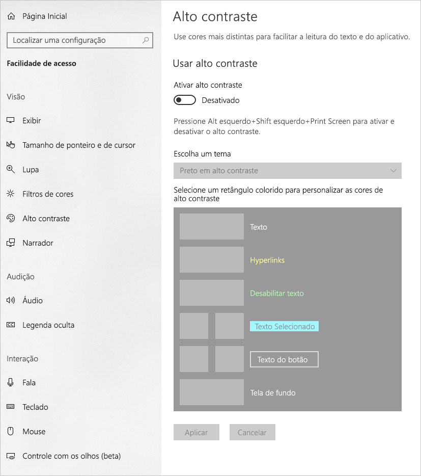
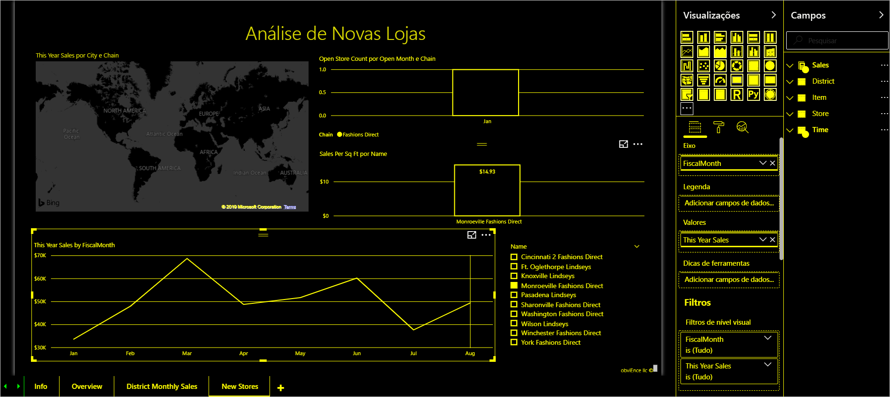
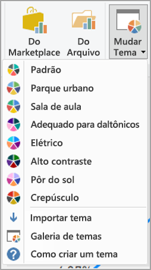

# Criar relatórios do Power BI para acessibilidade
Você pode projetar e criar relatórios atraentes e, ao mesmo tempo, projetá-los para acessibilidade. Sempre que criar um relatório, independentemente de quem é o público-alvo, você deve criá-los para serem utilizáveis pelo máximo de pessoas possíveis, sem a necessidade de ser adaptado para um tipo de design especial.

Este artigo descreve os recursos e as ferramentas de acessibilidade para a criação de relatórios acessíveis no Power BI.

Em geral, ao usar o Power BI com um leitor de tela, é recomendável desativar o modo de verificação ou o modo de procura.

Para melhorar o processo de criar relatórios com leitores de tela, um menu de contexto está disponível. O menu permite mover campos para cima ou para baixo na lista **Campos**. O menu também permite mover o campo para outras caixas, como **Legenda**, **Valor** ou outras.

## Tipos de recursos de acessibilidade

O Power BI oferece a capacidade de criar relatórios acessíveis, mas como o autor do relatório, cabe a você incorporá-los nos relatórios. Há três categorias de recursos de acessibilidade descritos neste artigo:

* Recursos de acessibilidade internos (sem necessidade de configuração)
* Recursos de acessibilidade internos (que exigem configuração)
* Outras dicas e considerações

Discutiremos cada uma dessas categorias nas seções a seguir.

## Recursos de acessibilidade internos

O Power BI tem recursos de acessibilidade internos do produto, que não exigem nenhuma configuração do autor do relatório. Esses recursos são os seguintes:

* Navegação pelo teclado
* Compatibilidade com leitor de tela
* Exibição de cores de alto contraste
* Modo de foco
* Mostrar tabela de dados

Também há recursos que ajudam na experiência de consumo do relatório. Os artigos que descrevem esses recursos podem ser encontrados na seção [Próximas etapas](#next-steps), no final deste artigo.

Vamos dar uma olhada em cada um desses recursos de acessibilidade internos. 

### Navegação pelo teclado

Como autor de um relatório, você não precisa se preocupar se seus consumidores podem usar o teclado para navegar em um relatório. Os visuais do Power BI são todos navegáveis por teclado e o consumidor do relatório pode percorrer os pontos de dados nos visuais, alternar entre as guias de página e ter acesso a recursos interativos, incluindo realce cruzado, filtragem e divisão.

Conforme um consumidor navega pelo relatório, o foco é exibido para indicar o local em que o usuário está no relatório. Dependendo do navegador que está sendo usado, o modo de foco poderá aparecer diferente.

Para acessar os atalhos de teclado usados com mais frequência, pressione *?* para exibir uma caixa de diálogo de atalhos de teclado. Para saber mais, veja os artigos sobre experiências de consumo acessíveis e atalhos de teclado na seção [Próximas etapas](#next-steps) no final deste artigo.

### Compatibilidade com leitor de tela

Em geral, todo objeto no Power BI que tem navegação por teclado também é compatível com leitores de tela. Quando um consumidor de relatório navega até um visual, o leitor de tela lerá o título, o tipo de visual e qualquer texto Alt, se tiver sido definido.

### Exibição de cor de alto contraste

O Power BI é compatível com alto contraste em relatórios. Se você estiver usando o modo de alto contraste no Windows, o Power BI Desktop detectará automaticamente qual tema de alto contraste está sendo usado e aplicará essas configurações em seus relatórios. Essas cores em alto contraste continuam no relatório quando ele é publicado no serviço do Power BI ou em outro lugar.

O serviço do Power BI também tenta detectar as configurações de alto contraste selecionadas para o Windows, mas o grau de eficácia e precisão dessa detecção depende do navegador usado para o serviço do Power BI. Se você deseja definir o tema manualmente no serviço do Power BI, no canto superior direito selecione **V > Cores de alto contraste** e, em seguida, selecione o tema que deseja aplicar ao relatório.

### Modo de foco
Se um consumidor de relatório estiver olhando para um visual em um dashboard, ele poderá expandir o visual para preencher mais a tela navegando até o menu de contexto do visual e selecionando **Abrir no modo de foco**.

### Mostrar tabela de dados
Os consumidores de relatório também podem exibir os dados em um visual em um formato tabular pressionando **Alt + Shift + F11**. Essa tabela é semelhante a pressionar **Mostrar Dados** no menu de contexto do visual, mas mostra uma tabela amigável para o leitor de tela.

## Recursos de acessibilidade internos que exigem configuração

O Power BI tem recursos de acessibilidade que são internos do produto e exigem configuração do autor do relatório.  Esses recursos incluem:

* Texto alternativo
* Ordem de tabulação
* Títulos e rótulos
* Marcadores
* Temas de relatórios

## Texto alternativo

O texto Alt (descrições de texto alternativo) é usado para descrever a aparência e a função de visuais e imagens na página do relatório para os usuários do leitor de tela. Os autores de relatório devem adicionar texto Alt aos objetos que transmitem informações significativas sobre um relatório. O fornecimento de texto Alt garante que os consumidores de seu relatório entendam o que você está tentando comunicar com um visual, mesmo que eles não possam ver o visual, a imagem, a forma ou a caixa de texto. Você pode fornecer um texto Alt para qualquer objeto em um relatório do Power BI Desktop selecionando o objeto (como um visual, uma forma e assim por diante) e, no painel **Visualizações**, selecionar a seção **Formatar**, expandir **Geral**, rolar para baixo e preencher a caixa de texto **Texto Alt**. A caixa de texto **Texto Alt** tem um limite de 250 caracteres.

O texto Alt deve incluir informações sobre o insight que você gostaria que o consumidor do relatório obtivesse com o visual. Como um leitor de tela lê o título e o tipo de um visual, você só precisa preencher uma descrição. Um exemplo de texto Alt para o seguinte visual poderia ser: *Satisfação líquida do usuário por cor de produto vendida, dividida por classe de produto.*

Entenda que falar um insight ou pontos de dados específicos pode não ser a melhor coisa a se colocar em texto Alt estático, pois os dados são dinâmicos no Power BI. Se desejar usar texto Alt dinâmico, confira a próxima seção que descreve a formatação condicional para texto Alt.

### Formatação condicional para texto Alt

Uma característica que torna o Power BI tão atraente é que seus dados são dinâmicos. Você pode usar medidas DAX e formatação condicional para criar texto Alt dinâmico. Os leitores de tela serão então capazes de falar valores específicos dos dados que um consumidor de relatório estará exibindo.

### Ordem de tabulação
A definição da ordem de tabulação ajuda os usuários de teclado a navegar pelo relatório em uma ordem que corresponda à maneira como os usuários processam visualmente os visuais do relatório. Se você estiver incluindo formas decorativas e imagens em seu relatório, remova-as da ordem de tabulação. 

Para definir a ordem de tabulação, selecione a guia **Exibir** na faixa de opções e selecione o botão **Painel de Seleção** para exibir o Painel de seleção.

No **Painel de Seleção**, selecionar **Ordem de tabulação** exibe a ordem de tabulação atual do relatório. Você pode selecionar um objeto e, em seguida, usar os botões de seta para cima e para baixo para mover o objeto na hierarquia ou pode selecionar um objeto com o mouse e arrastá-lo para a posição da lista desejada. Clicar no número ao lado de um objeto oculta o objeto da ordem de tabulação.

### Títulos e rótulos
Os títulos de página de relatório e visual são recursos de acessibilidade importantes que orientam o consumidor de relatório. Evite usar acrônimos ou jargões em seus títulos de relatório. Se você compartilhar o relatório com um novo usuário ou alguém que seja externo à sua organização, talvez ele não saiba o que significam seus termos ou acrônimos. A imagem a seguir mostra um visual com um acrônimo no título (à esquerda) e um título mais claro para o visual à direita.

Em um visual, verifique se todos os títulos, rótulos de eixo, valores de legenda e rótulos de dados são fáceis de ler e entender. Compare as imagens a seguir: a primeira imagem tem poucos números ou descrições dos dados e a segunda tem muitos.

Com rótulos de dados, você pode até optar por ativar ou desativar os rótulos de cada série no visual ou posicioná-los acima ou abaixo de uma série. Embora o Power BI faça o melhor para posicionar os rótulos de dados acima ou abaixo de uma linha, às vezes não fica muito claro. No visual a seguir, os rótulos de dados estão confusos e não são fáceis de ler.

Posicionar os rótulos de dados acima ou abaixo da série poderá ajudar, principalmente se você estiver usando um gráfico de linhas com várias linhas. Com alguns ajustes, os rótulos de dados parecem muito melhores.

### Marcadores

A melhor prática é evitar o uso de cores (incluindo a formatação condicional de recursos) como a única maneira de transmitir informações. Em vez disso, você pode usar marcadores para transmitir séries diferentes.

Para visuais de Linha, Área e Combinação, bem como para visuais de Dispersão e de Bolha, você pode ativar os marcadores e usar uma Forma de marcador diferente para cada linha.

Para ativar os Marcadores, selecione a seção Formatar no painel Visualizações, expanda a seção **Formas** e, em seguida, role para baixo até encontrar a tecla de alternância **Marcadores** e posicione-a em **Ativado**, conforme mostrado na imagem a seguir. 

Você também pode usar **Personalizar Série** para selecionar o nome de cada linha (ou área, se estiver usando um gráfico de Área) na caixa suspensa na seção Formas. Abaixo da lista suspensa, você pode ajustar vários aspectos do marcador usado para a linha selecionada, incluindo seu tamanho, cor e forma.

Nós sugerimos que os autores de relatório ativem rótulos de dados e marcadores, mas ativar todos eles em todos os visuais poderá causar distração e tornar seu relatório menos acessível. Na imagem a seguir, compare um visual que tem rótulos de dados e marcadores ativados e, em seguida, uma versão mais compreensível com rótulos de dados desativados.

Se você não tem certeza se o visual ou relatório está muito sobrecarregado, teste-o realizando um [teste de visão](https://chrome.google.com/webstore/detail/the-squint-test/gppnipfbappicilfniaimcnagbpfflpg).  Se seus olhos forem atraídos mais para os rótulos de dados do que os pontos de dados, desative os rótulos de dados.

### Temas, contraste e cores para daltonismo

Você deve garantir que os relatórios tenham contraste suficiente entre o texto e as cores da tela de fundo. O critério de êxito 1.4.3 da WCAG 2.1 descreve que o texto e a cor da tela de fundo devem ter uma taxa de contraste de, pelo menos, 4,5:1. Há várias ferramentas, como [Analisador de Contraste de Cores](https://developer.paciellogroup.com/resources/contrastanalyser/), [WebAIM](https://webaim.org/resources/contrastchecker/) e [Cores Acessíveis](https://accessible-colors.com/) que você pode usar para verificar as cores do relatório.

Você também deve considerar que alguns consumidores de relatórios podem ter deficiências de visão de cores. Ferramentas como [Coblis](https://www.color-blindness.com/coblis-color-blindness-simulator/) e [Vischeck](https://www.vischeck.com/vischeck/vischeckImage.php) simulam o que os visualizadores de relatórios com deficiências de cores diferentes enxergam.  Usar menos cores ou uma paleta monocromática em seu relatório pode ajudar a mitigar a criação de relatórios que sejam inacessíveis.

Determinadas combinações de cores são particularmente difíceis para usuários com deficiências de visão para distinguir cores. Isso inclui as seguintes combinações: 

* verde e vermelho
* verde e marrom
* azul e roxo
* verde e azul
* verde-claro e amarelo
* azul e cinza
* verde e cinza
* verde e preto

Evite usar essas cores juntas em um gráfico ou na mesma página do relatório. O Power BI tem alguns temas internos para ajudar a tornar seu relatório mais acessível, mas a melhor prática é verificar seu relatório com algumas das ferramentas adicionais sugeridas neste artigo.

## Dicas e considerações
Esta seção fornece algumas diretrizes, dicas e considerações para ponderar ao criar relatórios com a acessibilidade em mente.

### Entender o que seu público-alvo deseja

A criação de um relatório é um processo iterativo. Antes de começar a colocar os visuais na página, fale com alguns dos consumidores do seu relatório para ter uma compreensão melhor das informações que eles desejam obter do seu relatório e como desejam vê-las.  

A criação na acessibilidade deve fazer parte desse processo. Você pode descobrir que sua visão não é o que os consumidores do relatório têm em mente. Depois de preparar um rascunho inicial do relatório, mostre-o a um consumidor de relatório e reúna mais comentários. Como um autor de relatório, a coleta de comentários pode ajudar a mitigar uma futura avalanche de solicitações de alterações provenientes de consumidores infelizes com os relatórios.

### Mantenha seu relatório simples e consistente

Mantenha seu relatório o mais simples possível. Muitas vezes, as pessoas tentam colocar muita coisa em um único visual. Com frequência, a divisão em vários visuais torna mais simples e fácil entender. Considere o uso de vários visuais se eles mostrarem facetas diferentes dos dados e o uso de filtros ou interações visuais para criar uma experiência rica. Ao mesmo tempo, mantenha o número de visuais em uma página o menor possível. Tente evitar redundância desnecessária e o excesso na página. Você não precisa de dois visuais para mostrar a mesma coisa. Os consumidores de relatórios podem ficar sobrecarregados com todas as informações fornecidas em muitos visuais ou podem ter um foco limitado de atenção e ficarem distraídos. Isso não apenas torna o seu relatório mais fácil de consumir, mas, além disso, ter muitos visuais em uma página pode reduzir o desempenho do relatório.

Mantenha seu relatório consistente usando a mesma cor e estilo de fonte para os elementos visuais em todo o relatório. Use o mesmo tamanho de fonte para todos os títulos de visuais, assim como para rótulos de dados e títulos de eixo. Se você estiver usando segmentações em várias páginas do relatório, mantenha-as no mesmo local em todas as páginas do relatório.

### Teste para deficiência visual

Uma maneira rápida de testar a aparência de um relatório para consumidores com deficiência visual seria desativar o brilho da tela ou do dispositivo móvel.  Há complementos de navegador que você pode usar que podem ajudá-lo a executar um teste de visão.

## Lista de verificação de acessibilidade do relatório

Além de fornecer funcionalidades e ferramentas de acessibilidade, o Power BI fornece a seguinte lista de verificação para usar ao criar relatórios. Esta lista de verificação ajuda a garantir que seus relatórios sejam acessíveis e disponíveis para o maior público-alvo antes de você publicá-los. 

### Todos os visuais

* Verifique se o contraste das cores entre o título, o rótulo de eixo, o texto do rótulo de dados e a tela de fundo é de, pelo menos, 4,5:1.
* Evite usar cores como o único meio de transmitir informações. Use texto ou ícones para complementar ou substituir a cor.
* Substitua jargões ou acrônimos desnecessários.
* Adicione **texto Alt** a todos os visuais não decorativos da página.
* Verifique se a página de relatório funciona para usuários com deficiência de visão de cores.

### Segmentações
* Se você tiver uma coleção de várias segmentações nas páginas de relatório, verifique se o design é consistente entre as páginas. Use a mesma fonte, as cores e a posição espacial o máximo possível.

### Caixa de texto
* Verifique se o contraste de cores entre a fonte e a tela de fundo é de, pelo menos, 4,5:1.
* Coloque conteúdo de texto na caixa de **texto Alt** para que os leitores de tela possam lê-los.

### Interações visuais
* As principais informações somente ficam acessíveis por meio de uma interação? Em caso afirmativo, reorganize seus visuais para que eles fiquem previamente filtrados para tornar mais óbvias as conclusões importantes.
* Você está usando indicadores para navegação? Tente navegar pelo relatório com um teclado para garantir que a experiência esteja aceitável para aqueles que usam somente teclado.

### Ordem de classificação
* Você definiu intencionalmente a ordem de classificação de cada visual na página? A tabela **Mostrar Dados** acessível mostra os dados na ordem de classificação que você definiu no visual.

### Dicas de ferramenta
* Não use dicas de ferramenta para transmitir informações importantes. Os usuários com problemas motores e os que não usam mouse terão dificuldades para acessá-las.
* Adicione dicas de ferramentas a gráficos como informações complementares. Isso está incluído na tabela acessível **Mostrar Dados** para cada visual.

### Vídeo
* Evite vídeo que é iniciado automaticamente quando a página é renderizada.
* Verifique se o vídeo tem legendas ou forneça uma transcrição.

### Áudio
* Evite áudio que é iniciado automaticamente quando a página é renderizada.
* Forneça uma transcrição para qualquer áudio.

### Formas
* Marque todas as formas decorativas como ocultas na ordem de tabulação, para que elas não sejam anunciadas por um leitor de tela.
* Evite usar muitas formas decorativas ao ponto de causar distração.
* Ao usar formas para chamar pontos de dados, use **texto Alt** para explicar o que está sendo chamado.

### Imagens
* Ao usar imagens para chamar pontos de dados, use **texto Alt** para explicar o que está sendo chamado.
* Marque todas as imagens decorativas como ocultas na ordem de tabulação, para que elas não sejam anunciadas por um leitor de tela.
* Evite usar muitas imagens decorativas ao ponto de causar distração.

### Visuais do Power BI
* Verifique se há visuais do Power BI na tabela **Mostrar Dados** acessível. Se as informações mostradas não forem suficientes, procure outro visual.
* Se estiver usando o visual personalizado *Eixo de Reprodução*, certifique-se de que ele não seja executado automaticamente. Deixe claro que o usuário deverá pressionar o botão reproduzir/pausar para iniciar/parar os valores sendo alterados.

### Entre visuais na página
* Defina a ordem de tabulação e desative a ordem de tabulação (marque o item como oculto) nos itens decorativos.

## Considerações e limitações
Há alguns problemas conhecidos e algumas limitações com os recursos de acessibilidade. As descrições desses problemas e limitações estão na lista a seguir:

* Ao usar leitores de tela com o **Power BI Desktop**, a experiência será melhor se você abrir o leitor de tela de sua preferência antes de abrir qualquer arquivo no **Power BI Desktop**.

## Próximas etapas

A coleção de artigos sobre a acessibilidade no Power BI é a seguinte:

* [Visão geral da acessibilidade no Power BI](desktop-accessibility-overview.md) 
* [Consumo de relatórios do Power BI com ferramentas de acessibilidade](desktop-accessibility-consuming-tools.md)
* [Criação de relatórios do Power BI com ferramentas de acessibilidade](desktop-accessibility-creating-tools.md)
* [Atalhos de teclado com acessibilidade para relatórios do Power BI](desktop-accessibility-keyboard-shortcuts.md)
* [Lista de verificação de acessibilidade do relatório](#report-accessibility-checklist)
