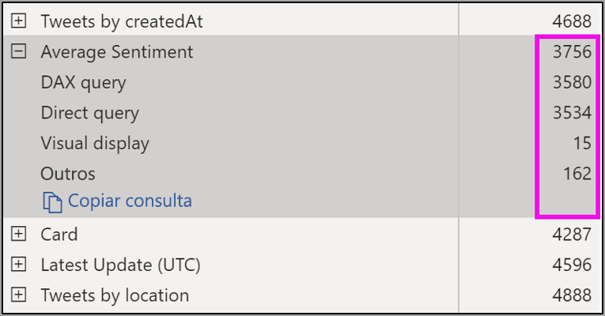

# Atualização automática de página no Power BI Desktop (visualização)

Ao monitorar eventos críticos, é importante que os dados sejam atualizados no mesmo momento que os dados de origem. Por exemplo, no setor de manufatura, é essencial saber quando um computador está com problemas de funcionamento ou prestes a ter esse tipo de problema.

O recurso APR (Atualização automática de página) do Power BI permite que a página de relatório ativa consulte novos dados, em uma frequência predefinida, em [fontes de DirectQuery](https://docs.microsoft.com/power-bi/desktop-directquery-about).

## Uso da atualização automática de página

Nesta versão prévia, você deve habilitar o recurso de atualização automática de página no Power BI Desktop. Vá para **Arquivo > Opções e configurações** e selecione **Opções** e **Recursos de visualização** no painel à esquerda. Habilite o recurso marcando a caixa de seleção ao lado de *Atualização automática de página*. A atualização automática de página está disponível somente para fontes de dados do DirectQuery.

Para usar a atualização automática de página, selecione a página de relatório cuja atualização você deseja habilitar. No painel de **Visualizações**, selecione o ícone **Formatação** (um rolo de pintura) e localize **Atualização de página** próximo da parte inferior do painel. 

A imagem a seguir mostra o cartão **Atualização de página**. As explicações dos elementos numerados são descritas nos próximos parágrafos:

1.  Controle deslizante Atualização automática de página: ativa ou desativa a atualização da página
2.  Valor do intervalo de atualização de página: valor numérico do intervalo de atualização
3.  Unidade do intervalo de atualização de página: unidade de intervalo para atualização de página

Aqui, você pode ativar a atualização de página e selecionar a duração da atualização. O valor padrão é 30 minutos, o intervalo de atualização mínimo é um segundo. O relatório começará a ser atualizado no intervalo que você definir. 

## Como determinar o intervalo de atualização de página

Quando a atualização automática de página está habilitada, o Power BI Desktop envia constantemente consultas para sua fonte do DirectQuery. Haverá um retardo entre a consulta enviada e a obtenção dos dados retornados, portanto, em intervalos de atualização curtos, você deve confirmar que as consultas retornam os dados consultados dentro do intervalo configurado. Se os dados não forem retornados dentro do intervalo, crie situações em que os visuais sejam atualizados com frequência menor do que o configurado.

Como prática recomendada, o intervalo de atualização deve corresponder ao menos à sua nova taxa de chegada de dados esperada:

* Se os dados novos chegarem à origem a cada 20 minutos, o intervalo de atualização não poderá ser inferior a 20 minutos. 

* Se os dados novos chegarem a cada segundo, o intervalo deverá ser definido como um segundo. 

Para intervalos de baixa atualização, como um segundo, você também deve considerar o tipo da fonte de dados de consulta direta, a carga criada na fonte por suas consultas, a distância entre os visualizadores de relatório e o data center da capacidade e assim por diante. 

Você pode estimar isso usando o Performance Analyzer no Power BI Desktop, que permite confirmar se cada consulta visual tem tempo suficiente para retornar o resultado da origem e onde o tempo é gasto. Com base nos resultados do Performance Analyzer, você pode ajustar e fazer alterações na fonte de dados ou pode experimentar outros elementos visuais e medidas em seu relatório.

A imagem a seguir mostra os resultados de uma consulta do DirectQuery no Performance Analyzer:

Vamos considerar algumas outras características sobre essa fonte de dados. 

1.  Os dados chegam a uma taxa de dois segundos. 
2.  O Performance Analyzer mostra a consulta máxima + tempo de exibição de aproximadamente 4,9 segundos (4.688 milissegundos). 
3.  A fonte de dados está configurada para lidar com aproximadamente 1.000 consultas simultâneas por segundo. 
4.  Você espera que aproximadamente 10 usuários exibam simultaneamente o relatório.

Isso resulta no seguinte:

* **5 visuais x 10 usuários = aproximadamente 50 consultas**

Esse cálculo resulta em uma carga muito maior do que a carga que a fonte de dados consegue suportar. Os dados chegam a uma taxa de dois segundos, de modo que essa deve ser a taxa de atualização. No entanto, como a consulta leva cerca de cinco segundos para ser concluída, devemos defini-la para mais de cinco segundos. 

Esse resultado também pode ser diferente quando você publica o relatório no serviço porque o relatório usará a instância do Analysis Services hospedada na nuvem. Talvez você queira ajustar suas taxas de atualização de acordo. 

Para considerar as consultas e atualizar o tempo, o Power BI só executará a próxima consulta de atualização quando todas as consultas de atualização restantes forem concluídas. Portanto, mesmo que o intervalo de atualização seja menor do que o tempo que suas consultas levam para serem processadas, o Power BI só será atualizado novamente quando as consultas restantes forem concluídas. 

Em seguida, vamos examinar como é possível detectar e diagnosticar problemas de desempenho como um administrador de capacidade. Você também pode marcar a seção **Perguntas frequentes sobre atualização automática de página**, mais adiante neste artigo, para ver mais perguntas e respostas sobre desempenho e solução de problemas.

## Atualização automática de página no serviço do Power BI

Você também pode definir intervalos de atualização automática de página para relatórios criados no Power BI Desktop e publicados no serviço do Power BI. 

A atualização automática de página para relatórios no serviço do Power BI é configurada com etapas semelhantes à configuração no Power BI Desktop. A imagem a seguir mostra a configuração da **atualização de página** para o serviço do Power BI:

1.  Controle deslizante Atualização automática de página: ativa ou desativa a atualização da página
2.  Valor do intervalo de atualização de página: valor numérico do intervalo de atualização, deve ser um número inteiro
3.  Unidade do intervalo de atualização de página: unidade de intervalo para atualização de página

### Intervalos de atualização de página

Os intervalos de atualização de página permitidos no serviço do Power BI são afetados pelo tipo de workspace do relatório. Isso se aplica a todos os relatórios a seguir:

* Publicar um relatório em um workspace com atualização automática de página habilitada
* Editar um intervalo de atualização de página que já está em um workspace
* Criar um relatório diretamente no serviço

O Power BI Desktop não apresenta restrição no intervalo de atualização; a frequência do seu intervalo de atualização pode ser até de um segundo. No entanto, quando os relatórios são publicados no serviço do Power BI, determinadas restrições se aplicam e são descritas nas seções a seguir.

### Restrições em intervalos de atualização

No serviço do Power BI, as restrições para a atualização automática de página se aplicam com base em fatores como o workspace e se os serviços Premium estão em uso.

Para esclarecer como isso funciona, vamos começar com um pouco de contexto sobre capacidades e workspaces:

As **capacidades** são um conceito fundamental do Power BI que representa um conjunto de recursos (armazenamento, processador e memória) usado para hospedar e fornecer conteúdo do Power BI. As capacidades são compartilhadas ou dedicadas. Uma **Capacidade Compartilhada** é aquela compartilhada com outros clientes da Microsoft, enquanto a **Capacidade Dedicada** está totalmente comprometida com um único cliente. As capacidades dedicadas são apresentadas no artigo sobre [Gerenciar capacidades Premium](service-premium-capacity-manage.md).

Na capacidade compartilhada, as cargas de trabalho são executadas em recursos computacionais compartilhados com outros clientes. Como a capacidade deve compartilhar recursos, limitações são impostas para garantir *equilíbrio*, como definir o tamanho máximo do modelo (1 GB) e a frequência máxima de atualização diária (oito vezes por dia).

Os **workspaces** do Power BI residem em capacidades e representam contêineres de segurança, colaboração e implantação. Cada usuário do Power BI tem um workspace pessoal, conhecido como **Meu workspace**. Workspaces adicionais podem ser criados para habilitar a colaboração e a implantação. Eles são conhecidos como **workspaces**. Por padrão, os workspaces, incluindo os pessoais, são criados na **capacidade compartilhada**.

Confira alguns detalhes dos dois cenários de workspaces:

**Workspaces compartilhados**: em workspaces normais (que não fazem parte de uma capacidade Premium), a atualização automática de página tem um intervalo mínimo de 30 minutos (o intervalo mais baixo permitido).

**Workspaces Premium**: a disponibilidade da atualização automática de página nos workspaces Premium depende das configurações de carga que o administrador premium configurou para a capacidade do Power BI Premium. Há duas variáveis que podem afetar a capacidade de configurar a atualização automática de página:

 1. *Ativar/desativar recurso*: se o administrador da capacidade decidiu desabilitar o recurso, você não conseguirá configurar nenhum tipo de atualização de página em seu relatório publicado.

 2. *Intervalo mínimo de atualização*: ao habilitar esse recurso, o administrador da capacidade deve configurar um intervalo mínimo de atualização. Se o intervalo for menor do que o mínimo, o serviço do Power BI substituirá o intervalo para respeitar o intervalo mínimo definido pelo administrador de capacidade.

A tabela a seguir descreve com mais detalhes onde esse recurso está disponível e os limites para cada tipo de capacidade e [modo de armazenamento](service-dataset-modes-understand.md)

| Modo de armazenamento | Capacidade dedicada | Capacidade compartilhada |
| --- | --- | --- |
| Consulta direta | **Compatível**: sim.  **Intervalo mínimo de atualização**: 1 segundo  **Substituição da capacidade pelo administrador**: sim. | **Compatível**: sim.  **Intervalo mínimo de atualização**: 30 minutos  **Substituição da capacidade pelo administrador**: não. |
| Importar | **Compatível**: não.  **Intervalo mínimo de atualização**: N/D.  **Substituição da capacidade pelo administrador**: N/D. | **Compatível**: não.  **Intervalo mínimo de atualização**: N/D.  **Substituição da capacidade pelo administrador**: N/D. |
| Modo misto (DQ + outros) | **Compatível**: sim.  **Intervalo mínimo de atualização**: 1 segundo  **Substituição da capacidade pelo administrador**: sim. | **Compatível**: sim.  **Intervalo mínimo de atualização**: 30 minutos  **Substituição da capacidade pelo administrador**: não. |
| Live Connect | **Compatível**: não.  **Intervalo mínimo de atualização**: N/D.  **Substituição da capacidade pelo administrador**: N/D. | **Compatível**: não.  **Intervalo mínimo de atualização**: N/D.  **Substituição da capacidade pelo administrador**: N/D. |
| Live Connect PBI | **Compatível**: não.  **Intervalo mínimo de atualização**: N/D.  **Substituição da capacidade pelo administrador**: N/D. | **Compatível**: não.  **Intervalo mínimo de atualização**: N/D.  **Substituição da capacidade pelo administrador**: N/D. |

> [!NOTE]
> Ao publicar o relatório com a atualização automática de página habilitada do Power BI Desktop para o serviço, você precisará fornecer as credenciais para a fonte de dados do DirectQuery no menu de configurações do conjunto.

## Considerações e limitações

Há alguns lembretes importantes ao usar a atualização automática de página, seja no Power BI Desktop ou no serviço do Power BI.

* Os modos de armazenamento Importar, Live Connect e Push não dão suporte para a atualização automática de página.  
* Há suporte para modelos compostos com pelo menos uma fonte de dados do DirectQuery.
* O Power BI Desktop não apresenta restrição no intervalo de atualização, que pode ser até de um segundo. Quando os relatórios são publicados no serviço do Power BI, determinadas restrições se aplicam, conforme descrito anteriormente neste documento.

### Diagnósticos de desempenho

A atualização automática de página é útil para monitorar cenários e explorar dados de alteração rápida. No entanto, às vezes isso pode colocar uma carga indevida na capacidade ou na fonte de dados.

Para evitar a carga indevida em fontes de dados, o Power BI disponibiliza as seguintes proteções:

1. Todas as consultas de atualização automática de página são executadas em uma prioridade **inferior** para garantir que as consultas interativas (como carregamento de página e visuais de filtragem cruzada) tenham precedência.
2. Se a consulta não for concluída antes do próximo ciclo de atualização, o Power BI não emitirá novas consultas de atualização até que a consulta anterior seja concluída. Por exemplo, se você tiver um intervalo de atualização de um segundo e as consultas demorarem quatro segundos em média, o Power BI emitirá efetivamente apenas uma consulta a cada quatro segundos.

Há duas áreas nas quais você ainda pode encontrar gargalos de desempenho:

1. **A capacidade:** a consulta atinge primeiro a capacidade premium que dobrará e avaliará a consulta DAX gerada a partir das visualizações de relatório nas consultas de origem.
2. **A fonte de dados do Direct Query:** as consultas traduzidas na etapa anterior são executadas em relação à origem. Esses seriam os seus SQL Servers, fontes do SAP Hana e assim por diante.

Usando o [aplicativo de métricas Premium](service-admin-premium-monitor-capacity.md) disponível para administradores, você pode visualizar o quanto da capacidade está em uso por consultas de baixa prioridade.

Consultas de baixa prioridade consistem em consultas de atualização automática de página e de atualização de modelo. Atualmente, não há como distinguir entre a carga de consultas de atualização automática de página e de atualização de modelo.

Se você observar que sua capacidade está ficando sobrecarregada com consultas de baixa prioridade, poderá executar as seguintes ações:

1. Solicite um SKU premium maior.
2. Contate o proprietário do relatório e peça para que ele diminua o intervalo de atualização.
3. No portal de administração de capacidade, você pode:
  1. Desativar a atualização automática de página para essa capacidade
  2. Elevar o intervalo mínimo de atualização, o que afetará a todos os relatórios nessa capacidade.

### Perguntas frequentes

Esta seção fornece perguntas comuns e suas respostas 

1. Sou autor de um relatório. Defini o intervalo de atualização do relatório como um segundo na área de trabalho, mas, depois de publicar, percebi que o serviço não está atualizando meu relatório.

    * Verifique se a atualização automática está ativada para a página. Como essa configuração é definida por página, você precisa garantir que ela esteja ativada para cada página do relatório que você deseja atualizar.
    * Verifique se você a carregou em um workspace com capacidade premium anexada, caso contrário, seu intervalo de atualização ficará bloqueado em 30 minutos.
    * Se o relatório estiver em um workspace premium, verifique com seu administrador se ele habilitou esse recurso para a capacidade anexada. Além disso, verifique se o intervalo mínimo de atualização para a capacidade é inferior ou o mesmo que o do relatório.

2. Sou administrador de uma capacidade. Alterei minhas configurações de intervalo de atualização automática de página, mas isso não causou efeito. Ou seja, os relatórios ainda são atualizados em uma taxa incorreta ou não são atualizados, mesmo que eu tenha ativado a atualização.

    * As alterações de configuração de atualização automática de página feitas na interface do usuário do administrador de capacidade demoram até 5 minutos para serem propagadas para relatórios.
    * Além de ativar a atualização automática de página para a capacidade, você também precisa ativá-la para as páginas de um relatório em que deseja que ela ocorra.

3. Meu relatório está operando no modo misto (DQ + Importar). Nem todos os visuais estão sendo atualizados.

    * Se os elementos visuais fizerem referência a tabelas do Importar, isso será esperado. O Importar não dá suporte à atualização automática de página.
    * Confira a pergunta 1 nesta seção.

4. A atualização do meu relatório estava funcionando bem no serviço e, de repente, parou.

    * Tente atualizar a página para ver se o problema se resolve sozinho.
    * Fale com seu administrador de capacidade, pois ele pode ter desativado o recurso ou elevado o intervalo mínimo de atualização (confira a pergunta 2)

5. Sou autor de um relatório. Meus visuais não estão sendo atualizados na frequência que solicitei. A atualização está ocorrendo em uma taxa mais lenta.

    * Se suas consultas estiverem demorando mais para serem executadas, seu intervalo de atualização será atrasado. A atualização automática de página aguarda a conclusão da execução de todas as consultas antes de executar novas.
    * Pode ser que seu administrador de capacidade tenha definido um intervalo de atualização mínimo maior do que aquele que você definiu em seu relatório. Entre em contato com o administrador de capacidade e solicite a diminuição do intervalo.

6. As consultas de atualização automática de página são atendidas pelo cache?

    * Não, todas as consultas de atualização automática de página ignoram os dados armazenados em cache.

## Próximas etapas

Para obter mais informações, consulte os seguintes artigos:

* [Usar o DirectQuery no Power BI](desktop-directquery-about.md)
* [Usar o Performance Analyzer para examinar o desempenho do elemento de relatório](desktop-performance-analyzer.md)
* [Implantar e gerenciar capacidades do Power BI Premium](whitepaper-powerbi-premium-deployment.md)
* [Fontes de dados no Power BI Desktop](desktop-data-sources.md)
* [Formatar e combinar dados com o Power BI Desktop](desktop-shape-and-combine-data.md)
* [Conectar-se a pastas de trabalho do Excel no Power BI Desktop](desktop-connect-excel.md)   
* [Inserir dados diretamente no Power BI Desktop](desktop-enter-data-directly-into-desktop.md)   
