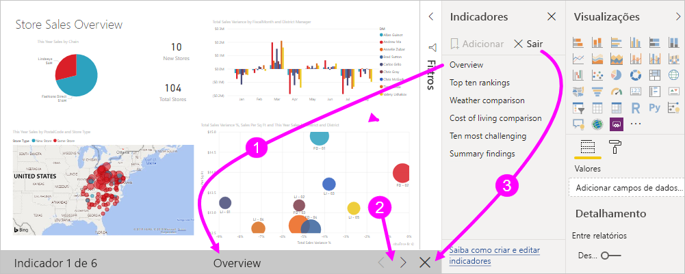
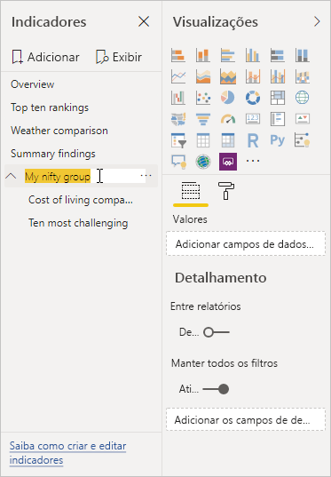
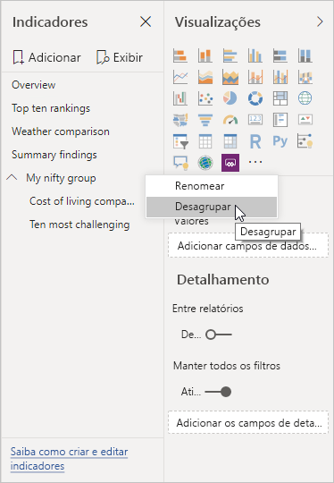

# Criar indicadores no Power BI Desktop para compartilhar insights e criar histórias
Com *indicadores* no Power BI Desktop, você captura a exibição de uma página de relatório configurada no momento, incluindo a filtragem e o estado dos visuais. Posteriormente, você poderá voltar para esse estado selecionando o indicador salvo. 

Você também pode criar uma coleção de indicadores, organizá-los na ordem desejada e, posteriormente, percorrer cada indicador em uma apresentação para realçar uma série de insights ou a história que você deseja contar com seus relatórios e visuais. 

Há muitos usos para indicadores. Por exemplo, você pode usar indicadores para acompanhar seu próprio progresso na criação de relatórios (indicadores são fáceis de adicionar, excluir e renomear) e, além disso, pode criar indicadores para criar uma apresentação de PowerPoint que percorre os indicadores em ordem, contando assim uma história com o seu relatório. 

> [!TIP]
> Para obter informações sobre como usar indicadores pessoais no serviço do Power BI, confira [Anunciar indicadores pessoais no Serviço do Power BI](https://powerbi.microsoft.com/blog/announcing-personal-bookmarks-in-the-power-bi-service/). 

## Usando indicadores
Para usar indicadores, selecione a guia **Exibição** na faixa de opções do Power BI Desktop e selecione o **Painel Indicadores**. 

Quando você cria um indicador, os seguintes elementos são salvos com o indicador:

* A página atual
* Filtros
* A segmentação de dados, incluindo o tipo de segmentação de dados (por exemplo, menu suspenso ou lista) e o estado de segmentação de dados
* Estado de seleção visual (como filtros de realce cruzado)
* Ordem de classificação
* Local de análise
* Visibilidade de um objeto (usando o painel **Seleção**)
* Os modos de foco ou de **Destaque** de qualquer objeto visível

Configure uma página de relatório como você deseja que ela seja exibida no indicador. Depois que a página de relatório e os visuais forem organizados como você deseja, selecione **Adicionar** no painel **Indicadores** para adicionar um indicador. 

O Power BI Desktop cria um indicador e concede a ele um nome genérico. Você pode facilmente **Renomear**, **Excluir** ou **Atualizar** um indicador selecionando as reticências ao lado do nome do indicador e, em seguida, selecionando uma ação no menu exibido.

Depois de criar um indicador, exiba-o selecionando-o no painel **Indicadores**. 

Você também pode selecionar se cada indicador aplicará as propriedades de **Dados**, como filtros e segmentação de dados; as propriedades de **Exibição**, como destaques e sua visibilidade; e as alterações da **Página atual**, que apresentam a página que estava visível quando o indicador foi adicionado. Essas funcionalidades são úteis quando você usa indicadores para alternar entre exibições de relatório ou seleções de visuais – nesse caso, provavelmente você desejaria desativar as propriedades de dados, de modo que os filtros não são redefinidos quando os usuários alternam as exibições selecionando um indicador. 

Para fazer essas alterações, selecione as reticências ao lado do nome do indicador e marque ou desmarque as caixas de seleção ao lado de **Dados**, **Exibição** e outros controles. 

## Organizando indicadores
Conforme você cria indicadores, pode achar que a ordem na qual eles são criados é diferente da ordem que você gostaria de apresentar ao seu público-alvo. Não há problema, você pode facilmente reorganizar a ordem dos indicadores.

- No painel **Indicadores**, arraste e solte indicadores para mudar sua ordem. 

   A barra amarela entre indicadores designa o local em que o indicador arrastado será colocado.

   

A ordem de indicadores pode se tornar importante quando você usa o recurso **Exibição** dos indicadores, conforme descrito na próxima seção.

## Indicadores como uma apresentação de slides
Quando você tem uma coleção de indicadores que você gostaria de apresentar em ordem, você pode selecionar **Exibição** no painel **Indicadores** para começar uma apresentação de slides.

Quando se está no modo **Exibição**, há alguns recursos a serem observados.

   

1. O nome do indicador aparece na barra de título de indicador, que aparece na parte inferior da tela.

2. A barra de título de indicador tem setas que permitem que você mova para o indicador anterior ou para o próximo.

3. Você pode sair do modo de **Exibição** selecionando **Sair** no painel **Indicadores** ou selecionando o **X** na barra de título de indicador. 

Quando se está no modo **Exibição**, é possível fechar o painel **Indicadores** selecionando o **X** nesse painel para oferecer mais espaço para sua apresentação. Todos os visuais são interativos quando estão no modo de **Exibição** e disponíveis para realce cruzado, assim como estariam quando você interage diretamente com eles. 

## Visibilidade: usar o painel Seleção
Relacionado ao painel **Indicadores**, o painel **Seleção** fornece uma lista de todos os objetos na página atual e permite que você selecione um objeto e especifique se ele é visível. 

No painel **Seleção**, selecione um objeto e indique se o objeto está visível no momento selecionando o ícone de olho à sua direita. 

Quando você adiciona um indicador, o status de visibilidade de cada objeto também é salvo, com base em sua configuração no painel **Seleção**. 

É importante observar que as segmentações de dados continuam filtrando uma página de relatório independentemente de estarem visíveis. Assim, você pode criar vários indicadores diferentes com diferentes configurações de segmentação de dados e fazer uma única página de relatório ter aparência diferente (e realçar insights diferentes) em indicadores diversos.

## Indicadores para imagens e formas
Você também pode vincular formas e imagens a indicadores. Com esse recurso, quando você seleciona um objeto, ele mostra o indicador associado a esse objeto. Esse recurso pode ser especialmente útil quando você trabalha com botões. Para obter mais informações, confira [Usar botões no Power BI](desktop-buttons.md). 

Para atribuir um indicador a um objeto: 

1. Selecione o objeto na tela do relatório. Em seguida, no painel **Formatar Forma** exibido, defina o controle deslizante **Ação** como **Ativado**.

2. Expanda a seção **Ação**. Em **Tipo**, selecione **Indicador**.

3. Em **Indicadores**, selecione um indicador.

   

Há inúmeras coisas interessantes que você pode fazer com indicadores vinculados a objetos. Você pode criar um sumário visual na sua página de relatório ou então pode fornecer exibições diferentes (como tipos de visual) das mesmas informações.

Quando você está no modo de edição, pressione **Ctrl** e selecione o link para segui-lo. Quando você não está no modo de edição, selecione o objeto para seguir o link. 

## Grupos de indicadores

A partir da versão de agosto de 2018 do Power BI Desktop, é possível criar e usar grupos de indicadores. Um grupo de indicadores é uma coleção de indicadores que você especifica, que pode ser mostrado e organizado como um grupo. 

Para criar um grupo de indicadores: 
1. Pressione **Ctrl** e selecione os indicadores que você deseja incluir no grupo. 

2. Selecione as reticências ao lado dos indicadores selecionados e, em seguida, selecione **Agrupar** no menu exibido.

   

O Power BI Desktop dá automaticamente ao grupo o nome *Grupo 1*. Você pode selecionar as reticências ao lado desse nome. Selecione **Renomear** e renomeie-o como desejar.

Como acontece qualquer grupo de indicadores, expandir o nome do grupo de indicadores somente expande ou recolhe o grupo de indicadores e não representa um indicador por si só. 

Quando você usa o recurso **Exibir** dos indicadores, são aplicados os seguintes detalhes:

* Se o indicador selecionado estiver em um grupo quando você selecionar **Exibir** nos indicadores, somente os indicadores *nesse grupo* serão mostrados na sessão de exibição. 

* Se o indicador selecionado não estiver em um grupo ou estiver no nível superior (como o nome de um grupo de indicadores), então todos os indicadores de todo o relatório serão reproduzidos, incluindo indicadores em qualquer grupo. 

Para desagrupar indicadores: 
1. Selecione qualquer indicador em um grupo e selecione as reticências. 

2. Selecione **Desagrupar** no menu exibido.

   

   Selecionar **Desagrupar** para qualquer indicador de um grupo remove todos os indicadores dele; isso exclui o grupo, mas não os próprios indicadores. 

Para remover um único indicador de um grupo: 
1. **Desagrupe** qualquer membro desse grupo, que exclui todo o agrupamento. 

2. Selecione os membros desejados no novo grupo pressionando **Ctrl** e selecionando cada indicador. Em seguida, selecione **Agrupar** novamente. 

## Usar o destaque
Outro recurso lançado com indicadores é o *destaque*. Com o destaque, você pode chamar a atenção para um gráfico específico, por exemplo, ao apresentar seus indicadores no modo **Exibição**.

Vamos comparar o destaque com o modo de foco para ver de que maneira eles diferem:

1. Com o modo de foco, você seleciona o ícone **Modo de foco** de um visual, o que faz o visual preencher toda a tela.

2. Com o destaque, você seleciona **Destaque** nas reticências de um visual para realçar um visual em seu tamanho original, o que faz todos os outros visuais na página ficarem praticamente transparentes. 

Quando você seleciona o ícone **Modo de foco** do visual na imagem anterior, a página é exibida da seguinte maneira:

Por outro lado, quando **Destaque** é selecionado no menu de reticências do visual, a página é exibida da seguinte maneira:

Se o modo de foco ou de destaque estiver selecionado quando você adicionar um indicador, o modo será retido no indicador.

## Indicadores no serviço do Power BI
Quando você publica um relatório no serviço do Power BI com pelo menos um indicador, você pode exibir e interagir com esses indicadores no serviço do Power BI. Quando os indicadores estão disponíveis em um relatório, você exibe os painéis **Seleção** e **Indicadores** selecionando **Exibir** > **Painel de seleção** ou **Exibir** > **Painel indicadores**. 

No serviço do Power BI, o painel **Indicadores** opera assim como ele faz no Power BI Desktop, incluindo a capacidade de selecionar **Exibir** para mostrar seus indicadores em ordem, como uma apresentação de slides.

Use a barra de título do indicador cinza, em vez das setas pretas, para navegar pelos indicadores. (As setas pretas movem você pelas páginas do relatório, não indicadores.)

## Habilitar a versão prévia dos indicadores (versões anteriores a março de 2018)
Após a versão de março de 2018 do Power BI Desktop, os indicadores foram disponibilizados ao público. 

Sempre sugerimos que você atualize para a versão mais recente. Porém, se sua versão do Power BI Desktop for anterior a essa versão, você poderá experimentar o recurso de indicadores começando com a versão de outubro de 2017 do Power BI Desktop e, para relatórios habilitados para indicadores, no serviço do Power BI também. 

Para habilitar o recurso de indicadores de versão prévia: 

1. Selecione **Arquivo** > **Opções e Configurações** > **Opções** > **Recursos de Visualização** e selecione **Indicadores**. 

   

2. Reinicie o Power BI Desktop para habilitar a versão prévia de indicadores.

## Limitações e considerações
Nesta versão dos recursos de indicadores, há algumas limitações e considerações a se ter em mente.

* A maioria dos visuais personalizados deve funcionar bem com indicadores. No entanto, se você encontrar problemas com o uso de indicadores e um visual personalizado, entre em contato com o criador desse visual personalizado e peça que ele adicione suporte para indicadores ao visual. 
* Se você adicionar um visual em uma página de relatório depois de criar um indicador, o visual será exibido em seu estado padrão. Ou seja, se você introduzir uma segmentação de dados em uma página em que você criou indicadores anteriormente, a segmentação de dados se comportará em seu estado padrão.
* A movimentação de um visual depois que um indicador tiver sido criado será automaticamente refletida no indicador. 

## Próximas etapas
Para obter mais informações sobre os recursos que são semelhantes ou interagem com indicadores, confira os seguintes artigos:

* [Usar o detalhamento no Power BI Desktop](desktop-drillthrough.md)
* [Exibir um bloco de dashboard ou visual do relatório no modo de foco](consumer/end-user-focus.md)

